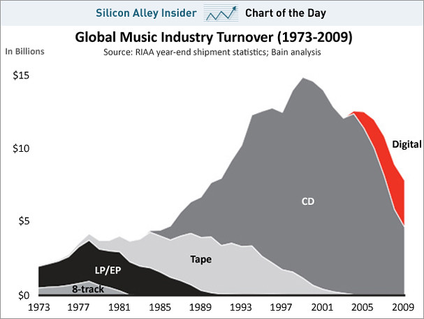

Business insider [published this chart today,](http://www.businessinsider.com/chart-of-the-day-music-industry-sales-2011-2) labeling it as a visualization of the collapse of the music industry, and how digital sales aren't doing enough to offset it.

<figure>

</figure>

The issue with this kind of stacking graph is that big changes on bottom layers always distort the top layers. Just changing the stack order, from bigger to smaller, gives us this chart:

For me this tells a very different story. Digital sales are almost reaching the turnover of the 70’s LP era (which no one ever says was a bad time for music), and the tape era of the 80’s. Looking this way, the “golden age” (at least for the CD business) of the 90’s seems more like an exception, an abberration, and this one, has clearly seen it’s end.
