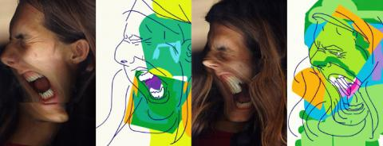
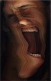

### [animated self portrait](http://wanderingabout.com/_/animation-video/animated-self-portrait/)

June 23, 2002

<figure>

</figure>

[watch the animation!](http://wanderingabout.com/myselfportrait/MOVIE_%20web.html)

(turn the sound and move the mouse)

Animation based on experimental photography on a scanner. They where achieved rotating the object (my own face) during the scanning process. Later the best results were redrawn on vectors and animated. A colored rectangle rotates and follows the mouse, revealing the colors on each animation. This was my first experiment on interactive animations.

Below are some samples of scanner photography.

<figure>

</figure>

<figure>

</figure>

<figure>

</figure>

<figure>

</figure>

<figure>

</figure>

- about: This self Portrait as developed in 2002 in a course of introduction to representation techniques given by the teacher and artist Amador Perez.

[Animation & Video](http://wanderingabout.com/_/category/animation-video/)
