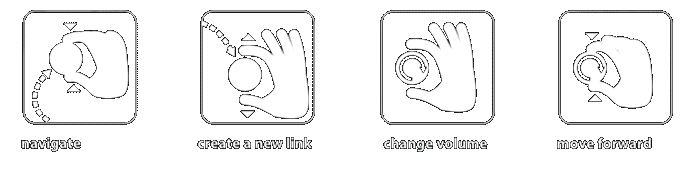
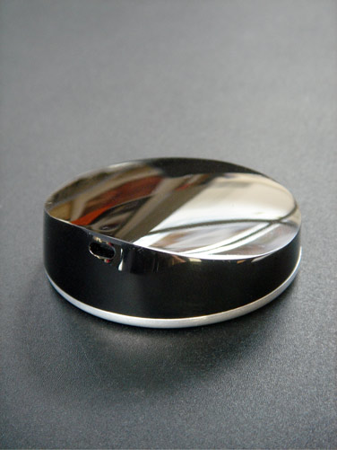
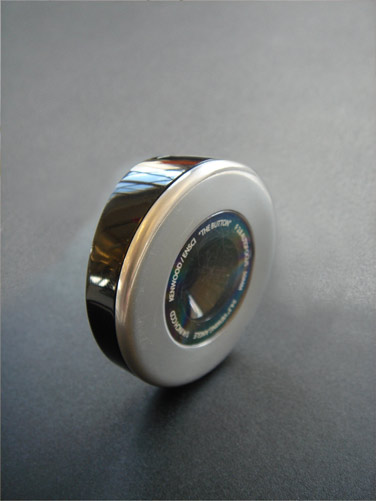
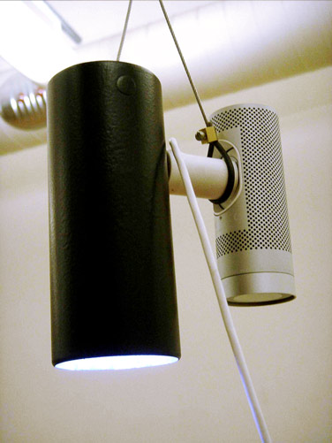
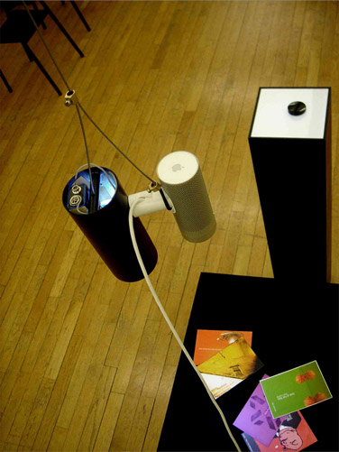

### [Le button](http://wanderingabout.com/_/animation-video/le-button/)

January 19, 2006

_Le_ button is one single button that can transform any surface in a radio tuner. It allows to use any printed page as an link to an internet audio file which you can stream to your headphones. And because it’s able to save any pattern in it’s internal memory, you can re-save those links in any surface you can look at. how much can you do with a single button?

<figure>

</figure>

<figure>

</figure>

<figure>

</figure>

<figure>

</figure>

<figure>

</figure>

- about: Made in 2006/07 for Kenwood corporation and École Nationale de Création Industrielle along with Clément Tissandier, using Adobe After Effects\* for the movie and Max/MSP/jitter\* to program the working prototype . \*(both which I had learned the week before)

[Animation & Video](http://wanderingabout.com/_/category/animation-video/) [Interaction Design](http://wanderingabout.com/_/category/interaction-design/)
