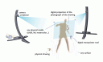

### [Mélange](http://wanderingabout.com/_/animation-video/melange/)

September 1, 2005

Digital tools are great but they lack the refinement or the sensibility of the classical drawing tools such as pens and pencils. Mélange is an attempt of bringing those together not by simulating how ink flows in a paper but by bringing the digital screen over the canvas.

<figure>

</figure>

- about: Started making it in Rio in 2004 and finished in paris, 2005 using watercolor, ink, pencils and a projector.

[Animation & Video](http://wanderingabout.com/_/category/animation-video/) [Interaction Design](http://wanderingabout.com/_/category/interaction-design/)
