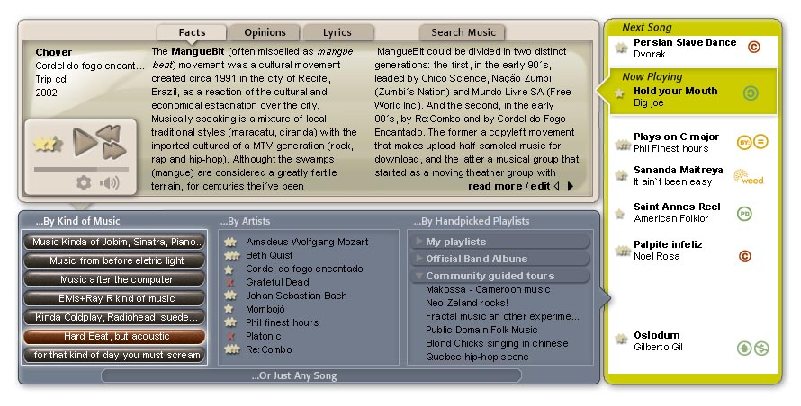
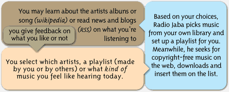
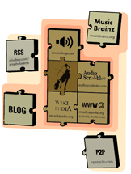

### [Radio Jaba](http://wanderingabout.com/_/interaction-design/radio-jaba/)

January 23, 2004

<figure>

</figure>

### Free music might change our culture. But only if it creates a culture. 

We live in a funny paradox. You can hear any music, from anywhere, given you already know it, or at least know how to spell it in a search engine. As a result, most of downloads are the famous artists seen in MTV, which makes the MTV guys very unhappy, as that´s precisely what they don´t want you to do. And at the same time, thousands of ignored musicians out there are actually asking to be heard, but remain in oblivion.

The result: recording companies prosecute people who can´t understand what they have done wrong (we´ve all always heard music for free after all), independent unknown artists who remain unknown artists, and radios plays old music as if nobody had done anything different in the last 10 years. It´s a everybody lose game.

That´s what radio Jaba it´s about.This is not a radio, nor a website, but it isn’t exactly a software neither. At least not yet: right now, it’s a conceptware, a proposal, spoken as an existing software, to stimulate discussion about the future of free music.

<figure>

</figure>

Radio Jaba is a mp3 player for exploring the musical world. You let him guide you, and he will give you information about the music you already own, bring you discussions and opinions about that musician, history on the albums, background for any musical genre, meanings, lyrics even translations for that song. You take the control and guide it, and it helps you make new unsuspected connections between musical genres, explore unknown realms of music, and get to know novelties uprising anywhere in the world.

<figure>

</figure>

 
 _how to put everything together_

And, mainly, it analyzes your library to bring you new music, that you might want to hear, and mostly important that the artists want you to hear. This last piece of technology has been already explored in many softwares out there, like iRate, Gnomoradio and Indy.tv , to name a few. We´ve seen them, tested them, being inspired by them and hope for their future. They´ve done the technology right, but that´s not enough. It´s not about just downloading unknown mp3 to user´s HD´s, it´s about making a community. Bring information, bring people together, give them navigating tools and they will make you a community. It´s not just music, it´s about a whole free

Read more: 
 [What it does?](http://wanderingabout.com/FreeMusic/whatitdoes.php) 
 [And how will the musicians make money?](http://wanderingabout.com/FreeMusic/money.php) 
 [Criticism on similar programs](http://wanderingabout.com/FreeMusic/related.php) 
 [Related Technologies](http://wanderingabout.com/FreeMusic/related.php) 
 [Meta: about the project´s design](http://wanderingabout.com/FreeMusic/design.php) 
 [Download Now!](http://wanderingabout.com/FreeMusic/download.php)

- about: Radio Jaba was a pet project of two students: interface designer Alexandre Van de Sande and Music Producer Pedro Borges. It was started in 2004 when we felt that alternative music needed a free distributing channel. About the same time many others were tinkering with the same problems and the emergence of Podcasting showed us that some things we only thought possible through massive computer algorithms, like filtering the gigantic amount of online music, was done thanks to the work of thousands of volunteers, who contributed with time and hosting space. A valuable lesson indeed. Pedro Borges is now a prominent podcaster in Brazil, and set up a site to help others spread the word. Alexandre, besides helping designing that site, still tinkers about media interfaces, as you may see in the rest of this site.

[Interaction Design](http://wanderingabout.com/_/category/interaction-design/)
