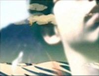
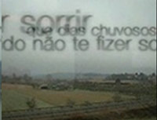
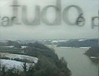
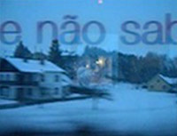

### [Video Poetry](http://wanderingabout.com/_/animation-video/video-poetry/)

January 19, 2005

How do you freeze a moment? those two videos were made during my studies at the École Nationale Superieure de Création Industrielle in paris, and where meant to represent two distinct feelings. Both clips were made during my stay at l’Ecole nationale de Creation Industrielle, Paris, but not necessarily _for_ the school.

### In between the days

 
 In between days” is about being into a daily routine while your mind wanders throught so many images and new ideas. It’s a mashup of many clips in a music by the coral sea..

<figure>

</figure>

<figure>

</figure>

<figure>

</figure>

<figure>

</figure>

### Come Here

The second, “come here”, is a work of love about missing something for long and then having a concentrated overdose.

<figure>

</figure>

<figure>

</figure>

<figure>

</figure>

- about: Made in 2005 using Adobe Premiere, Adobe After Effects and Apple’s iMovie

[Animation & Video](http://wanderingabout.com/_/category/animation-video/)
