[I have a small obsession about constant area hexagonal map.](https://blog.vandesande.design/gosper-world-a-novel-world-map-made-of-hexagonal-like-fractals-or-how-i-made-matt-parkers-impossible-ball) Maps can serve many purposes, but the ones I am mostly interested in education, their ability to show the world in a way that you can figure out new connections just by looking at them. Hexagonal maps have a strong association with board Games (and Video Games), and I believe it is because games, like maps, are an attempt at creating an idealized model of a piece of the world, a scenario in which from far away, a complex system looks simpler. As if you knew the basic rules, then you could figure out how the game plays out.

<figure>
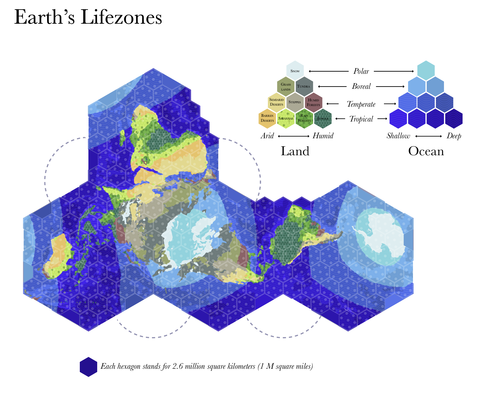
<figcaption><em>It  feels "playable" doesn't it?</em></figcaption>
</figure>

I wanted to give an upgraded new map for the Impossible Map I've made last year, and so I started working on an expanded version of Holdridge Life Zones mini-map already present on last year's poster.  There's a lot I like about this map: for starters the overall arrangement is inspired by Fuller's "World Island" Dymaxion map, but the external shape is more identifiable as 4 simple hexagons.  And there's a lot you can tell about the world history by looking at the map:

- The multi-millennia challenge that is to go from Africa to the southern tip of South America or Australia.
- How Eurasia, specially from Europe to China, works as mostly a few lifezones that can exchange crops and technology, while Africa and the Americas are more diverse (important for fans of Jared Diamond)
- How Norway to Vinland (Newfoundland) is basically a straight-line with island hopping (this map isn't great at maintaining straight line correpondence, and distances can be up to 30% different, but area is very accurate)
- That Russia, while it has a large coastline, it's mostly surrounded by cold non-navigable waters

There are some things I don't wanted to improve upon it. For starters, the fact that topography is absent. Mountains as natural barriers have shaped and still shape history to this day, so a map that doesn't scream about Himalayas or the Andes, that doesn't tell you about the Alps that Hannibal had to cross with elephants, is incomplete. A second factor I dislike is how I need to move some smaller hexagons from the African plate so that South America isn't cut. But I do love the fact that you can rearrange the main hexagons and I realized by simply increasing the hex to a circle I could include South America. 

<figure>
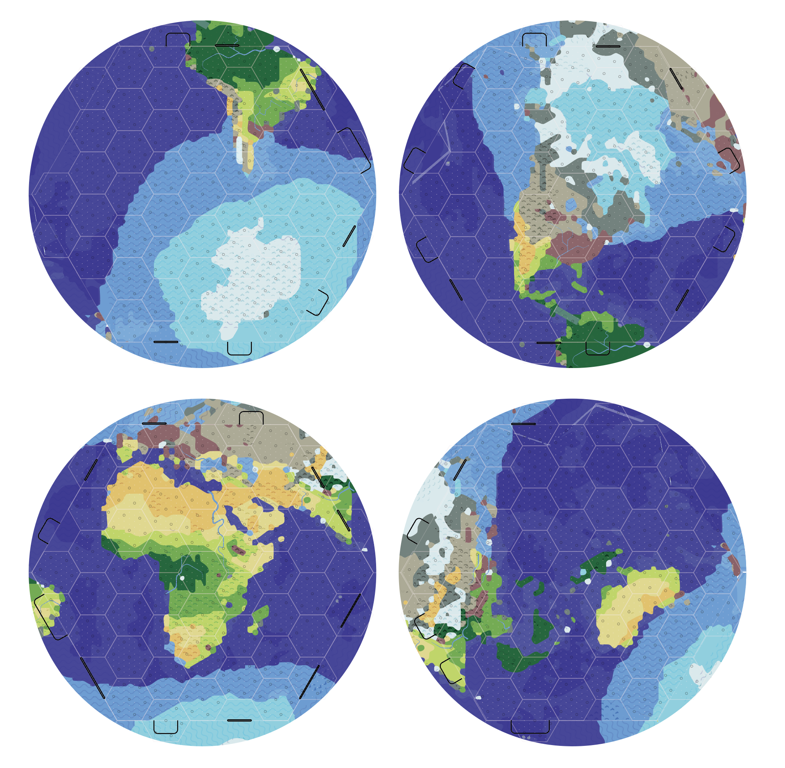
<figcaption><em>Print these, cut and fold the black lines  and play  build your own map</em></figcaption>
</figure>

In the [**Impossible Map**](https://blog.vandesande.design/gosper-world-a-novel-world-map-made-of-hexagonal-like-fractals-or-how-i-made-matt-parkers-impossible-ball) I had made topography appear as more stark shadows. Here I decided to make them as icons for hills and mountains, so that it doesn't interfere with the color scheme for Lifezones. Printing them in large sheets, and playing with different arrangements made me feel more like it's a perfect board for a game whose rules I haven't yet discovered. Certainly more about connections and commerce than war, so it's more akin to Ticket to Ride than to Risk.

But it also made me realize that, while I originally started with a Rhombic Dodecahedron,  I've stretched and combined so many faces that in the end what I have is a Tetrahedron earth! There are many maps based on tetrahedron, like [Lee's Conformal](https://en.wikipedia.org/wiki/Lee_conformal_world_in_a_tetrahedron) or the [Autagraph](https://en.wikipedia.org/wiki/AuthaGraph_projection) but they're usually dismissed because it's hard to think of a less spherical solid than the tetrahedron. But what most people don't realize is that when projected on a globe, a spherical tetrahedron face is very "rounded" and is in fact, very similar to the hexagons presented above. 

<figure>
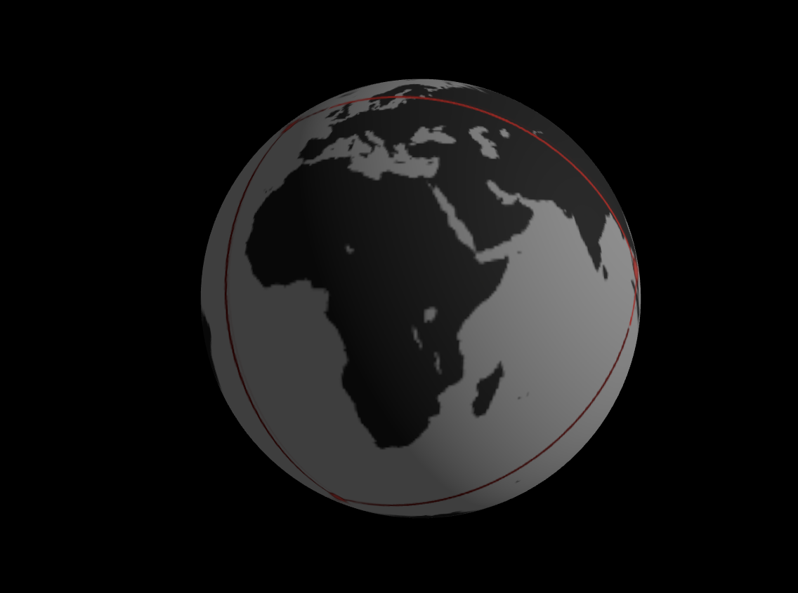
<figcaption>Visualizing spherical tetrahedrons. <a href="https://alexvansande.github.io/Gosper-Fractals/globe.html">Play with one in this link.</a></figcaption>
</figure>

Naturally I've asked myself: what would be the best positions that a tetrahedron can fall on the planet without touching any land? So I did what anyone would do, and [built a website for finding tetrahedron vertexes](https://alexvansande.github.io/Gosper-Fractals/vertexfinder.html). Go and play around with it. Try to figure out the best position or even click "Scan Map" to search every position possible! I won't give a direct answer because the final results are very subjective. For example, the second best result (measured by least edge distance on land) only does it because it crosses Africa and South America in small slices, but it's not what I would consider a great way to divide the planet in 4 ways.  I've even added a distance to land slider so you can select what counts as "too close". 

<figure>
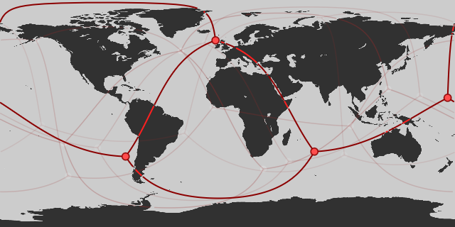
<figcaption>That line crossing right throng the Red Sea feels like cheating!</figcaption>
</figure>

<figure>
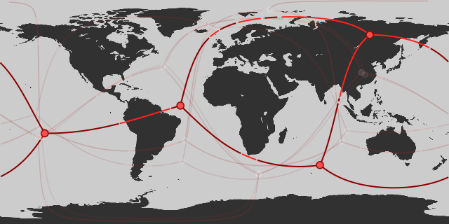
<figcaption>This is my particular favorite as it separates in logical segments. Set Coastal Distance to 4.</figcaption>
</figure>

So here we have it. Tetrahedrons divides earth in four logical segments, and while we have to include some distortion, each face is similar to what a globe would look like from that perspective, and the faces, because of their great circle shapes, can be faithfully approximated to hexagons – which are of course, the best way to tile a plane.  End of story.

Well, it depends.

**Game of Life on a Hexagonal Grid.**

As I said, my fascination with maps and specially board games, is about how they simulate complex models using simple rules. Another area where this happens in an interesting manner are zero-player games, like Conway's game of life, or their more interesting modern equivalents like [Smooth Life](https://smooth-life.netlify.app) or [Particle Life](https://sandbox-science.com/particle-life). Of particular interest is the [Lenia](https://en.wikipedia.org/wiki/Lenia) family, which has found some interesting living specimens that emerge and are able to move, consume matter, reproduce and evolve. One issue in these systems, is that they're very computational heavy: you can only render a tiny minuscule portion of their universe, so small that a Petri Dish feels gargantuan. 

I've been asking myself: what if you could come up with simple rules for a very small simulation space and then observe how these rules created more emergent behavior.  But then, and that's the most interesting part, you could figure out what are the rules that govern that emergent behavior and use that to simulate a larger, but coarser grid around it? And then you could observe and do again with another coarser and larger grid again, and keep repeating this until you're basically simulating a whole planet?

It's like observing particles and figuring out how they interact and become molecules. And then simulating a simplified model of these molecules with only the chemistry rules we learn, instead of having to run a physics simulation for every molecule. And then observing the rules of biology based on the emerging behavior of the chem rules. In this way, instead of having to model forest by simulating every single atom, you would be running lots of coarse simulations in many levels, and allowing the lessons learn from one level to set the rules for the next one. 

That's how I started playing around with the concept of Hex Life. 

<figure>
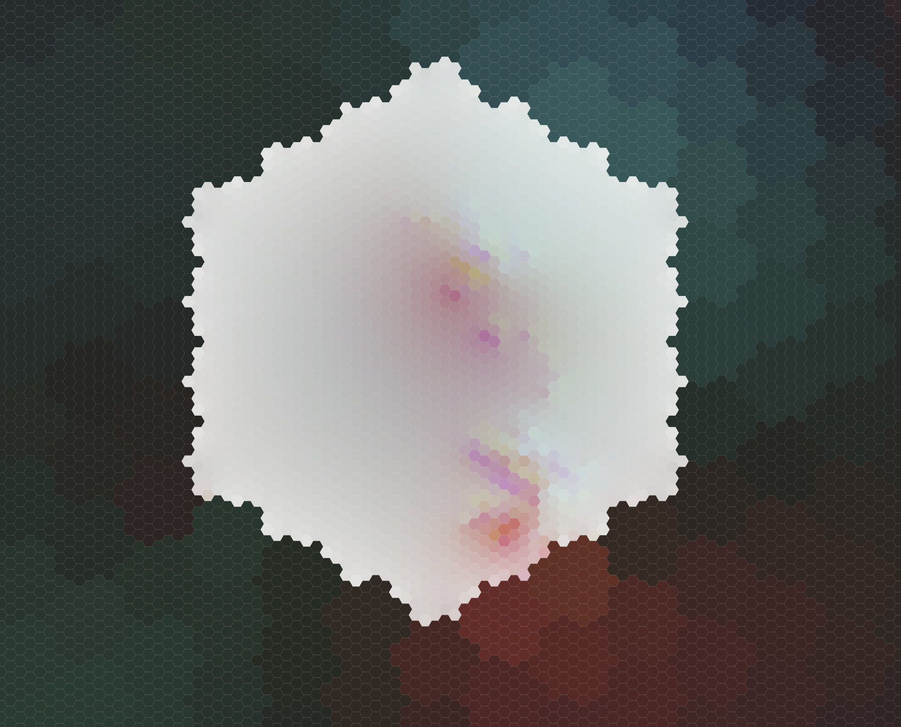
<figcaption>It's more pretty than useful at the moment. </figcaption>
</figure>

<figure>
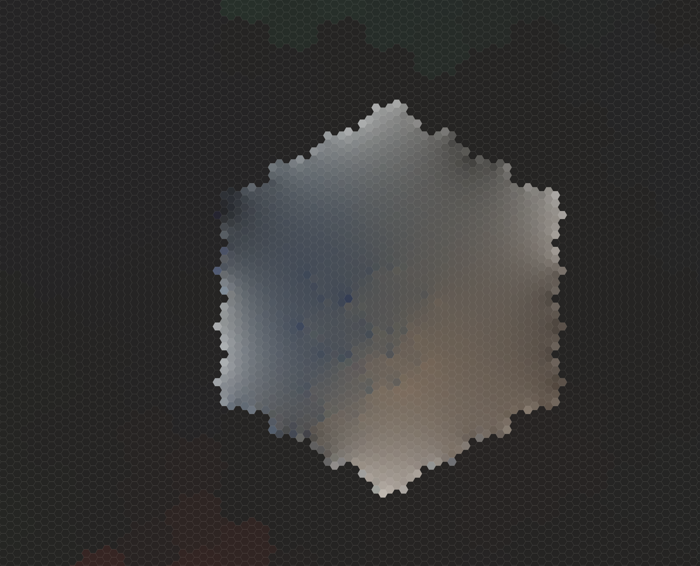
<figcaption>Notice the black pigment from the outer edges falling back in the inner simulation</figcaption>
</figure>

 HexLife is a fluid simulation that uses a series of pigments, that, much like Particle Life, has a series of interaction rules. Some pigments attract, others are repel, and how these interact often leads to interesting patterns. I only simulate a small universe in the grid in the center and when pigments move away from that grid, instead of wrapping around or being ignored, they're picked up by another simulation that surrounds it. That simulation also has similar rules for how colors interact, but it's run on a more coarser grid. Right now it's very buggy and barely functional but the goal is to have it expand from the size of a few molecules to a whole planet, all running from a standard desktop computer. 

I am using a hex grid. This would be much more straightforward if I didn't, as having different resolutions in the same square grid is a lot easier, but for some reason I'm doing the more complicated way. And what does the planet looks like? 

<figure class="float-right" style="width:50%">
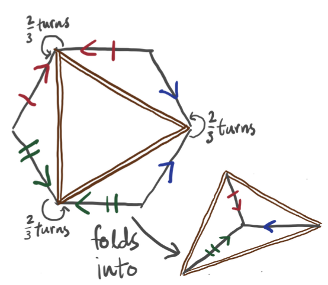
</figure>

Right now, Im using an infinite grid outwards, but at some point it probably makes sense to set a boundary that wraps around, like a planet does. If I used the tetrahedron based shape before, that would mean I would have four hexagons arranged inside a single hexagon.  That looks simple enough but I was wondering if I could do better with a single hex for the world. Turns out I can, and the answer was staring at me the whole time.  One of my favorite papers on the subject of hexagonal maps is called ["flow snake earth"](https://archive.bridgesmathart.org/2017/bridges2017-237.pdf) by Jacob Rus and describes many ways in which a hexagon can be folded into a sphere. One of the first is achieved by a simple folding into two triangles. A similar approach was made by Oscar Sherman Adams back in 1920 which resulted in this interesting gem: 

<figure>
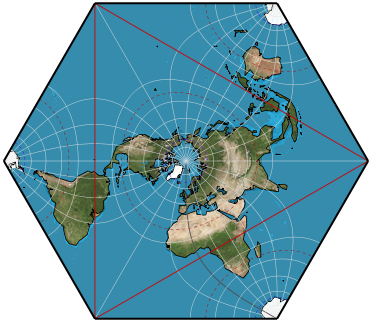
<figcaption>"Adams World"</figcaption>
</figure>

I really felt it could be improved by having an equal area projection so I decided to take on the challenge. I also wanted the poles to be similar to a hexagon so I divided each hemisphere into 12 triangles that would slowly transition from a hex into a triangle. This is the final result.

<figure>
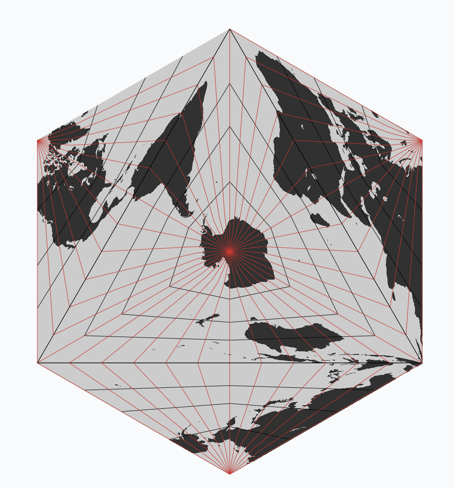
<figcaption>Is it any better? Not sure.</figcaption>
</figure>

It definitely creates a lot more unrecognizable shapes that our previous hex projection did not. You could think of this in 3d as two Tetrahedrons glued to one face, or a Tetrahedral bipyramidal earth. It does allows you to tile the plane and has a hexagonal grid subdivision which is useful for my Hex Life concept. 

<figure>
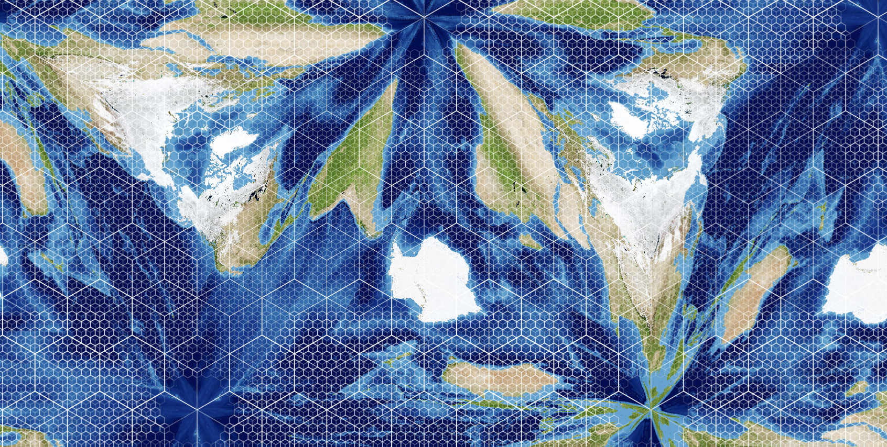
</figure>

Anyway, this is a summary of things I've been thinking that are map related which I'm sharing with the world.

