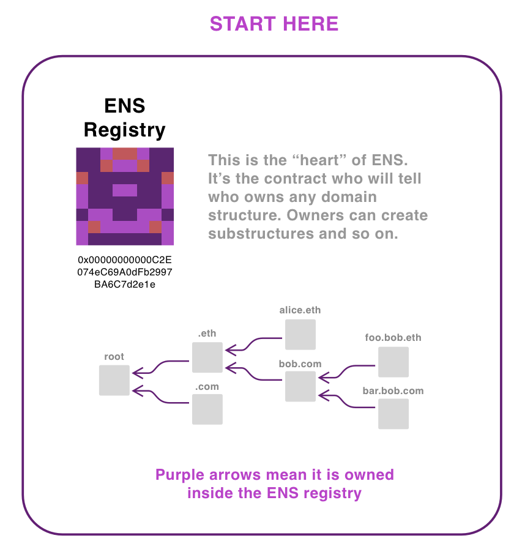
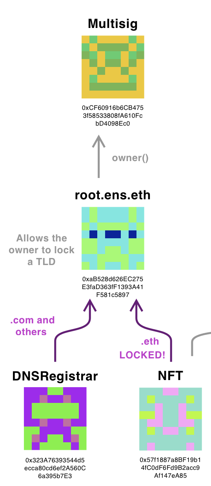
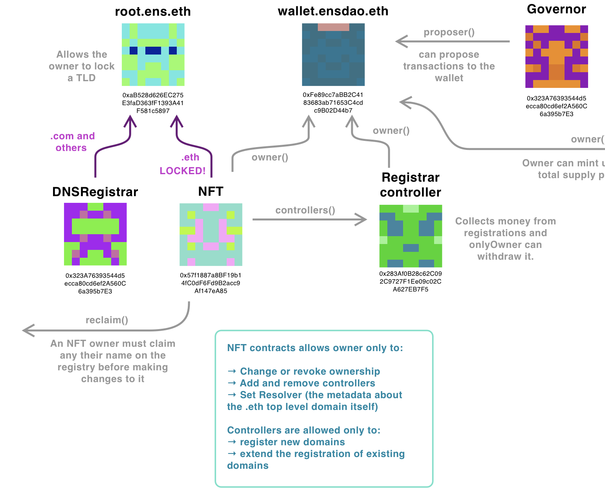
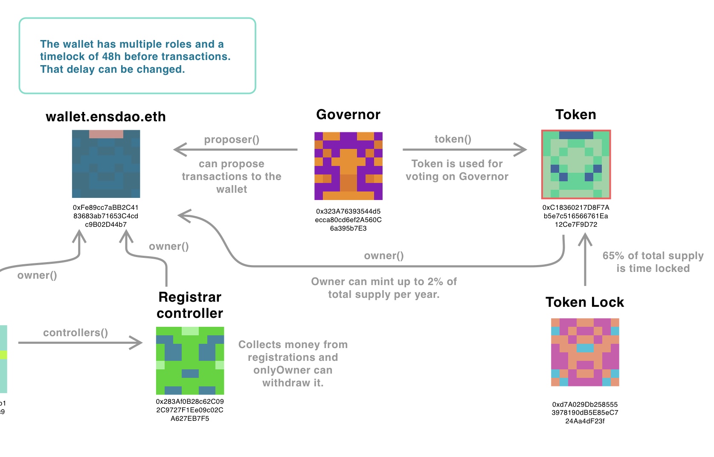

This is a work in progress and continuation of an [earlier thread](https://discuss.ens.domains/t/on-property-rights-and-threat-models-for-ens/10701/) about threat assessments. ENS is made of many contracts and this is an attempt to clarify. It’s also has been a great understanding path for me to get more acquainted with all the governance changes. But most importantly it answers the question: what is the worst that can happen with my names?

<figure>

</figure>

Let’s start at the ENS Registry itself. This is the most important contract, the root of where ownership exists, you can even notice this by the care that was taken in choosing an address with lots of 0s. This makes it harder to spoof and creates tiny gas savings. It’s the contract deployed on all chains including for testing. It’s a very simple contract that uses a nested logic: if you own the root, you can create top level domains, which allows you to create domains, subdomains etc etc etc. You can check who owns the root by going in the contract and asking it for the owner of 0x000..

It should return the root.ens.eth contract, which is just a contract that passes direct orders from its owner–unless the owner specifically forbids that. It has only one locked contract which you can check by passing the keccak256 of “eth”, which will allow to confirm that nobody, not even the root, can change the owner of .eth anymore.

<figure>

</figure>

You’ll notice that the owner of .eth is the contract I named “The NFT” because it is the NFT address you add to your wallet. You’ll also notice that the multisig is still the owner of the root contract, per design as requested on EP1. We should expect this to change for the DAO in the future.

<figure>

</figure>

Why is the owner of .eth set to the NFT contract and not, let’s say, the dao itself? Great question. If you look at the code in the NFT you’ll see that when you transfer the NFT you are not at all changing the Registry, just the NFT ownership. But the owner can execute the “reclaim()” function which will allow you to set the owner of the NFT to the owner in the ENS registry. So the NFTs in your wallet are not actually the claim on the registry itself, but rather a special token that allows the owner to claim it.

The NFT contract is owned by the wallet.ensdao.eth which is the proper DAO. What can the DAO do to the NFT? It can call the following contracts:

- Change Ownership: this will transfer ownership to someone else
- Revoke Ownership: similar to transferring ownership to a null address
- Set Controller: adds an address as a controller. There can be more than one.
- Remove Controller: revoke controller permissions from the address
- Set Resolver: this is just for setting metadata on the .eth address itself. Not something people usually do.

What are controllers? They are addresses authorized to call these functions:

- Register: sets the new owner of a name that has expired and updates the ens registry
- RegisterOnly: does the same but doesn’t update the registry (cheaper, but user will have to later reclaim it)
- renew: extends the existing period

As you can see, there’s no option that will change the ownership of an address that has an owner. The easiest way to check for this without having to read the whole code is to look for instances of “onlyOwner” and “onlyController”, so you can verify it yourself.

<figure>

</figure>

Finally for the governance side. Both the NFT contract, Registrar Controller and token contracts are owned by wallet.ensdao.eth. The only thing the registrarController owner can do is call it to withdraw the money.

The owner of the Token contract has the right to mint up to 2% of the current total supply, once a year. Notice it’s not “per year” but rather it’s an action that, after done, requires waiting another year. Meaning that if the DAO calls to mind 0.5% of new tokens for some usage, that will be the limit that year.

The token contract is then used as the token inside the governor contract, which is part of an elaborate governance contract from Open Zepellin that I haven’t done researching, but suffice to say it’s the thing that counts the votes and creates a 48h delay before they can be executed by the DAO. It’s also interesting to notice that 65% of the token supply, owned both by the DAO and in minor scale, some contributors, is still locked in the time lock contract.

I urge you to verify all these contracts by going yourself on etherscan and checking the code: you don’t need to read everything, but you can start by searching keywords like “owner” to understand what can happen.

**So name ownership is quite locked down. Only a owner of a token NFT (or the previous owner until they reclaim it) can change the ENS registry. This is enforced by a locked contract that is the true owner of the ENS root, which itself is under the control of the multisig. Unless there’s some bug in either of those contracts, then no matter how the token holders vote, people cannot lose their domains.**

### Threat scenarios

One scenario that could be more sensitive is the controller. The DAO can add and remove controllers as will, so while it can’t do anything to existing names, it could stifle or limit the growth of ENS names. Examples that a bad controller could do:

- While it can’t change the expiry date down, a controller could refuse to renew a name for a user for any reason. This would go against the article I of the constitution but right [now it’s relatively easy to change that.](https://discuss.ens.domains/t/promoting-decentralization/10747/5)
- A bad controller could also limit who can acquire new names. It could decide to only accept KYC USD token that required its users to doxx themselves. Or it could require that any new user have a specific token that would identify them as a member of some special club. Or it could straightaway create allow and block lists for who can acquire names. Again, goes against the constitution, but if you have votes to control the wallet, you have votes to change the constitution.

### Security suggestions

It’s too soon for us to lock down controllers. There are probably more creative and clever ways to deal with registration than the simple $5 a month, which also requires an oracle and ties itself to the dollar. But we can add more than one controller, and we could transfer ownership of the NFT contract to a locked contract similar to the one at root.ens.eth, which would prevent a few actions or add more delays.

- We could add a last recourse controller that created a fixed price for ENS names at a higher point. This controller could not be removed, not even by the DAO. Maybe it would say that you could always use/burn X amounts of ether or ENS to acquire a year of domain names. It would of course be more expensive than the other avenue, but at least it would guarantee that someone who couldn’t access whatever other restrictions could be put in place. Of course it’s hard to figure out how to price something in this scenario, but that is a contract that is not meant to be used, rather a lever saying “you can’t add restrictions because there’s already a backdoor”.
- Add greater delays on controller changes. Maybe any controller changes should have a minimum delay of 30 days, so that if some change is about to happen that you disagree with, you still have 30 days to add 100 years to your current domains.
