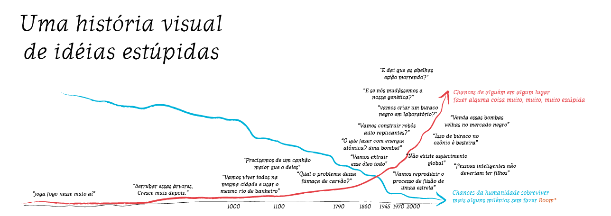
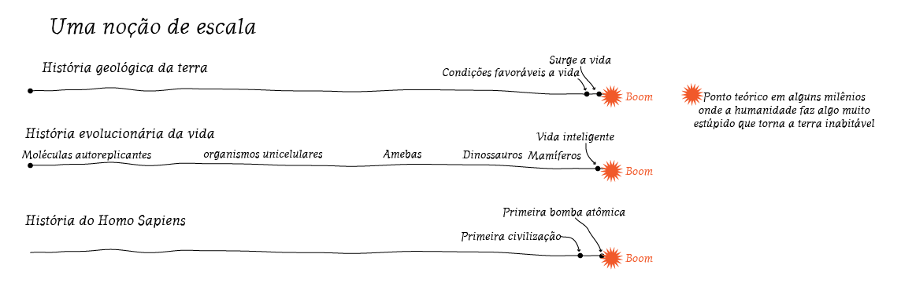
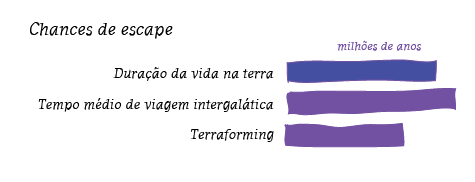
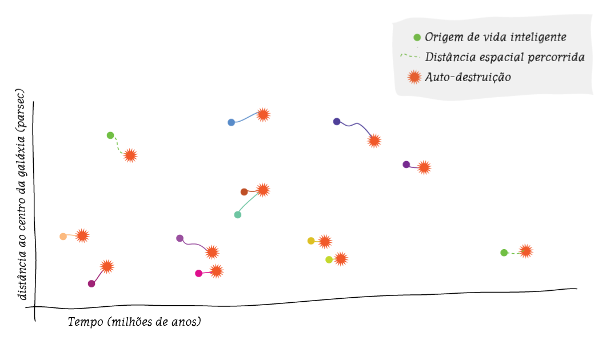

Passo 1: Observar como, com o advento da civilização o homem foi criando cada vez mais formas de se autodestruir. Durante os primeiros milhares de anos essas chances eram negligenciáveis (chance de acidentalmente destruir todos os humanos com machadadas) essa possibilidade tornou-se palpável a ponto de ser ponto de debate constante em reuniões de cúpula política, processos judiciais ou aulas de ciência do primário.

<figure>

</figure>

Medidas preventivas foram bem sucedidas nos últimos cem anos, mas existe um risco crescente que elas falhem em algum ponto nos próximos 5 mil anos

<figure>

</figure>

Partindo do pressuposto que uma das milhares de opção de apocalipse se realize dentro de dois ou três mil anos, é importante ressaltar que esse tempo, apesar de longo para uma vida é relativamente irrelevante em termos evolutivos ou mesmo cosmogênicos.

<figure>

</figure>

Percebendo que o tempo, na escala cósmica entre o surgimento da vida e seu auto aniquilamente é quase um estlo imediato, notemos que é um tempo muito curto para que possamos mudar de galáxia ou criar um novo planeta.

<figure>

</figure>

Conclusão:

A vida nesse exemplo é como faíscas que surgem espontaneamente em um matagal onde cada plantinha está separada por dois mil kilômetros de deserto.

Do ponto de vista cósmico, Vida é uma anomalidade planetária autodestrutiva de curtíssima duração.

C.Q.D.
