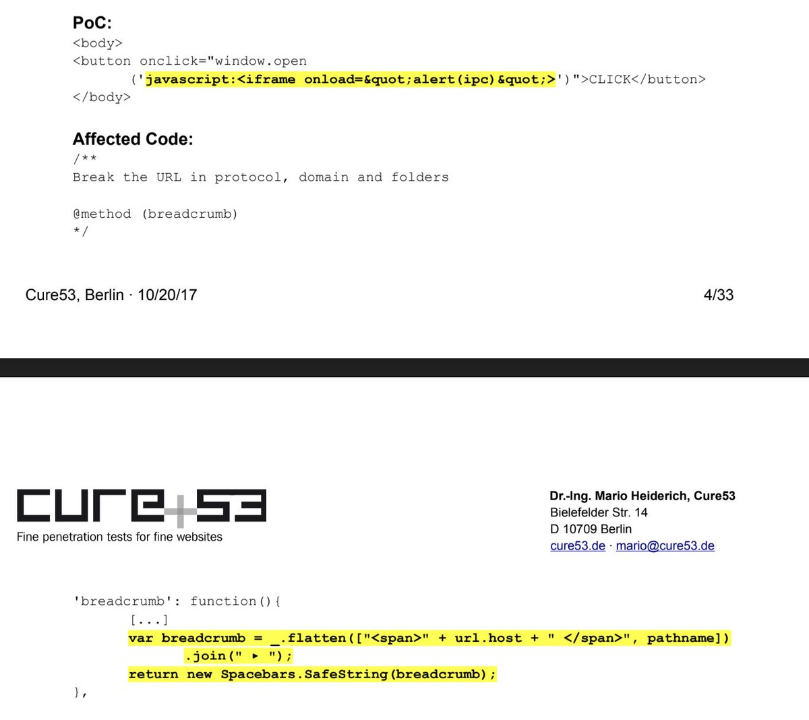
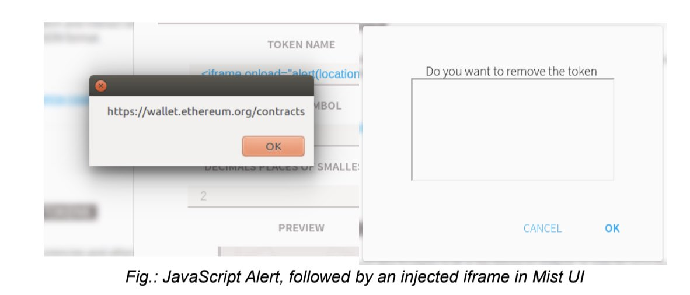
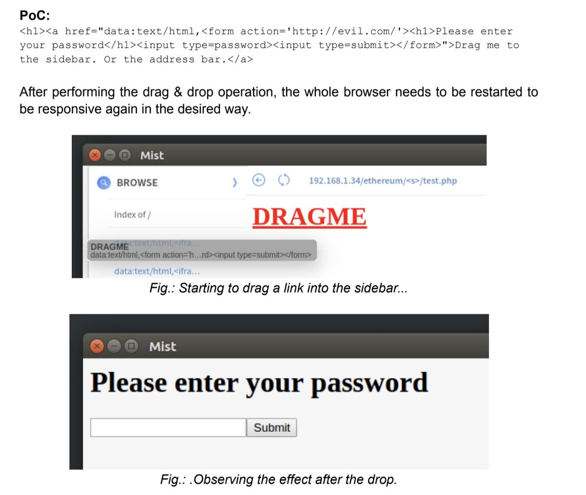
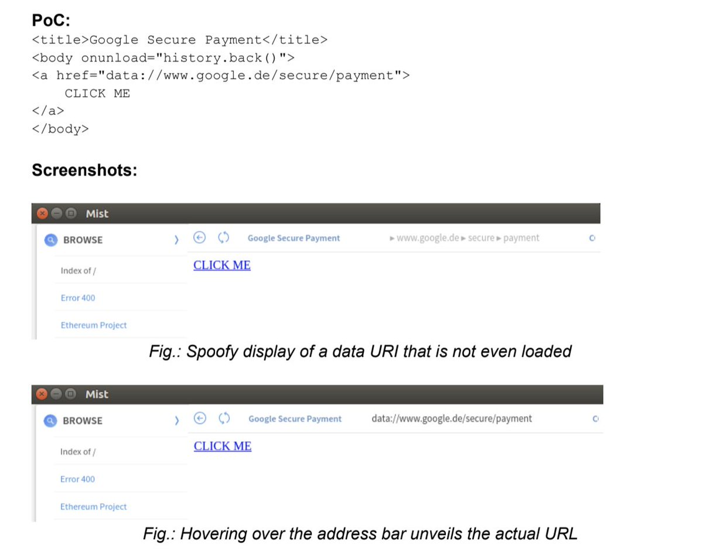
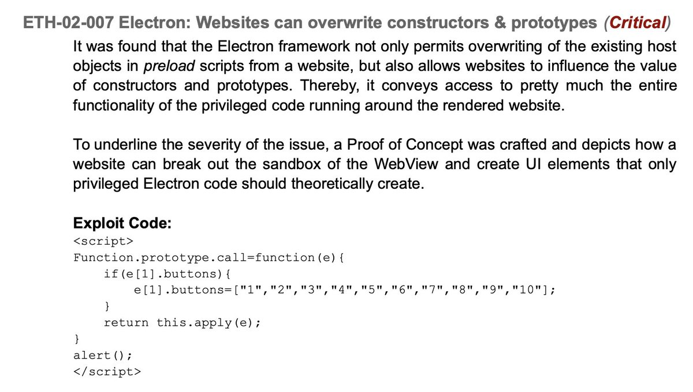
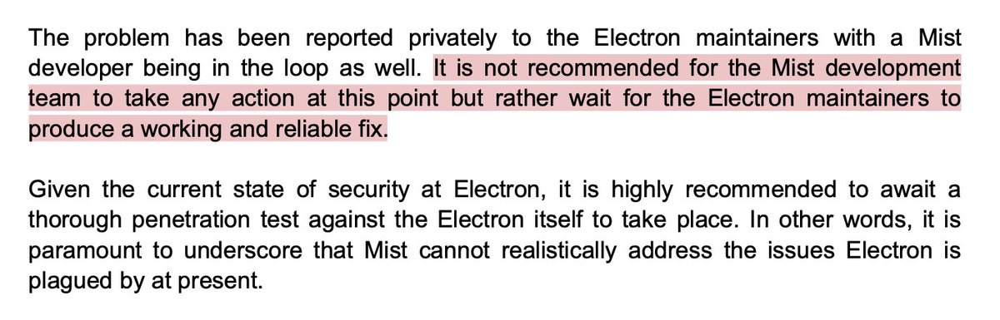
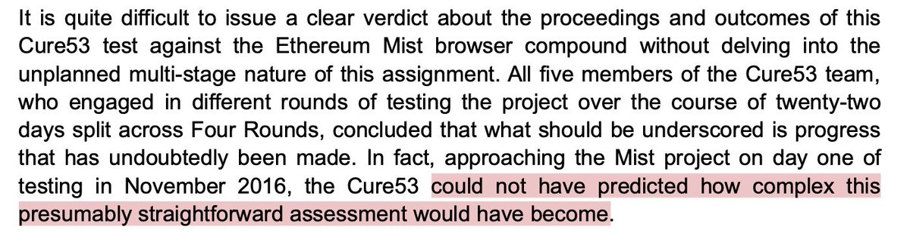
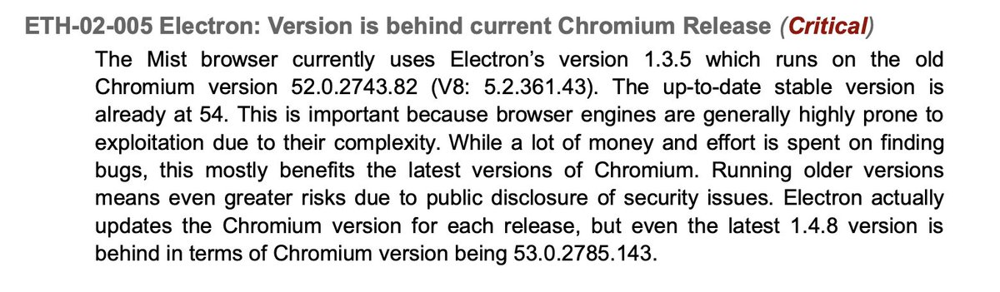

In 2016-17 the Ethereum Foundation hired @cure53berlin for a security Audit of Mist. The process was eye opening and contributed to the discontinuation of the project. [The report](https://drive.google.com/file/d/1LSsD9gzOejmQ2QipReyMXwr_M0Mg1GMH/view) was never publicized but it might still be valuable for builders today.

Mist was a brainchild of Gavin and Jeff but I took the lead of it when I joined the foundation in 2014. We had grand plans for it being the realization of all web3 technologies we were building and it was planned as the main software release of Metropolis

<figure class="youtube">
<iframe src="https://www.youtube-nocookie.com/embed/IgNjs_WaFSc" title="Ethereum presents Mist" loading="lazy" allowfullscreen allow="accelerometer; autoplay; clipboard-write; encrypted-media; gyroscope; picture-in-picture"></iframe>
</figure>

However the first 2 years I worked on Ethereum we were mostly focused on the Wallet app, so it started being released as a beta in 2016 and we started a security audit at the same time. The Foundation contacted Mario Heiderich from Cure53.

**It was a great piece of humble pie.**

As a designer I had spent a lot of time working on small things that I was really proud of, for instance instead of the URL being a simple text field we wanted to show all the url elements in a proper hierarchical order. But turns out Meteor’s SafeString wasn’t that safe.

<figure>

</figure>

We would then build our own sanitizers and then they would come back to us with “actually,  this isn’t enough, there’s a bug in Webkit using this particular character so we were able to execute javascript code by encoding it in a token’s name”

<figure>

</figure>

A lot of the exploits were abusing long strings to hide information that could be used to phish the user, or things that didn’t even cross our minds, like “we can actually make a draggable object from your site overtake elements from the UI”. We were impressed.

At this point everything was fixable. But at some point they started going deeper into our tech stack: you could force an error in Node.js to reveal information about the user’s folder names. You could abuse our injected provider and override the native JSON parser functions.

And then the really scary things started popping: the found out how to abuse electron to access privileged commands not even Mist should have access to. At some point a POC was able execute *any* app in the computer. This is scary for a normal app, but fatal for a crypto wallet.

<figure>

</figure>

The whole process took over a year of back and forth, where they would find issues, we would fix and come back to them. At some point issues started escalating to Electron team, Chromium and Webkit. Cure53 itself said it was out of our hands and they couldn’t have predicted it.

**This was fundamentally the end of the project.** We explored  different approaches, using other frameworks, building our own, starting from scratch on a completely different language. We saw Brave pop up and eventually abandon Electron too. In a year Mist would be discontinued.

I wouldn’t have thought about the report again, if it wasn’t for @Jordancoin pinging me about it, wanting to learn more what we learned ourselves and it made me realize these lessons could be applied to more people building desktop wallets in crypto.

So I’m sharing it now.

I hope this is useful for some people. Thanks Jordan for pinging me about it, @Silverhair72 for digging it out again and of course my former team mates @feindura , @evertonfraga , @mhswende, @MaiaVictr, @Philipplgh, @wolovim for working so hard to dig us out.
