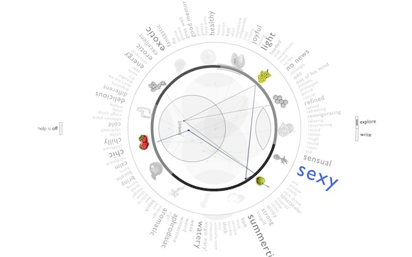
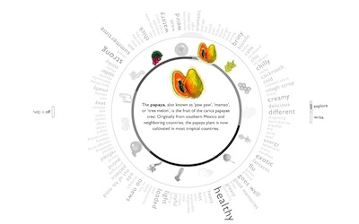
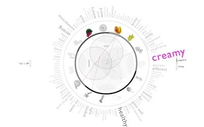

[Experiment the Alchemy!](http://wanderingabout.com/fruitjuices/alquimia.html)

<figure>

</figure>

Can we map something as subjective as tastes? Alchemy of juices is a interactive infograph that is helps to choose a juice made with various fruits, by selecting either the fruits, the feeling or the taste. At the same time it tries to foresse those tastes and feelings of juices you mix there, based on user input from previous juices. Just as an alchemic diagram it’s about being a somewhat misterious but beautiful infograph.

<figure>

</figure>

<figure>

</figure>

Yes, we’ve got bananas, and thousands of other tropical fruits. And it is not amazing that in any casual restaurant in Rio de Janeiro you may ask to mix peanuts, banana, and amazonian fruits like Guaraná and Açaí. Best of all, they’ve got creative names: this one for example is called viagra. Watermelon and lemon is called “Sexy juice”. For some unknown reason we have to agree that there is something extremely sensual in that combination, even without tasting. Juices are more than just taste; they bring back memories.

The Alchemy of Juices is an experiment on information architecture which tries to reveal the most information possible in a visually simple and dynamic diagram. The main target is not to be easily readable at first, but to become intuitive once the logic is learnt.

The result is a rather mysterious-looking schema that allows the user to seek for juices based on a sensation or a fruit, to share experiences with other people, to guess what will be the result of a any mix, even to know what fruits you expect in this time of the year. All in one non polluted screen.

Once I head a teacher that, whenever asked how to know if a curve was correct would answer. ‘If it looks beautiful, it’s probably the correct one.’ Alchemy looks as an occult symbol: even though you don’t understand it, it’s attractive to look.

- about: Made with Flash and actionscript in the year 2003, along with Ricardo Bacellar, with the supervision of Gui Bonsiepe
