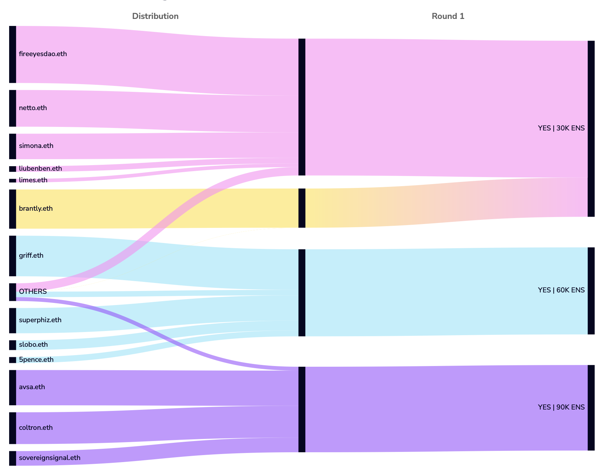
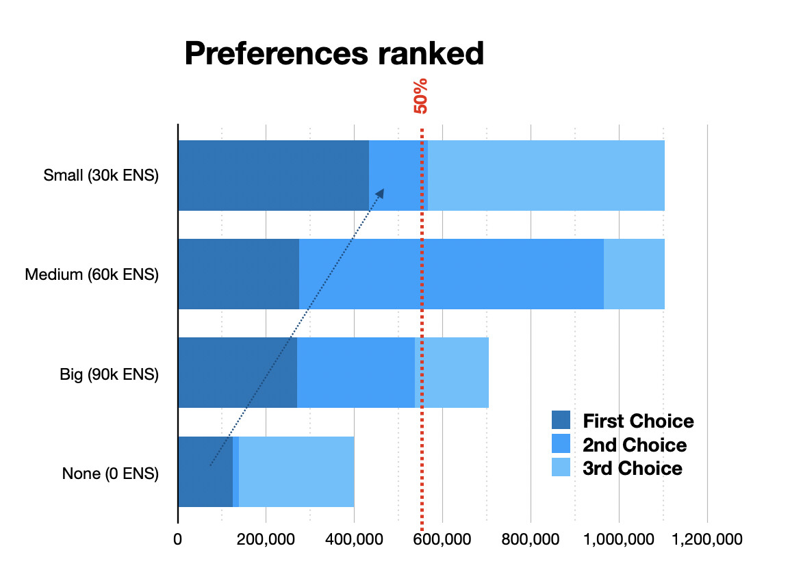
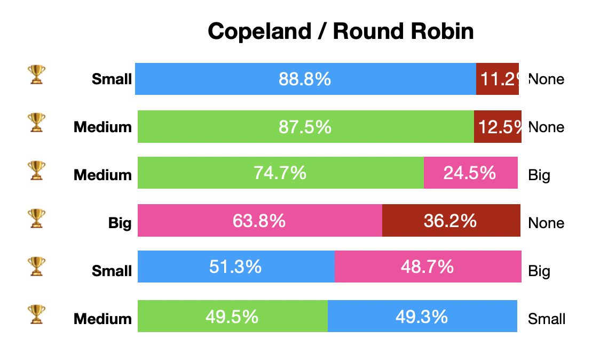

The DAO has voted and it has approved [EP5.19 with the project having being set as a budget of 30k](https://discuss.ens.domains/t/ep-5-19-social-governance-distribution-pilot-program/19759). Since I am a big governance geek and I have been vocal about my issues with Ranked Choice voting and its alternatives I’d like to analyze the resulting data.

Before, I’d like to clarify that this is a debate on how different voting methods lead to different result and not a complaint about the result itself. I would have been writing this regardless of the outcome. In fact the choice I voted as my first choice did not win and there is no way of analyzing the data that it would’ve won.

First, probably the best graphical analysis of the vote can be seen on [https://dhive.io/proposal/1478/analytics](https://dhive.io/proposal/1478/analytics) 

<figure>

</figure>

The vote’s purpose was both to approve the pilot program and to decide its budget. There were three different budgets, let’s call them Big, Medium and Small, and the option of Rejecting the program as a whole, which set the budget at 0.

Looking at the graph above we can see some interesting things: first, the 10 largest votes represented 90% of the final voting power, and this is the main issue the pilot program is trying to address. The second interesting thing is that everyone’s first choice was roughly split equally in 3 ways, with only one major vote outright rejecting it. For those used to First past the post, even with runoff elections, “vote splitting” is a bad thing, but ranked choice vote is designed to solve that.

In the current scenario the only vote to reject the proposal received the least amount of votes, so that ballot’s voting power was then redirected to the Small option, leading it to reaching over 50% of the votes and therefore winning.

Another visualization of the same data is below:

<figure>

</figure>

First, second and third choices are here visualized as different shades of blue. We can see the same scenario: the option for a budget of 0 was the least voted, so these votes were then transferred to the Small option (blue arrow), taking it over the 50% line (red dotted line). But interestingly, this was the ONLY moment where a second choice ballot was considered. The second choice values of the voters that voted for all the other options were never considered. This could lead to some strategic voting: voters who want the largest possible budget would do well of changing their voting preference to put Medium as their first choice and Large as second.

In fact if instead of a ranked choice, let’s assume this election was an approval voting. And for simplicity’s sake, let’s also assume that voters “approved” their first and second choices and did not approve their third and fourth.

In this scenario, the small budget would’ve won 51% of the approval, as it happened with the Instant Run Off method. But the Medium Budget would’ve received an 87% approval! A Big budget would’ve received 49% and the rejection is at 12%. This is because in the current Instant Runoff, the secondary options of most ballots are not being taken in consideration, we are only counting the secondary options of candidates who were eliminated in early rounds.

However, if we assume all voters approve their top 3 preferences, then Small and Medium are tied. This would basically be an election on the least rejected option and it would ignore voters preferred outcome.

This means that if the choice was only between 60k and 30k, then the Medium sized budget would’ve won by a large margin. We can graph all those choices, using the exact voting data as follows:

<figure>

</figure>

Putting all the options like this, is called a Condorcet Analysis. We can see that a Medium Budget would’ve been preferred by all voters over any other option (although it’s a very close call when compared to a small budget). The Medium option is what is called a Condorcet Winner, meaning it wins over all other options. The NONE option is a Condorcet Loser, as it loses all one to one comparisons.

This analysis also helps us see how the vote can be changed. Before, a voter that wanted a larger budget would do well by switching their vote from Large first and Medium second into a Medium first and Large second. In this Condorcet scenario that wouldn’t matter, as the Medium x Large preference is very strong.

In this scenario however we can see the closest comparisons are Medium vs Small and Small x Large, both that are almost a tie. But unlike the previous example, a voter who’s interested in the smaller budget possible doesn’t have many options rather than changing someone’s else vote from ranking Medium over Small to the opposite.

There are many ways to tally a Condorcet Election but when there is a clear Condorcet winner, then they always result the same. What is in my opinion the most straightforward method is Copeland/Roundrobin, in which you just count up the victories.

The only issue here is when there is no clear Condorcet winner, then a tie could occur. For example, a big voter that preferred Big over Small over Medium could change the metrics so that the last two disputes would result in a tie. This is why we need to have separate tiebreaker metrics. Here are them for this data set:

<table>
<tr><th></th><th>Victories</th><th>Avg Support</th><th>Margin of Victory</th><th>Worst Defeat</th></tr>
<tr><td>Medium (60k ENS)</td><td></td><td>70.5%</td><td>41.8%</td><td>0.0%</td></tr>
<tr><td>Small (30k ENS)</td><td></td><td>63.1%</td><td>40.1%</td><td>0.2%</td></tr>
<tr><td>Big (90k ENS)</td><td></td><td>45.7%</td><td>27.7%</td><td>50.1%</td></tr>
<tr><td>None (0 ENS)</td><td>-</td><td>20.0%</td><td>0.0%</td><td>77.5%</td></tr>
</table>

In the current Data Set, the Medium Budget has 3 victories. It also has an average of 70% support across all comparisons, it has the highest average margin of victory and has the lowest rejection.

### Conclusion

This has been a close election. While the proposal itself was widely approved (as seen by the low numbers of the NONE option), the highest budget was unlikely to win. Medium vs Small budget were a close call, and the result could’ve changed depending on the vote method.

But most important of all is the transparency of the election and it is my belief that Round Robin elections provide more of that.
