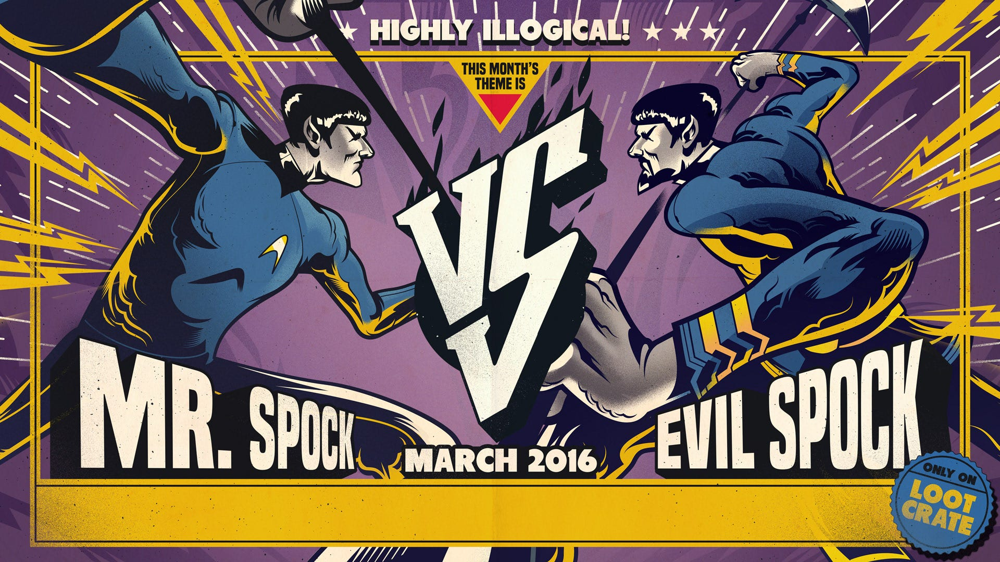
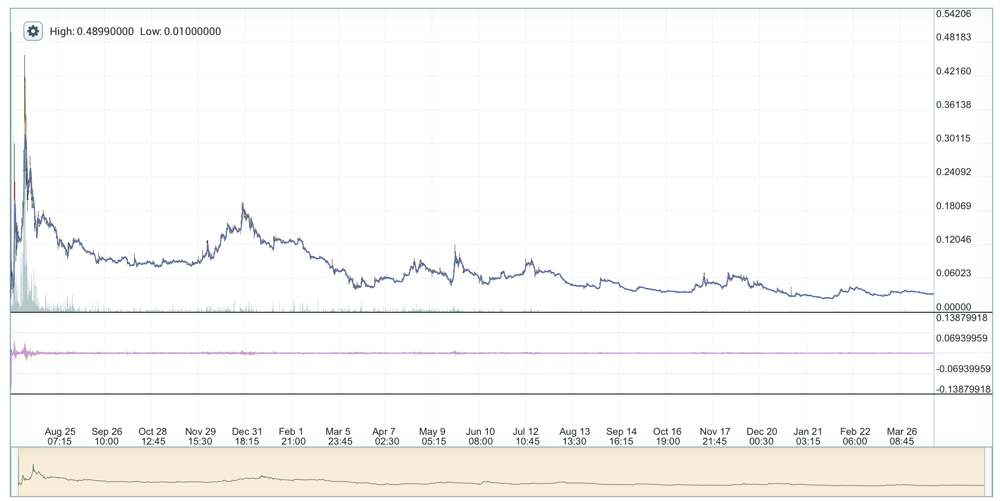

<figure>

<figcaption>art by <a href="http://gabrielsilveira.com/loot-crate-versus">Gabriel Silveira</a></figcaption>
</figure>

Parity has recently [proposed an EIP](http://eips.ethereum.org/EIPS/eip-999) to recover funds lost on the accidental destruction of a multisig library, which held hundreds of millions of dollars at current value by multiple teams. There are [many debates rehashing the same arguments of the DAO hard fork](https://ethereum-magicians.org/t/eip-999-restore-contract-code-at-0x863df6bfa4/130/47), about immutability, precedent and moral hazards. I’d like to present a new side by talking what has changed between now and 2016 in the ethereum platform: a lot of new tokens and a new understanding about forks.

### If you build it, they will split it

The first, most important is that forks are not only **possible** but can be **profitable**. Saying this now might be obvious, but there were many people who believed, back in 2016 that once a chain split, one of the sides would eventually die out, as economic and social incentives were worked against coexistence. Actually the opposite happened:

<figure>

<figcaption>ETC/ETH: started at less than 0.5%, to almost 30% then back to less than 10% in a few months</figcaption>
</figure>

- Coin media sites have an incentive to discuss any new fork of a coin, as long as it has any sort of narrative behind it on why it makes more sense
- Even if someone doesn’t believe in the narrative, if they believe that someone will believe it enough to buy it allows speculation (specially if you already had the coin for free)
- There’s an incentive for smaller exchanges to be the first to list a controversial new coin as it attract users and more fee
- mining cost will always adjust to profitability eventually (in ethereum classic it happened in a matter of days)
- The smaller the coin is, the higher upside potential to speculators. If you model two coins as prediction market on which will succeed, the main coin dropping from 99.5% of certainity to 95% might be a slight drop, but it’s a 10x increase in price for those who invested in the small fork
- These early speculators can use their gains to fund development and bootstrap a community that therefore can become self-sustainable
- When forks can’t sustain a narrative or a community, they can still be used by scammers that can use a very iliquid market to manipulate market caps and lead users to compromised versions of the main tools to steal private keys

The main point being: the same censorship resistance, antifragile and self-bootstraping properties of blockchains in general that were able to get most cryptocurrencies off the ground and sustain them long term, apply to any chain splits, making forking a highly profitable venture. As long as you can have any reasonable narrative behind both forks, **giving the option to chain split will inevitably lead to a chain split**.

### Ethereum in 2016 was an experiment, in 2018 it’s a platform

The rules in the previous section applies to all coin forks, be it Monero, Bitcoin or Ethereum, but usually a fork only applies to the coin itself and only matters for very few traders. But with ethereum, there’s a crucial difference: Ethereum is a platform of a thousand tokens. When the DAO raised a hundred million dollars in ether, that was seen as high milestone for crowdsales. But since then, hundreds, maybe thousands of ICOs were built in Ethereum, capitalizing that trend. In the case of another Ethereum Split, like Ethereum Classic, then every single one of these tokens (and apps) will also have their own forks to deal with. What happens to them? Let’s break them in categories.

#### Tokens as future promises

Many tokens created out of ICO’s have very little built-in functionality and are worth a promise: it will be used in a service or product yet to be built. In these cases, once two tokens exist, the developers will be forced to take a stand and say what they will do. It might be as simple as a blog post clarifying which chain they’ll fulfill their obligation on, but it might also have to involve some sort of community vote or debate. Either way, they will be forced to take a clear position on a debate that they might have no interest in participating and see themselves be dragged in a hot political debate. For small teams it can be a terrible distraction from their main goal, and for some larger projects might involve lawyers.

#### Tokens are asset custody

Many projects in Ethereum are meant to be backed by something in the real world: gold, oil, real estate. They can be a simple promise by a central company, an so it’s treated like any promise token, but often these projects (or at least the good ones) try to give further guarantees to the user that takes a bit the centralization risk. After all, a token backed by precious metal isn’t worth much [if the company that holds them is seized by the government](https://en.wikipedia.org/wiki/E-gold) or simply disappears out of thin air. But in the case of a chain split, from the point of view of the minority chain, the token will behave as if the company simply decided not to make good on their promises. How exactly this behaves will depend completely on the legal framework and the tech stack that the organization created to defend itself — and it doesn’t matter which argument the company uses to choose a chain, it’s guaranteed that someone unhappy with the decision, or just wanting to try their luck at doubling their gold reserves, will want to test it out.

#### Tokens as smart contracts

Tokens that have a more complex contract behind them that decides how they behave are few, but these are also the ones most valuable and best fit to the ethereum ecossystem. A prime example would be the [DAI token](https://coinmarketcap.com/currencies/dai/#charts) which uses a complex CFD enforced by smart contracts to guarantee a constant value at $1. In order to do that it uses ether as a collateral and the MakerDAO tokens for last resort valuations and governance. If a chain split occurred, what happens to the Dai holders, do they have now twice the amount of dollars? Since it’s entirely possible to build DAI in Ethereum Classic, if the system works perfectly it’s plausible that the peg would hold in both sides, but at the cost of the collateral owners.

The first things to fail on the Dai would probably be the oracles that input the current price of ether in dollars, used as a basis. Multiple oracle sources are used and they can be updated by MKR holders (more precisely holders of the _split_ MKR token) in case one of them malfunctions, but it’s a process that by design requires time and in this case all of them would stop working at the same time. If the oracles keep working, then the system would work as if there was a sudden sharp drop in ether price, and dai will be burned in exchange for the remaining collateral. If the drop continues, new maker dao split tokens will be issued as a lender of last resort. Maker is working on a DAI that is collateralized by multiple ERC20 tokens: in the case of a chain split, suddenly some of these would be valid and some not, making the situation worse.

Best case scenario the system would stabilize back, with most of the DAI holders being made whole but the CFD creators having lost their collaterals on the minority chain and the MKR holders being extremely diluted out. The technology would be seen as solid, but it would be like testing aircraft safety by removing both engines of a fully loaded passenger jet mid air.

#### Dapps and games

Ethereum is more than tokens of course, it’s also a platform for apps, games and other sorts of experiments, and all of them would also be split in a similar way. If you [are playing a board game](http://ethernalgo.com), then you’d suddenly be playing two identical games concurrently, and would have to keep playing both or forfeit the winnings in one of the chain. If you [own rare online cats](http://cryptokitties.co), now every one of them will have an evil twin in a parallel universe. Similar things would happen to IOT devices, or [smart oracles using embedded chips](https://www.smartcontract.com).

And in every single one of these cases, developers would be asked to support both chains, and in every one of them a smaller version of the same arguments of which chain was the “best” one would be rehashed. Exchanges are an even worse case, because they will suddenly have twice the amount of tokens to support and then they have to figure out which ones are valid in each chain.

### Conclusion: splits are bad

Imagine if Google employees could vote on some political stance and then every single android developer would also have to explicitly take an action agreeing or disagreeing. No developer gets into a platform looking for uncertainty, extra support work or having legal troubles for their app with issues on the underlying technology.

During the past years since the DAO hack we learned two important lessons:

- When a controversial fork is proposed, **then the end result is _not_ a _vote_ but a _split_.**
- As long there’s a sustaining narrative, **both chains will coexist for a long time**
- Splits happen not only to the underlying token **but to all projects built on top of it**

I sympathize with all the affected parties by the Parity multisig wallet disaster that got their funds locked, just like I sympathize with the many projects that had their ether stolen (some also due to another parity bug). I also believe when they say the web3 foundation (the largest invested party) is a serious organization bounded by their mission and the Swiss law to invest their funds in research and decentralized tech. But I think for the sake of the platform, it’s not fair to create a burden on every token. I believe the way to move forward is to build not only better contracts but also insurance systems to hedge against eventual failures and to create a (voluntary) fund to minimize the damages to victims of these failures. Chain splits are bound to happen eventually, but they should be only risked when the whole ecossytem is at risk or needs some sort of upgrade.

The cost of forking might be to create and fund and adversarial community, as if a parallel universe collided and out of there jumped an alternate version of you with a goatee, whose mission is remind you of all the potentially bad decisions you took, and to prove they are worthier than you.

Let’s avoid invoking our evil twins.

<figure>

</figure>
