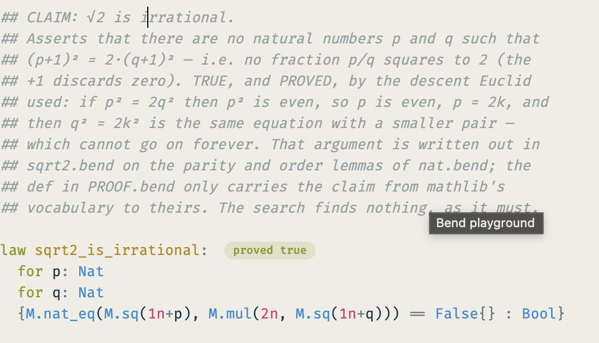
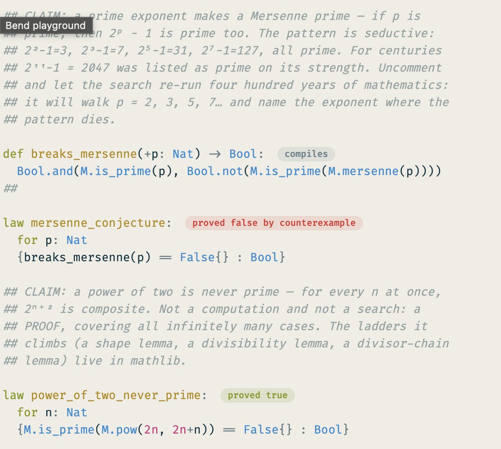
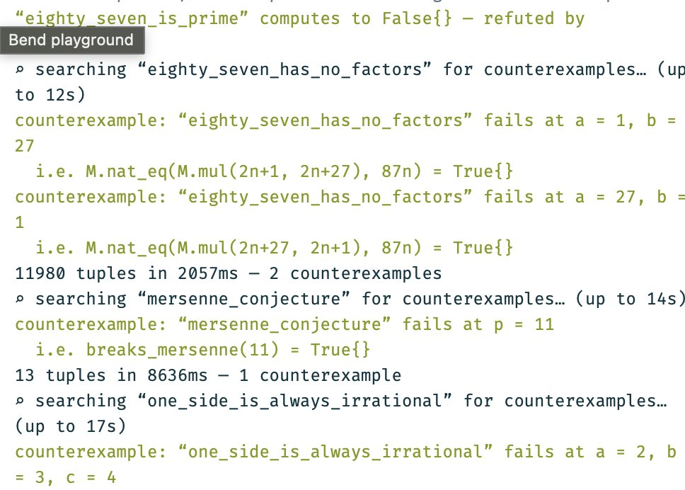
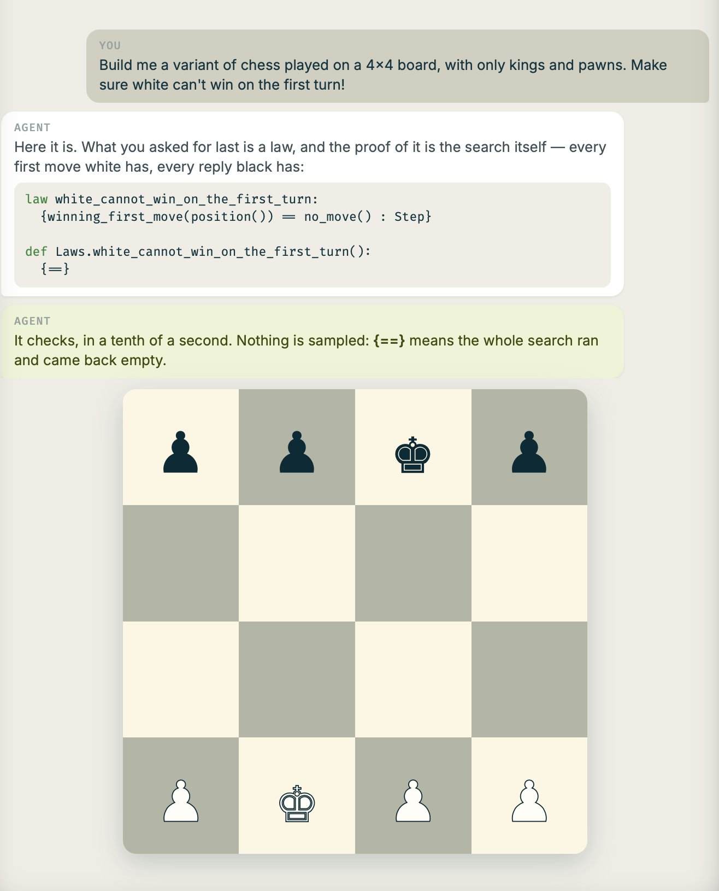
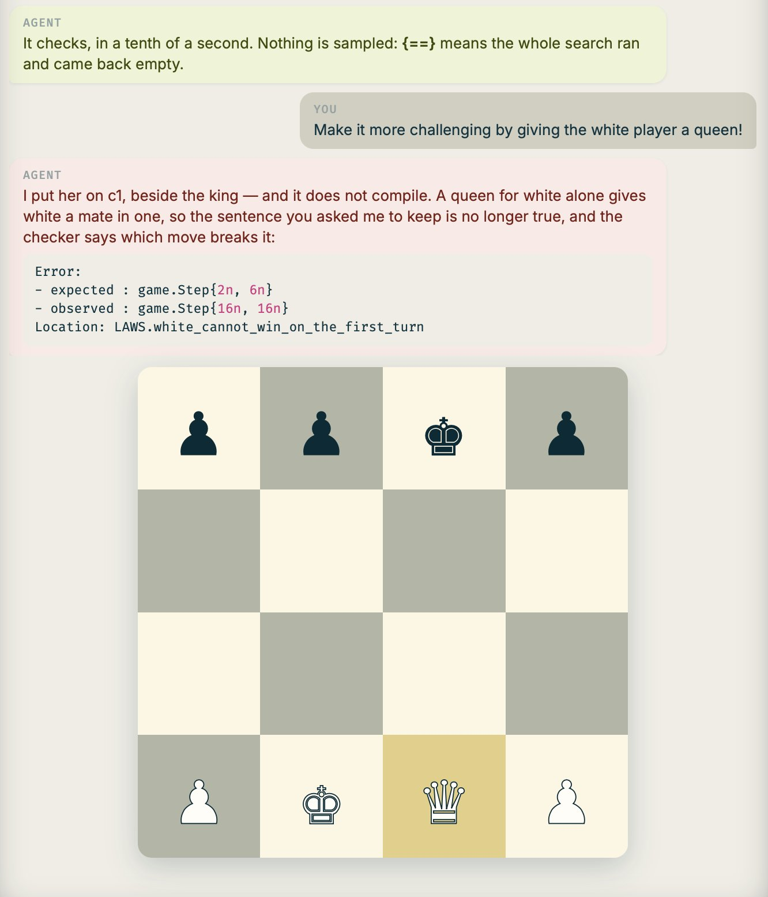

Victor is a brilliant engineer. He built formal verification for the EF 7 years before leadership started talking about it as a priority. He pivoted the company to "symbolic AI" way before AI could solve Millennium Problems and vibe coding was a word. He was so focused on parallel computing he coded a computer from scratch. You should try bend.

If you're also a developer and love terminals, you should follow the [official site](https://higherorderco.com) and install the script.

But for everyone else I build [this site](https://bend.how), to help you give your AI superpowers. Check the demos and paste the prompt!

## So what is it?

You've heard about AI solving Erdos Problems every day. How do they do it? They can do it because math has been formalized in code, mostly by Lean (also a Brazilian developer BTW).

Like Lean, Bend is formally verified. Here's an example of it finding proofs in your browser! [bend.how/math/](https://bend.how/math/)

Now imagine you did that for anything in your code. Imagine you are vibe coding a game and want to make sure the agent doesn't break some fundamental rules.

In this example I built a tiny chess board and added a fundamental rule of white cannot mate in one. Then I asked the AI to add a queen and it refused to do so, because doing that would break the fundamentals of the game.

Can you do it with Lean? Sure, but Bend is not only formal verification. It's about parallelization. Every code runs on the GPU. Anything that can be parallelized will be. It's like writing in CUDA.

I asked Bend to generate these fractals for me – it's not always guaranteed, but more often than not it would make my code 2-10x faster, without any extra effort. I just told it "build it with bend and see what happens". And every pixel is verified to be correct.

For parallel tasks it's great. Not always. For Mandelbrot it was a 100x. Mandelbulb 60x. In Lenia it gave me a 6x improvement. Particle Life was a 5x. Basic Game of Life was a tie. Try it yourself, ask your AI to run the benchmarks and see what it thinks!

I am very excited about the project. Right now it's all open source and free to the world. We are building hoping the world appreciates it.

Ask your agent about [Bend](https://bend.how).
