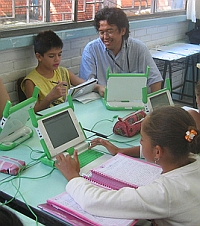

Brazil has officially opened a request for proposals for 150,000 "educational laptops" for it's Um Computador por Aluno project (One Computer per Student, in Portuguese) and OLPC looks to be the preferred candidate.

<figure class="float-right" style="width:50%">

<figcaption>Brazilian children's future?</figcaption>
</figure>

**Brazil's UCA Laptop RFP**

As the law mandates, the RFP is open for anyone to bid in, but the way the [official solicitation is written](http://www.olpcnews.com/files/Brazil-Computer-RFP.pdf) it becomes clear they already have a winner in mind. The bidding demands that the laptops must have:

- A gnu-linux operation system
- A video camera, microphone and audio output
- Support temperatures between 5 and 41 degrees Celsius
- A screen at least 7 inches, a minimum 800x600 pixel, not too much reflective on highly bright areas and have a high contrast in dark places
- And the ability to mesh network with one another

If that does not fit the XO laptop description enough, the final winner will be chosen based on who comes with the lowest price. Proposals will be accepted between December 18-20 so if Intel wants to be in the game they have no more than a week to have a serious update on their screen and a mesh network capability.

There's only one requirement that may make One Laptop Per Child sweat: the laptops must have a minimum of 36 months of full warranty. That's far from the naive "kids will repair it" maintenance plan of OLPC, but is in line with the [Brightstar promise to OLPC Uruguay](http://www.olpcnews.com/countries/uruguay/olpc_uruguay_buying_xo_laptops.html).

**Equal Distribution**

The laptops are intended to be distributed in 300 schools throughout all 26 states of Brazil equally, independent of state population. For a contrast 4,600 thousand laptops will be distributed in the Amazon state where the total population is 3.2 million while São Paulo with it's population of 40 million will receive only 5,500.

Brazil is a country of over 180 million people with at least 8 million kids aged between 5-9. Just 150,000 might seem shy when compared to the 250,000 of Peru or even 100,000 for the smaller 2 million habitants neighbor Uruguay. But seen as a whole it seems that South America is seriously intending to be the forefront of OLPC for 2008.

And here is a preview of what Brazilian teachers might experience soon, when laptops start to invade classrooms. Professora. Tania da Escola Luciana de Abreu Fala in Luciana de Abreu School, Porto Alegre speaks about OLPC Brazil in her classroom:

Translated video from [OLPC.TV](http://olpc.tv/2007/10/07/subtitled-teacher-tania-from-luciana-de-abreu-olpc-test-school/#respond).
