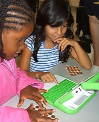

<figure class="float-right" style="width:50%">

<figcaption>Brazilian OLPC Game Jam</figcaption>
</figure>

From 10 to 11th November, Sao Carlos, a city in Sao Paulo, hosted the first [Brazilian OLPC Game Jam](http://blog.ericksouza.com/participei-do-game-jam-brasil/). Six groups of students spent 48 hours, some without sleep, developing new games from scratch to the Sugar platform.

Sunday kids from local schools were called in to the daunting task of playing all the games and choosing a winner, which took home a brand new green machine to continue developing.

The main goal of course was to seed developing of games, no one was expected to have a full complete game without errors, but a playable version that can be further developed. The winner was a game of Pong with a twist: they used the XO tablet mode to build a game for two players each one sitting opposite to each other.

The other games developed were:

- [ReciclaPY](http://code.google.com/p/reciclapy/) a circling game with educational purposes. Kids must direct the falling trash to the right basket
- Math Balloon: A math game, were each operation is represented by a color balloon
- War of boots (Guerra das botas): Not much information available, but some kind of Nibble games with boots

But developer's (and this writer) favorite was one overlooked by the child judges: [Gambiarra](http://www.youtube.com/watch?v=lU0pcosVJbQ), a The Incredible Machine clone:

<figure class="youtube">
<iframe src="https://www.youtube-nocookie.com/embed/lU0pcosVJbQ" title="YouTube video" loading="lazy" allowfullscreen allow="accelerometer; autoplay; clipboard-write; encrypted-media; gyroscope; picture-in-picture"></iframe>
</figure>

The game seems really fun, and a feat to accomplish so much in a short period of time, although in the developer's own word the visual were poor because they lack graphic skills.

But in the end of the day, it still is a clone. In a perfect world other developers would [follow the steps of Will Wright](http://www.olpcnews.com/content/games/simcity_on_the_olpc_xo.html) and release the source of old games that cannot be profitable anymore to be repacked into new platforms such as OLPC.

"[The Incredible Machine](http://www.amazon.com/gp/redirect.html?ie=UTF8&location=http%3A%2F%2Fwww.amazon.com%2FIncredible-Machine-Even-More-Contraptions%2Fdp%2FB00005KB3J&tag=olpcnewspost-20&linkCode=ur2&camp=1789&creative=9325)" was a product of Dynamix Entertainment, released from the early to mid 90's. Dynamix was bought by Sierra which due to a series of twists is now today a failing arm of Vivendi. Just to sort out who owns the rights to the original TIM game would be more costly than anyone in the company could bother to care.

In the real world, most of those games will end up in the XO platform through some MS DOS emulator hoop, which is barely legal and won't allow innovation as future developers improve the code. Then if developer wants to bring to today's kids the joy they had with computer games the only thing they can do is rebuild it from scratch. In our imperfect world, kids learn from a early age how to jump through legal barriers.

As one Game jam developer described, after playing the game a child replied: "Great! Will you release a pirate version of this?"
