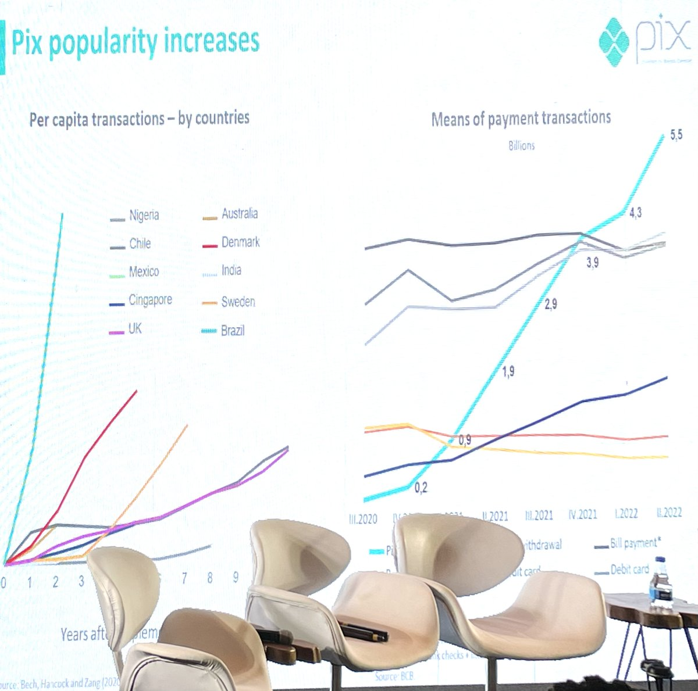

SEC, Anticrypto Army, while the US is waging war against crypto, Brazil Central Bank attended Ethereal Rio to show off their plan to put the Real on chain.|

It's not China's CDBC, but rather a model I predict that will be copied all over the western world.

First, a context: Brazil is fast to adopt new technologies. Everyone already has phones, social media accounts and WhatsApp. Also, Brazil is already a pioneer with digital payments, being the second largest market of digital transactions behind India:

[oglobo.globo.com/economia/noticia/2023/04/com-pix-brasil-fica-em-segundo-lugar-em-ranking-de-paises-por-uso-de-pagamentos-instantaneos.ghtml](https://oglobo.globo.com/economia/noticia/2023/04/com-pix-brasil-fica-em-segundo-lugar-em-ranking-de-paises-por-uso-de-pagamentos-instantaneos.ghtml)

Pix, launched in 2020 was adopted much faster than digital payment platforms anywhere else in the world. You can go anywhere with just the phone and assume it will be accepted, even with informal beach vendors.\
(sorry for the pic quality)

<figure>

</figure>

Brazil's "Digital Real" will be launched by 2024. It's a hard deadline because that's when the Central Bank's president term ends and he made that his top priority. With Pix and open Finance already launched, he wants to make sure his legacy is digitalization.

How does it work? Well it's a sort of compromise that is not intended to be revolutionary, rather it's purposefully built to make sure that it is welcomed by the same players of the current system. It's pragmatic, but also innovative.

The goal is NOT to have end users have a digital wallet, but rather focused on financial institutions. It would use Hyperledger Besu (a Consensys developed Ethereum implementation for private networks) to act as a the famous "settlement layer" between financial institutions.

It would be a PoA network: the Central Bank would basically issue licenses to run validator nodes, but it's open to issue those licenses to any bank, fintech and even other civil society organizations.

It has a strong focus on privacy, but not like you expect: since banks are running it, they want to make sure their own transactions are shielded from other banks.

It means all transactions are private and if the government wants your data it must get it via a court order.

The goal is to replicate the same legal structure of the current system, just more efficiently. There is no "government controlled button" on the people's wallets – at least not any more than they have today.

But the interesting, is really how it enables NEW applications.

They're dead serious about it: besides working with Consensys' Besu they have selected Aave as one of their development partners.

One of their stated goal is to make this local network 100% compatible with the EVM ecosystem and to bridge to it.

[bcb.gov.br/detalhenoticia/17632/nota](https://www.bcb.gov.br/detalhenoticia/17632/nota)

A more long term goal is to adopt the Ethereum  standards to create standardized financial (and non financial) instruments: emit national bonds as tokens, to have official land registries using NFTs, to have public universities issuing NFT diplomas, all on the  national chain.

They are fans of DAOs, NFTs, AMMs and all the Ethereum ecosystem innovations, and want to bring them to the national government.

One national chain for everything, ran by multiple nongovernmental institutions. Not revolutionary, but quite evolutionary in my opinion.

(got a new keyboard and it keeps replacing Ethereum with Ethereal and Consensys with Consensus, so sorry for all these typos)
