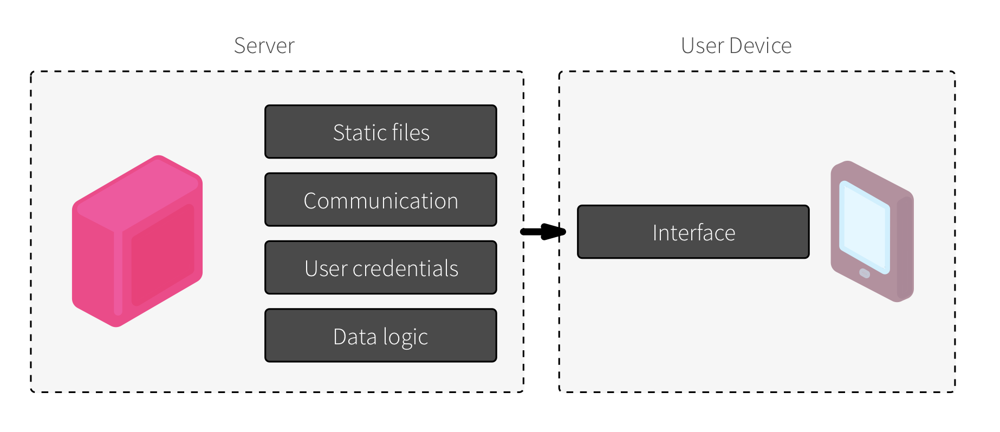
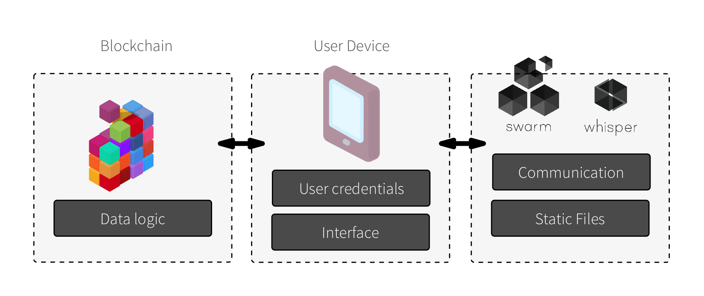
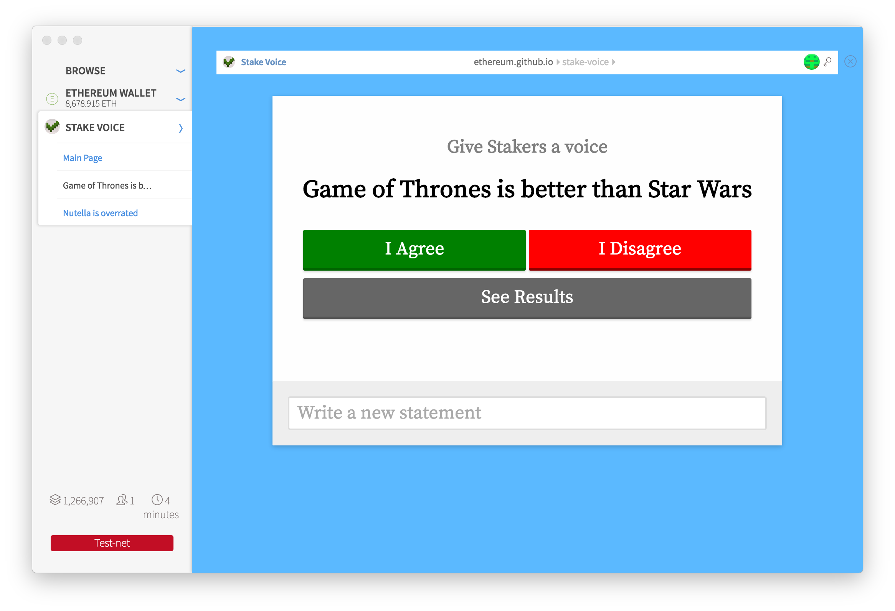

Ethereum is not meant to be a platform to build esoteric smart contract applications that require a STEM degree to understand, but it aims to be one pillar of a different architecture for applications on the world wide web. With this post we will try to elucidate how this can be done and give some basic examples on how to start building a decentralized app.

## Who is this for?

This text is intended at those who have a basic understanding of web technology and how to build a simple javascript and html app, and want to convert these skills into building apps for the Ethereum ecosystem.

## How can apps run without servers?

Currently servers in web apps do much more than what they were originally intended to. Besides serving static web pages, they also keep private information, handle user authentication and deal with all the complicated ways in which data is analyzed and saved. All the user computer does - a device which would be considered a super computer when the web was invented - is to load and display that information to the user.

Current server models

<figure>

</figure>

Instead, a more decentralized architecture would allow a much more modular approach, in which different machines and different protocols would handle specific tasks, some on the user's side and some in specialized machines deployed on a peer to peer network. Therefore all the Data logic (what gets saved, who saves it, how to solve conflicts etc) is handled by smart contracts on the blockchain, static files are served via  [Swarm](http://swarm-gateways.net/bzz:/a600d48f01d5e6d07907d9d14db0ff205624caf0570d0c2601cdb80c9767bcb9/index.html)  and realtime communication over  [Whisper](https://github.com/ethereum/wiki/wiki/Whisper). The user device keeps the user authentication and runs the application interface.

Doing this would remove the danger of data breach and attacks as there are less single nodes keeping tons of unencrypted data, while also removing the load and cost of serving apps by distributing it across the network. Since all those protocols are decentralized, anyone can connect to the network and start providing a specialized service: if the user is browsing from a powerful laptop, for instance, they can also serve static files to network neighbors.

Decentralised Server models

<figure>

</figure>

A decentralized architecture also encourages innovation: since the interface is detached from the data, anyone can come up with a new interface to the same app, creating a more vibrant and competing ecosystem. Arguably, one of the most interesting and innovative periods in Twitter history was when it served mostly as a central data hub and anyone could build their Twitter Application.

## See it working

If you want to experiment with the app before learning it, we recommend you [download Mist and read our introductory tutorial to how to install the app and run it.](https://github.com/ethereum/mist/releases/tag/0.8.0) If you just want to see the whole app instead, you can download it directly from the [Stake Voice Github repository](https://github.com/ethereum/stake-voice).

Stake Voice running on the Mist Browser

<figure>

</figure>

## Let's get to it

We are going to build a very simple application called "Stake Voice". The idea is to allow ether stakers to vote on anything they want, and the app will tally the total ether balance of all those who agree or disagree with the statement.

The app underlying contract is written in [Solidity](https://solidity.readthedocs.io/en/latest/), a javascript-like language and is very simple:

```
contract EtherVote {
    event LogVote(bytes32 indexed proposalHash, bool pro, address addr);
    function vote(bytes32 proposalHash, bool pro) {
        if (msg.value > 0) throw;
        LogVote(proposalHash, pro, msg.sender);
    }
    function () { throw; }
}
```

The first line sets up the contract name and the second creates an event called "LogVote", which will output in the log the following:

- a hash of the proposal being voted on
- if the voter agrees or disagrees with it
- the address of the voter

The function "vote" will then fire the log, which the application later will count. It also has a check that no ether can be sent accidentally. The “anonymous” function is executed when any ether is deposited on the smart contract and will then automatically reject it.

If you want to learn more about coding in Solidity we recommend you start on the [ethereum](https://ethereum.org/token) [solidity](https://ethereum.org/crowdsale) [tutorials](https://ethereum.org/dao), read the [official documentation page](https://solidity.readthedocs.io/en/latest/) and try it on your browser using the [online compiler](https://ethereum.github.io/browser-solidity/#version=soljson-latest.js).

That's essentially it: you choose a hash, choose a side and execute Vote(). So how does this translates into a polling app?

## Serverless Architecture

Following the principle of KISS, we are doing the minimum product possible that is still usable, meaning we won't be using databases for storing proposals or using any feature that requires anything other than vanilla javascript and pure html.

So we will use the URL of the app itself to keep the proposal text, and we will use that to display it to the user and generate a hash that can then be used to check the votes. The users can use social media to share which proposals they want to debate or simply use direct links.

```
// On the initial startup function:
proposal = decodeURI(getParameterByName('proposal'));

// get parameter function
function getParameterByName(name, url) {
    if (!url) url = window.location.href;
    name = name.replace(/[\[\]]/g, "\\$&");
    var regex = new RegExp("[?&]" + name + "(=([^&#]*)|&|#|$)"),
        results = regex.exec(url);
    if (!results) return null;
    if (!results[2]) return '';
    return decodeURIComponent(results[2].replace(/\+/g, " "));
}
```

## Start with basics

So grab your favorite html framework and get a basic website on your local machine and open it on Mist. All pages in Mist have access to a javascript object called web3 which will where you will be working the most. First thing we need to do is check if web3 is present or not:

```
Function init() {
...
if(typeof web3 == 'undefined') {
    // Alert the user they are not in a web3 compatible browser
    return;    
 }
 
```

Some application developers might want to load their own web3 object, to guarantee forward compatibility. To do that, just add just before _\</body>_ tag:

```
<script src="https://raw.githubusercontent.com/ethereum/web3.js/0.16.0/dist/web3.min.js"></script>
```

And then add this on your initial function to load your own custom web3 provider:

```
// Checks Web3 support
if(typeof web3 !== 'undefined' && typeof Web3 !== 'undefined') {
    // If there's a web3 library loaded, then make your own web3
    web3 = new Web3(web3.currentProvider);
} else if (typeof Web3 !== 'undefined') {
    // If there isn't then set a provider
    web3 = new Web3(new Web3.providers.HttpProvider("http://localhost:8545"));
} else if(typeof web3 == 'undefined') {
    // Alert the user he is not in a web3 compatible browser
    return;  
}
```

## Load information from the blockchain

You checked you are connected to a blockchain, but which one? Is it the main ethereum network? Maybe a testnet or a private network? Maybe it's a fork in the future and your chain is a brand new one. The best way to check this is to see if the contract address you want to load has any code on it.

Furthermore, to execute a contract you need to know two basic things: it's address and the ABI, which will be a json encoded file containing interface information.

```
var contractAddress = '0x1e9d5e4ed8ef31cfece10b4c92c9057f991f36bc';
var contractABI = [{"constant":false,"inputs":[{"name":"proposalHash","type":"bytes32"},{"name":"pro","type":"bool"}],"name":"vote","outputs":[],"type":"function"},{"anonymous":false,"inputs":[{"indexed":true,"name":"proposalHash","type":"bytes32"},{"indexed":false,"name":"pro","type":"bool"},{"indexed":false,"name":"addr","type":"address"}],"name":"LogVote","type":"event"}];
```

Now that you have those, you can check if the contract exist on the startup function:

```
// Load the contract
web3.eth.getCode(contractAddress, function(e, r) {
    if (!e && r.length > 3)
        loadContract();
 })
 
```

You can even run this command recursively, to try connecting to it again using another address (in case you are actually on the testnet). Once you have found your contract you can load it up here:

```
Function   loadContract() {
// load the contract to javascript
      ethervoteContract = web3.eth.contract(contractABI);
      ethervote = ethervoteContract.at(contractAddress);
}
```

You are using the web3 object to create a new a javascript object that will be able to execute all the ethereum commands directly from the browser. If you want to load only a single instance of the contract, then you can even do it in one line:

```
    
ethervote = web3.eth.contract(contractABI).at(contractAddress);
```

## Identify the user

Knowing the user's account reveals a lot of information about the user: how much ether and any other tokens it has on its balance, and their transaction history. So having all apps know this by default would create a super cookie and would be an unacceptable invasion of privacy. On the other hand, requiring the user to create an user account with login information for each site is not only a pain for the user, but also puts your private information in control of third parties, which creates giant honey pots that can be breached by hackers.

As a result of this dilemma most users have most of their personal information and authentication information [handled by a half dozen billion dollar corporation](https://xkcd.com/1150/). Privacy should not be a compromise we accept in exchange of practicality: users should be able to easily authenticate into any app while being in control of their own personal information.

Using Mist, apps have no information about the user, until the user decides to reveal itself to the app. When you want to query what you know about the accounts, you should call the getAccounts function:

```
web3.eth.getAccounts(function(e,accounts){
    if (!e) {
        // do something with the accounts
   }
});
```

Currently, the returning object is an array that holds simple accounts that the user has local access to, but in the future it will also hold smart contract accounts the user uses to identify themselves. This will allow the user to have access to features currently available only to centralized authenticators, like two factor authentication or cloud backup, and to future improvements only available to smart contracts, like allowing a few trusted friends to give you access to an account for which you lost keys or having automatic inheritance of inactive accounts.

Each future Ethereum browser will handle how users identify themselves to the App. In Mist we have two ways: either the user can initiate it by clicking the "connect" button (currently it's just called a "no accounts" button) or the App can request the authentication by calling the "requestAccount" api.

Attention: the accounts on this list are just one which the user claims to hold the key to, but the user has provided no proof of doing, therefore you can show a different UI, but don't send the user any secret information intended only to that account. If you require the user to prove their identity you need them to sign a message, while Mist will also support that in the future, keep it in mind that it would force the user to add an extra step and type their password, so you should only use that when absolutely necessary.

## Voting

Once you have the contract as an object, voting is a matter of calling it from javascript. This will pop up a Mist transaction pane, where the user will be able to check the transaction and then type their password. So first we will create two clickable objects that calls a vote function:

```
    
document.getElementById('vote-support').addEventListener('click', function(){ vote(true);}, false);
document.getElementById('vote-against').addEventListener('click', function(){ vote(false);}, false);
```

Notice that one calls the function with a true parameter and the other false. The function vote could be as simple as:

```
Function vote() {
    ethervote.vote(proposalHash, support, {from: web3.eth.accounts[0]});
}
```

"Ethervote" is the object we created before, and "vote" is one of its functions, which correspond to one of the contract functions:

```
function vote(bytes32 proposalHash, bool pro) {}
```

We pass the two parameters demanded by the function and then add a third object containing transaction informations, like who is it being sent from and optionally, how much gas to include or how much to pay for the gas.

Consequently this would generate a panel asking the user to confirm the transaction - but most likely it will return an error because currently the web3.eth.accounts object is an empty array by default, so you have to check for that and if empty, request the accounts to the user:

```
function vote(support) {

     web3.eth.getAccounts(function(e,accounts){
        // Check if there are accounts available
        if (!e && accounts && accounts.length > 0) {
            // Create a dialog requesting the transaction
            ethervote.vote(proposalHash, support, {from: accounts[0]})

          } else {
            mist.requestAccount(function(e, account) {
                if(!e) {
                    // Create a dialog requesting the transaction
                    ethervote.vote(proposalHash, support, {from: account.toLowerCase()})
                }
            });
        }
    });
}
```

You should only request an account once the user initiated an action: pinging a transaction out of nowhere will deservedly irritate the user and probably make him close your app. If we observe abuses from apps using this feature, we might add more strict requirements to when an alert will show up.

## Watch the contract

Finally, to count up all the votes we need to watch the contract events and see what votes were cast. To do that, we have to run this function once to start watching the events, after we instantiated "ethervote":

```
ethervote = web3.eth.contract(contractABI).at(contractAddress);
var logVotes = ethervote.LogVote({proposalHash: proposalHash}, {fromBlock: 1800000});
// Wait for the events to be loaded
logVotes.watch(function(error, result){
    if (!error) {            
        // Do something whenever the event happens
      receivedEvent(result);
    }
})
```

The above code will start reading all blocks from number 1.8M (when the contract was uploaded) onwards and then execute the receivedEvent() function once for each event. Whenever a new block arrives with an event this function will be triggered again so you won't need to call continuously. So what would this function do?

```
Var voteMap = {};
Function receivedEvent(event) {
    // Get the current balance of a voter             
    var bal = Number(web3.fromWei(web3.eth.getBalance(event.args.addr), "finney"));
    voteMap[res.args.addr] = {balance: bal, support: event.args.pro};
}
```

From the original solidity contract, you can see that the LogVote event comes with three argumenst, proposalHash, Pro and Addr:

```
event LogVote(bytes32 indexed proposalHash, bool pro, address addr);
```

So what this function does is that it will use the function web3.eth.getBalance to check the current ether balance of the address that voted. All balances always return numbers in wei, which is a 1/1000000000000000000 of an ether and is not very useful for this particular application, so we also use another included web3 function which converts that to any ether unit we want. In this case we will be using the finney, which is a thousandth of an ether.

Then the function will save the balance, along with the position of the voter to a map based on the address. One advantage of using a map instead of an array is that this will automatically overwrite any previous information about that same address, so if someone votes twice, only their last opinion will be kept.

Another thing we could do is identify the user and show them if they voted or not.

```
// Check if the current owner has already voted and show that on the interface
web3.eth.getAccounts(function(e,accounts){
    if (!e && accounts && accounts[0] == res.args.addr) {
        if (res.args.pro) {
            // User has voted yes!
        } else {
            // User has voted against!
        }
    }
 });
```

## Tally up the votes

Finally, we should add a separate function to calculate the sums of the votes:

```
calculateVotes();
```

Why do we want to tally up the votes on a separate function? Because since the vote weight is based on the current balance of each account, we should recalculate the balances at every new block, event if we received no new event. To do this you can add this function that will execute automatically everytime a new block arrives:

```
web3.eth.filter('latest').watch(function(e, result){
    if(!e) {
        calculateVotes();
    }
}); 
```

Finally, up to calculating the final tally. We have previously used eth.getBalance in synchronous mode, where the app would wait for the result of the previous action to proceed. Here, since we can be calling a lot of actions every block, we will use it in asynchronous mode: you call the node and execute the action whenever it replies without freezing the interface.

```
var totalPro, totalAgainst, totalVotes;
function calculateVotes() {
    totalPro = 0;
    totalAgainst = 0;
    totalVotes = 0;
    Object.keys(voteMap).map(function(a) {
        // call the function asynchronously
        web3.eth.getBalance(a, function(e,r) {
            voteMap[a].balance = Number(web3.fromWei(r, 'finney'));
            if (voteMap[a].support)
                totalPro += parseFloat(voteMap[a].balance);
            else
                totalAgainst += parseFloat(voteMap[a].balance);
            // do something cool with the results!            
        });            
    });
}
```

As you can follow on the code, what the app is doing is looping in each of the voting addresses and getting their balance, and as soon as it returns, it will either add it to the pro or against camp and sum the totals.

## Extra Goodies

A few extra caveats: when there are no events, nothing will be returned and votes won't be calculated so you should add a timeout function on all functions that rely on events from the blockchain.

```
setTimeout(function(){
        // If the app doesn't respond after a timeout it probably has no votes
    }, 3000);
```

Now you can feel free to use all your current webdeveloper foo to work whatever magic you want. Use the numbers to build a nice visualization in 3D or connect to your favorite social media to share the best questions.

Mist also tries to simplify your code by providing some basic navigation and UI methods. If you want your app to be header less and occupy the full height of the mist app, just add this to your \<head> tag:

```
 <meta name="ethereum-dapp-url-bar-style" content="transparent">
```

And if you want to use Mist itself to navigate on your app, you can use the [Mist.menu](https://github.com/ethereum/mist/blob/develop/MISTAPI.md#mistmenu) object:

```
for (item of propHistory) {
    if (item.length > 0 && item != 'null') {
        mist.menu.add( item ,{
        name: item,
        position: n++,
        selected: item == proposal
        }, function(){
            window.location.search = '?proposal=' + encodeURI(this.name);
        });
    }
 }
```

One great thing about ethereum is that you can expand on this simple contract functionality without needing permission: you can add all extra functionality on separate contracts, keeping every single one of them simple and easier to debug. It also means other people can use the contracts you created to their own apps and give new functionality. Meanwhile, all the apps use the same data and backend.

You can play with this app live hosted on [github pages](https://github.com/ethereum/stake-voice), but this isn't the canonical source of truth, just one of the many possible interfaces to it. The same app will also work as a local html file on your computer or on an [IPFS network](https://ipfs.io/) and in the future it will be downloaded directly via Mist using Swarm.

**Some ideas on how you can try:**

- Create a listing of currently available statements. Anyone can check them by seeing the sha3 of the proposal text, so you don't need permission.
- Create threaded comments where users can reply to statements and then upvote or downvote them, sort of like a decentralized stake based Reddit
- Instead of (or in addition to) using ether balance, you can use some other ethereum token, like The DAO or Digix Gold to weight your questions differently. Since all that the original contract stores is the sender, you can check all balances. Or maybe you can create your own currency that is based on reputation, karma or some other way.
