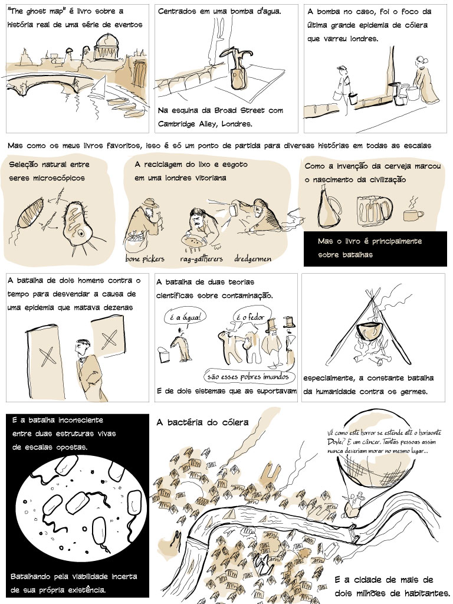

<figure>

</figure>

Leio (ou nesse caso ouço) alguns livros que me deixam pensando muito tempo. Quase todos os do Steven Johnson ou Malcom Gladwell caem nessa categoria, pois são livros de não-ficção estruturados como uma ficção. Ghost map, especialmente é um livro que daria um filme, de tão bem que ele amarra todas as histórias em uma trama central e um cenário rico. Decidi então desenhar a minha recomendação de leitura. É também um ótimo exercício de _storytelling_ resumir tudo a no máximo nove quadros por página, e me trouxe algumas exigências de desenho um pouco mais complexas...
