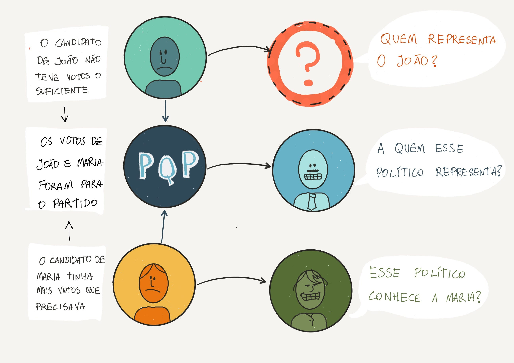
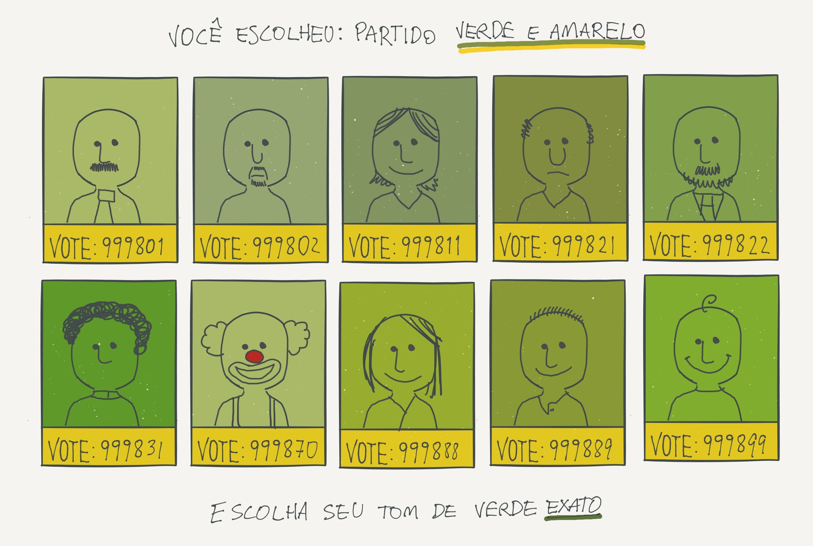
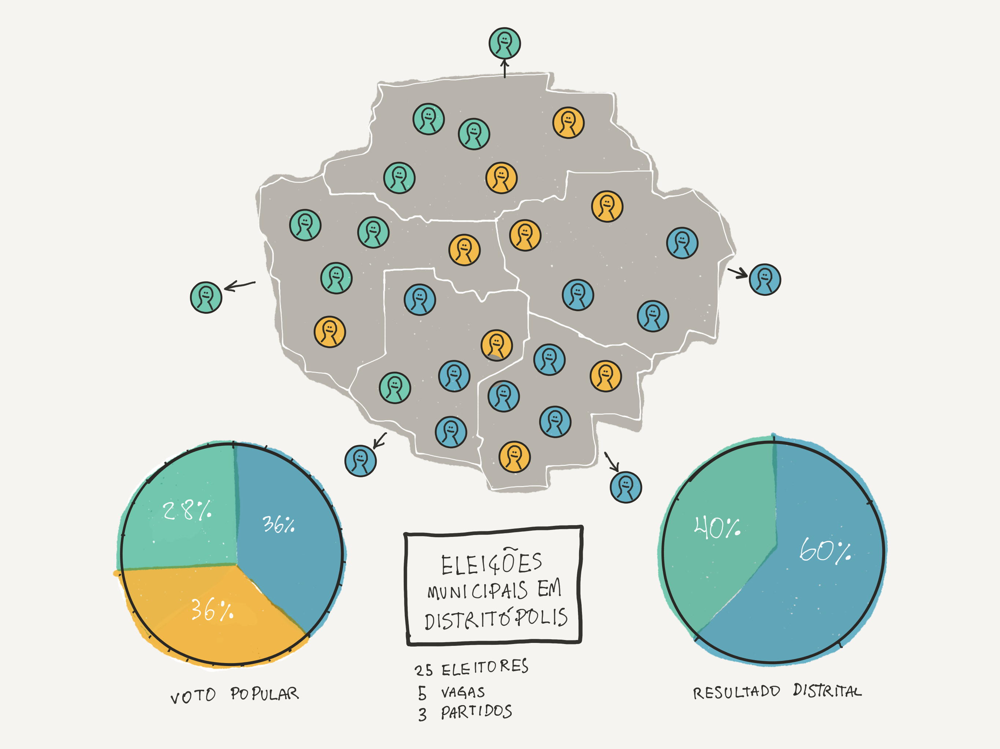
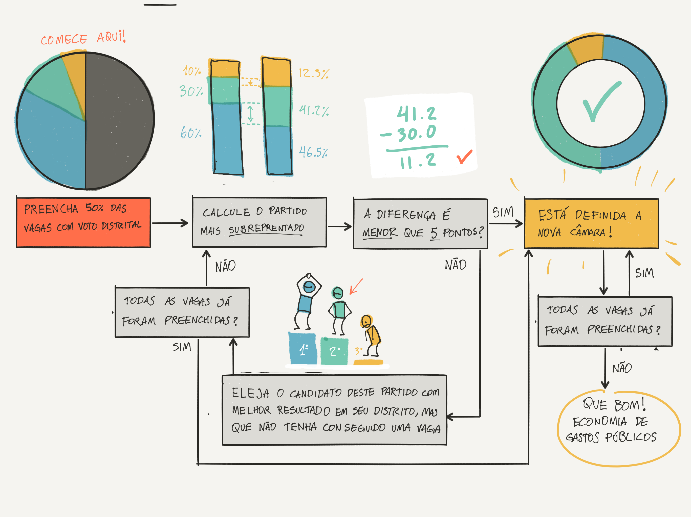

**Repescagem: uma forma de contabilizar os votos que une o melhor do voto distrital e proporcional e pode diminuir os gastos públicos**

Saiu o resultado da última eleição e você provavelmente está focado no que aconteceu no Executivo. Mas essa eleição, foi acaba de ser definida sua nova câmara municipal, que deveria ter um impacto grande no que acontece na sua cidade. E agora, você sabe quem te representa na câmara?

<figure>

<figcaption>Quem te representa em um voto Proporcional?</figcaption>
</figure>

Se o vereador que você votou foi eleito, _parabéns_, você está em uma minoria! Mas se você precisar que ele ou ela te represente em alguma coisa, você tem acesso ou a pessoa é popular e inalcançável demais pra isso?

Se seu candidato não foi eleito, a pergunta fica mais complicada: você é representado pelo colega dele de partido? Ou talvez alguém que mora perto de você mas você não votou? E os políticos que ganharam suas cadeiras por voto do partido, a quem eles representam? Quem é responsável por fiscaliza-los?

Ou será que nessa câmara completamente renovada que nem começou a trabalhar, já vale o clichê:

> Nenhum desses políticos me representa

Sendo tão difícil assim responder a essas perguntas simples, não é de se espantar que estejamos vivendo em uma crise de representatividade onde grande parte da população se questiona _pra que sequer temos tantos desses políticos_.

<figure>

</figure>

Não há nenhuma razão dessa distância tão grande entre políticos e os seus eleitores. No Brasil, um município pequeno tem 1 vereador para cada 500 pessoas, podendo chegar até 1 para 150 mil nas grandes capitais. Parece um número grande mas se você conhece 500 pessoas pelo primeiro nome, e cada uma dessas pessoas puder te apresentar 500 outras, significa que você está a um aperto de mão de distância de 250 mil brasileiros. Mas vereadores e deputados no Brasil são tratados como seres de outro mundo, sub celebridades distantes e inalcançáveis, não um amigo de um amigo.

Pra piorar a situação, durante o período da eleição existem centenas de pretendentes a cada vaga, tornando impossível ao eleitor conhecer a todos, reduziondo-os a números de cinco dígitos (quatro para deputados federais) a serem memorizados. O Brasil tem dez vezes mais prefeitos que deputados, mas enquanto os eleitores minimamente informados conhecem seus candidatos a prefeito, assistem debates e discutem com amigos as opções, quando chega a hora de escolher um representante do legislativo, não existe nada disso. Em geral os eleitores vão em indicação de amigo, rostos conhecidos ou gente que chame a atenção de outra forma. **É assim que o sistema estimula que sejam eleitos velhos políticos, celebridades decadentes e palhaços.**

Não falo de “sistema” de forma genérica, mas especificamente do nosso sistema de contagem de votos, chamado de **voto proporcional**. Seu voto é computado entre todos os outros eleitores e depois redistribuído de acordo com uma série de regras complexas e opacas cujo objetivo é fazer com que os partidos tenham uma distribuição de cadeiras proporcionais aos votos recebidos. Esse sistema foi criado para substituir o sistema distrital, ainda usado em alguns países como Estados Unidos, França e Inglaterra onde os eleitores são divididos em áreas geográficas menores e o mais votado de cada distrito é enviado para a câmara.

Em um **voto distrital**, a fronteira dos distritos e distribuição dos eleitores influencia completamente uma eleição. Dois partidos com a mesma quantidade de votos podem ou tomar controle do congresso ou não ter nenhuma cadeira, dependendo de sua distribuição geográfica(vide abaixo). Essas distorções forçam o eleitor a pensar mais no “voto útil” e não votar em partidos menores que ele prefere. Quando se dificulta que novos partidos possam crescer a renovação política se torna muito mais difícil.

<figure>

<figcaption>Redefinir fronteiras de distritos eleitorais para garantir um resultado se chama <a href="https://en.wikipedia.org/wiki/Gerrymandering">Gerrymandering</a>. Mas mesmo em distritos naturais essas distorções podem acontecer. No caso acima o Partido Azul ganhou a maioria da camara obtendo 36% dos votos, enquanto o partido amarelo, com o mesmo número de votos, não teve nenhum representante.</figcaption>
</figure>

O voto proporcional foi feito para resolver esses problemas mas com ele perdemos a maior vantagem do voto distrital: a relação direta, geográfica, entre o representante e o representado. Em uma eleição distrital, todos sabem quem são seus representantes, e os políticos sabem quem está lá cobrando deles. Além disso, a proximidade geográfica torna mais fácil implementar um recall em caso de escândalo, diminui os gastos de campanhas e faz com que o político seja literalmente vizinho do seu eleitor.

**Será possível ter o melhor dos dois mundos?**

Sim. Alguns países como Alemanha e Nova Zelândia, usam um sistema misto. Normalmente esses sistemas são mais complexos para o eleitor, envolvendo um segundo voto e listas elaboradas pelo partido. Aqui descreveremos um método muito mais simples, que faz esses cálculos de uma vez. **E de brinde, podemos diminuir _até a metade_ a quantidade de políticos.**

##### Eleição distrital com repescagem

Imagine que o Brasil seja dividido em distritos eleitorais de de acordo com sua população. No caso de um deputado federal, cada distrito teria 600 mil habitantes (uma cidade média ou uma zona de uma cidade grande) e no caso de municípios o número iria variar até 250 mil (um bairro populoso) em grandes capitais.

Partidos poderiam lançar apenas um candidato por distrito. Para o eleitor isso significaria o fim de memorizar longos dígitos para cada candidato: para votar no seu candidato, bastaria digitar o número do partido (um voto em um candidato é considerado um voto no partido). Com um número limitado de candidatos por área, torna-se mais fácil a organização de debates locais entre os candidatos e não haveria a necessidade de caravanas passeando por todo o estado ou cidade, possívelmente diminuindo os custos de campanha.

<figure>

</figure>

A eleição se da em apenas um turno, com o candidato mais votado automaticamente ganhando uma vaga na câmara, mas nesse momento **apenas metade das cadeiras é distribuída**. Ao final dessa eleição distrital simples, compara-se a distribuição de cadeiras com os votos conquistado pelo partido no total. Caso não haja distorções significativas (digamos que as distribuições de cadeiras e votos esteja a menos de 3 pontos percentuais de diferença) a eleição é dada por concluída.

**Isso significa que em alguns casos as câmaras teriam apenas metade dos políticos atuais, economizando dos cofres públicos.**

Caso contrário começa o processo de repescagem:

###### A repescagem

Para cada partido, calcula-se a diferença entre a proporção de votos obtidos e cadeiras conquistadas. O partido que estiver mais sub representado (tiver a maior diferença, em pontos percentuais, entre votos populares e composição na camera) ganha automaticamente uma vaga a mais e a preenche com seu candidato mais votado que já não esteja eleito.

Imagine que um partido tenha ganho 120 mil votos dos votos no total de um município de 1 milhão de habitantes mas tenha conquistado a maioria em apenas 1 dos 25 distritos eleitorais. Como ele conquistou apenas 4% das cadeiras mas teve 12% dos votos, ele ganha direito a uma cadeira a mais. Essa vaga não vai para um desconhecido do eleitor, mas para um dos candidatos de outro distrito eleitoral que tenha ido muito bem na sua campanha e provavelmente ficou em segundo ou terceiro lugar. Agora o partido tem 2 vagas das 26 da câmara (7%) e as diferenças entre votos e vagas ganhas são recalculados para todos os partidos novamente.

O processo é repetido até nenhum partido ter uma diferença de representatividade maior do que 5 pontos percentuais entre os votos e as cadeiras, ou até que todas as vagas tenham sido preenchidas.

Vantagens desse método:

- **Menos custos:** Garante-se que na maior parte das eleições as câmaras ficarão com um tamanho menor ao que temos hoje em dia
- **Garantia de proporcionalidade:** a câmara sempre terá uma composição semelhante aos votos conquistados no total
- **Proximidade geográfica:** cada distrito envia um ou dois candidatos, tendo portanto uma conexão direta entre os representantes e seus representados
- **Maior cobranças:** cada cidadão é responsável por ficar de olho em um ou dois vereadores que ele elegeu, facilitando a implementação de um _Recall_ caso a população deseje.
- **Nada de fantasmas:** Políticos só são eleitos se tiverem votação significativa no seu próprio distrito.
- **Menos ou tudo ou nada:** se dois candidatos tem uma eleição apertada, o segundo colocado ainda tem uma chance ganhar uma vaga na repescagem.
- **Sem votos desperdiçados:** um voto em candidato que não ganhe a eleição pode ajudar um outro candidato do mesmo partido que tenha tido uma votação mais significativa em outro distrito
- **Sem puxadores de votos:** pela limitação de distritos uma celebridade muito famosa não pode ganhar mais do que 100% dos votos em uma área, e consegue no máximo ajudar a eleger um segundo candidato bem votado em outro distrito
- **Campanhas mais baratas:** sem necessidade de viagens ou campanhas de alcance nacional, os custos de campanhas são reduzidos

###### Gostei, mas isso nunca vai ser implementado!

O meu maior objetivo com esse texto não é realmente esperar que um sistema desses será implementado tão cedo no Brasil, mas fazer as pessoas prestarem menos atenção nos políticos corruptos que são eleitos e mais nos sistemas que fazem com que eles sejam eleitos. Não acredito que todos os problemas do Brasil sejam causados por políticos desonestos tentando sabotar o país, mas que muitos problemas são, na verdade causados por resultados esperados de defeitos em sistemas complexos que ninguém está prestando atenção. Então na próxima vez que você estiver frustrado com um político ou uma crise, tente pensar em de quem ou qual partido é a culpa, mas o que poderia mudar na forma como somos governados para que os desonestos tenham menos oportunidades.

Discuta entre seus amigos menos sobre pessoas e mais sobre formas de fazer uma reforma política.

**_A desesperança na democracia é algo muito perigoso, e a única forma de realmente mudar algo grande é focar em uma parte pequena que poderia melhorar._**
