On a recent [post I’ve written critically of Instant Run-off voting](https://mirror.xyz/avsa.eth/4pvULeQRqWCS8mMnk_UY1THYt3p6tEQNL0JkCzflcd0), mainly criticizing it for being too complex to visualize the full state of the vote and that’s unintuitive to figure out the winner without tallying up all the votes in your head. I’ve also given a few examples in which the vote result could change drastically by a few voters changing their strategies as well as an example that in a typical race where the most popular candidates were extreme opposites, then the moderate candidates in the middle would be squeezed out. _Hard to predict, hard to understand and prone to surprising results_: those are the opposite qualities you want from a voting system.

Often the rebuttal is “There are better systems, but Condorcet is too complicated for a general audience”. I want to challenge this notion here by trying to explain visually a series of Condorcet compliant systems, as they would be explained to a live audience during multiple phases of an election: polls before election, a running count during it and the analysis and explanations of the result post the count.

The goal here is not merely to educate voters on how a particular system works in general, but to try to find a self explanatory visualization that could be used to show the current result of a vote.

### RCV vs IRV vs Condorcet {#h-rcv-vs-irv-vs-condorcet}

First some short definitions:

- **Ranked Choice voting** is a system in which you rank candidates by the order of your preference
- **Instant Run off voting**, is a specific counting algorithm that takes those ranked votes and spits out a winner. There are many other types of similar algorithms
- **Condorcet** is not a specific voting system but _a feature of voting systems_ that states that the if there’s a candidate that would win against all others in a 1:1 round, then that candidate should be the winner, and if there’s a candidate that would lose against all others that it should never be the final winner. **IRV does not guarantee that this will be the case!**

The first problem here is how precisely one can visualize the state of all voter’s preferences. Because of the very nature of the Ranked Choice, if there are N candidates then there is at least N! ways a voter can rank them (more if voters can decide not to rank all candidates or rank candidates in equal positions). Meaning that if there are 5 candidates there will be at least 120 different ballots, if there are 10 candidates there are over 3.6 million possible ballots!

<figure>
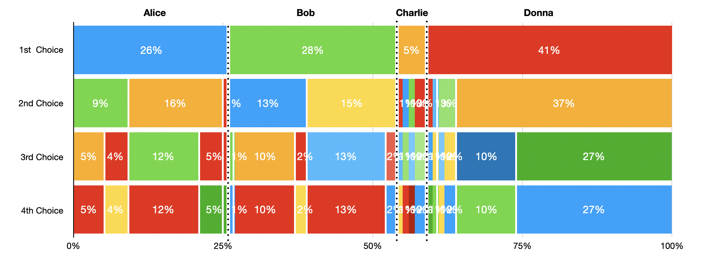
<figcaption>A possible way to visualize all current ballots in a 4 way race, in a series of "DNA strips". Gets increasingly complex as more candidates are added.</figcaption>
</figure>

Probably the best way to visualize the whole race is not to try to show individual ballots but to break down on specific preferences as “different races”. Which is a great because it also happens this is the first step in any Condorcet system. If there’s a candidate that beats all others in a one to one race, then in any Condorcet compliant system that candidate should be the overall winner. But what if there isn’t? That’s where it gets interesting.

<figure>
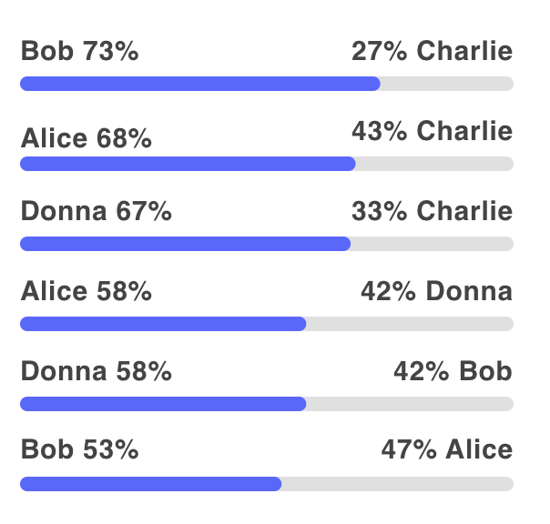
<figcaption>A Condorcet table</figcaption>
</figure>

### Condorcet systems explained simply: {#h-condorcet-systems-explained-simply}

Condorcet are often considered the fairest of voting systems, but are also considered complex and hard to understand. Often because wikipedia articles about it are filled with arcane high magic pentagrams and complex formulas. I hope to challenge that notion.

<figure>
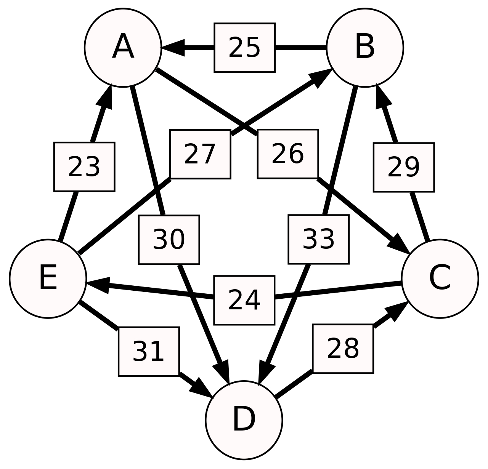
<figcaption>That is NOT how you summon an ancient king to your board of directors.</figcaption>
</figure>

As a UX designer I also felt the need to test these out, and therefore I used [Usability Hub](http://usabilityhub.com) to show the tables of results you are about to see to 40 random users (without any explanation on the methods). Then I asked them to explain how they thought the winner was selected and had them rate each of them in a fairness/clarity score.

### Shulze Method {#h-shulze-method}

<figure>
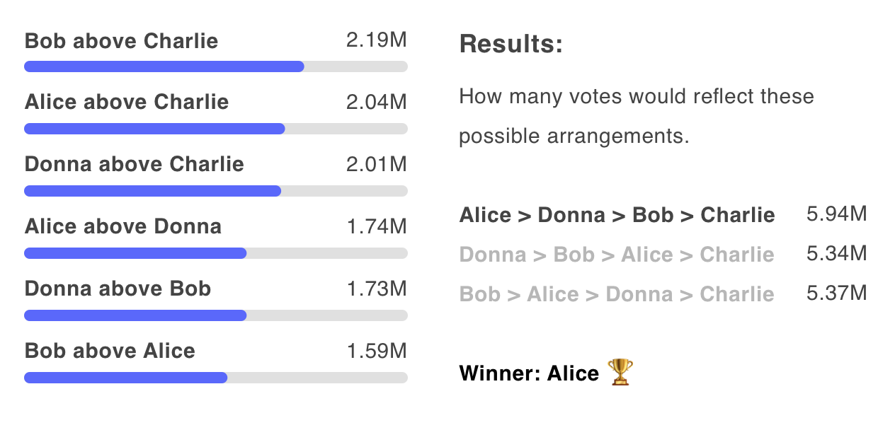
</figure>

While no country has yet to implement Condorcet methods on their elections (except a few cities in specific referenda), Shulze has been used extensively in many boards and associations and tech organizations like Ubuntu, Wikimedia, Haskell, Kubernetes etc. It’s also a very complex black box, that uses the concept of “heaviest paths”.

An easier way to visualize it would be a **rank of rankings.** After ranking all pairwise preferences, you sort all possible rankings by the amount of votes that would support that position. In that particular example Charlie is always on the bottom since it has been beaten on all races. But there’s a cycle of winnings between Bob, Alice and Donna. The way Shulze resolves this is to add all votes that would support a full ranking. So the ranking Alice > Donna > Bob > Charlie would be supported by the votes of all people who ranked Alice above Donna (1.8M), as well as all the votes that supported Donna above Bob (1.7M) and Bob over Charlie (2.2M) but it would NOT include the pairs Bob over Alice (because it would contradict the ranking) nor Alice above Charlie (even thou it supports the ranking, indirect links are not counted in the algorithm).

<figure>
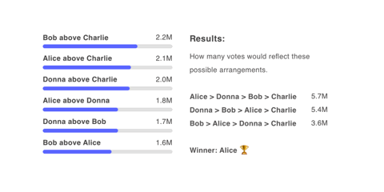
<figcaption>Each final candidate ranking is supported by different pairs. The sum of all these pairs should give the total score of each ranking. Higher score ranking wins.</figcaption>
</figure>

Shulze is, in the opinion of this graphic designer, a hard to describe black box that simply says “trust the algorithm”, which is why it’s so often used in tech companies that, by their own nature, trust algorithms. It’s also probably why Condorcet methods have such a bad reputation as hard to comprehend.

It also rated really bad on the usability test, with most subjects not being able to really understand how it worked. It was rated 2.6 out of 5 for clarity and fairness.

### Ranked Pairs Explained {#h-ranked-pairs-explained}

<figure>
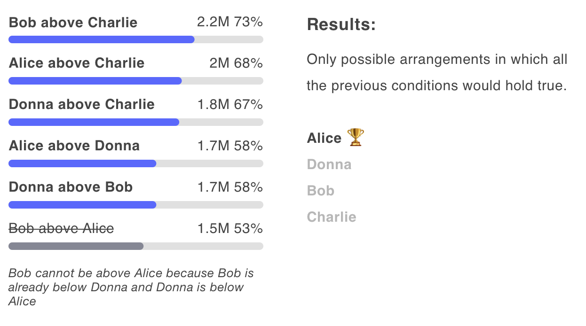
</figure>

Ranked Pairs is a little bit easier to visualize than Schulze, but it still is complex. You rank all pairwise races among each other and start making the rank from top to bottom until you find the only possible graph possible to draw, skipping any contradictions.

<figure>
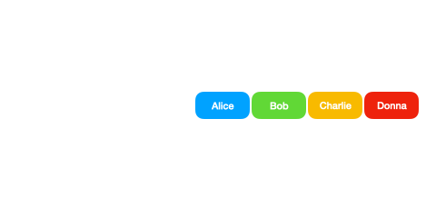
<figcaption>Names are arranged by following the ranks from top to bottom, ignoring any later rank that would contradict an already established relationship.</figcaption>
</figure>

Ranked Pairs did fairly well in the Usability test, being ranked second on the Clarity/Fairness scale but even thou people felt confident to explain it, many still had misunderstandings.

### Minimax explained {#h-minimax-explained}

<figure>
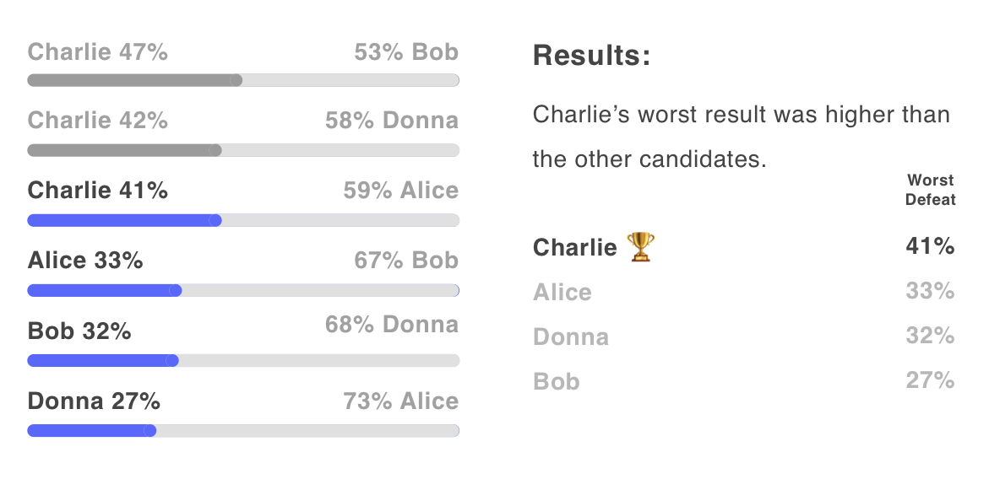
</figure>

Minimax is a lot easier to visualize and understand. You rank all candidates by their worst defeat and pick the one where the least bad one. While it’s guaranteed to always pick a Condorcet winner if there’s one, if there’s none then it might result in picking a _Condorcet loser_! In this example I’m showing how you could have a candidate that **lost all races** and yet was the winner.

For some, it might also feel unfair or lopsided to pick the least worst, but in a way this is precisely the point of the Minimax method: it’s not about picking the most supported candidate but the least rejected. It’s easy to visualize and understand, but it could be seen to be also very unfair and suboptimal.

In the usability test all subjects could explain it with no problem, by just looking at the above image. However it ranked third in the fairness/clarity score, probably due to the fact that many didn’t feel it was very fair (in the test it was the same score for both).

### Copeland Explained {#h-copeland-explained}

<figure>
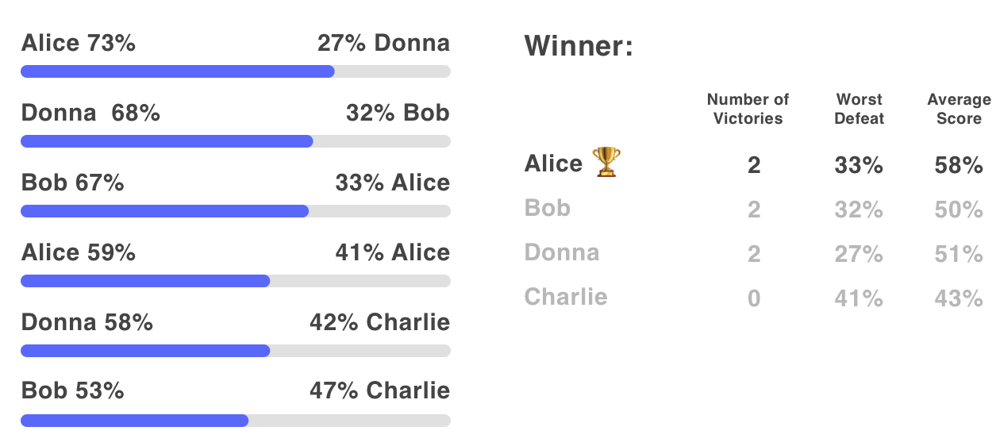
</figure>

Copeland is probably the most familiar and it’s so common that most people have been exposed to it without ever realizing it or even thinking of it as an election system: it’s often used in sports competition. In Copeland, you separate all pair wise races and add a point for each victory (in some systems there’s also a separate score for a tie or a negative score for a loss). Whoever has the most points wins. It seems simple and straightforward and if there’s a single candidate that wins all races it’s guaranteed to be picked, and if there’s a candidate that lost all of them it’s guaranteed not to be picked.

Copeland doesn’t have a proper system for ties, but this is often solved by using Minimax or simply the average Score of each candidate. While Minimax might feel unfair being applied to all candidates, as a tie breaker it feels fundamentally fairer.

In the usability tests, being shown just the image above and no other explanation, all subjects were able to very easily explain how it worked and it scored 3.6 out of 5, the highest for clarity and fairness.

### Conclusion {#h-conclusion}

Condorcet methods are highly considered among academics but rarely used in real elections, due to it being considered too complex and hard to understand. Often states and cities that change to Ranked Choice voting adopt the Instant Run-off mechanism by default, but [IRV is also very hard to visualize and can have chaotic and surprising results](https://mirror.xyz/avsa.eth/4pvULeQRqWCS8mMnk_UY1THYt3p6tEQNL0JkCzflcd0), which is not what you want from an election.

Condorcet Pairwise rankings is also the best way to visualize the current state of all votes. While an election with N candidates will have N! possible ballots, it will only have N×(N-1) possible rankings. When considering polling situations (or even lessons learned for the next election) it’s a lot easier to think about what factors could change: in our current example it’s clear that if Bob wants to stand a better chance of winning, it should focus on how it compares not to Alice, the winner, but how it fairs among supporters of Donna, which is at third place. Bob doesn’t even need to win all of Donna’s voters: if just a 5% of them start seeing him in a more favourable light, then Bob would rank higher than Alice in the Minimax tiebreaker. If the tiebreaker was average score, then the result is the same: if Bob wants to win, just focusing on diminishing his overall rejection among other voters would be enough to tip the scale.

<figure>
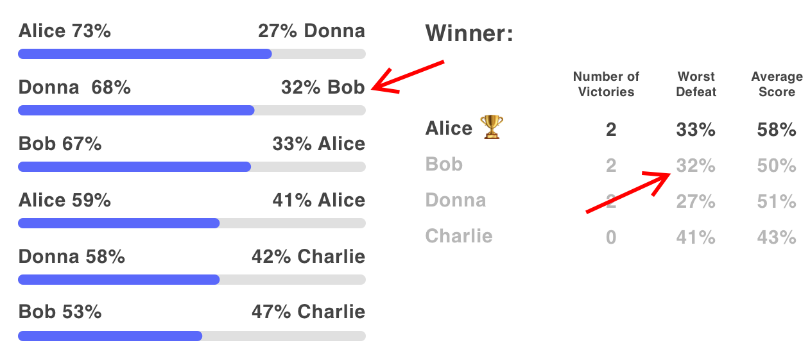
</figure>

After running these little experiments it’s been my opinion that Copeland is by fair the most fair and easy Condorcet method, specially when used with Minimax. It’s so easy to understand that it requires no other explanation than a simple table of results. It’s no wonder: billions of people are often exposed to Copeland style competitions and have no issue understanding who is ahead on a given ranking, because it’s used in sports everywhere.

<figure>
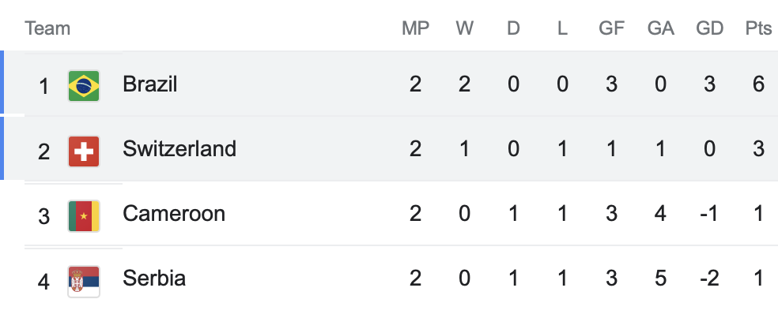
</figure>
