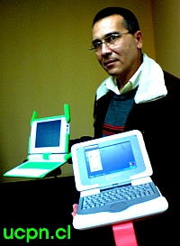

<figure class="float-right" style="width:50%">

<figcaption>Classmate PC over OLPC XO?</figcaption>
</figure>

The [Brazilian auction to purchase 150,000 computers for children](http://www.olpcnews.com/countries/brazil/um_computador_por_alno.html) is on currently on hold after the end of the first round which ended on December 19th. Positivo Informática won the first round of biding with the lowest offer, 98 millions of Reais, 6 million less than OLPC had offered.

No one has had access to details of each proposal but the most probable culprit were customs duties in Brazil which, along with all the maintenance and warranties, brought the total of each XO to $387,39, twenty dollars over the winning model. Positivo had by it's side decades olds tax policies that favors local assembly with lower taxes on electronics components, not ready made equipment.

The model offered by Positivo is still unknown but Intel has already congratulated them for winning, which led all to believe that it's a newer version of the [Classmate PC](http://olpcnews.com/forum/index.php?board=31.0) with built-in camera and mesh networking.

To bring yet more confusion to the issue, in the same morning that the auction began was issued an official statement freeing all candidates of the taxes, but no one, neither the candidates or the auction judges, were informed about it.

Currently the fate of the 150,000 laptops are unknown. The judges consider the price high but the rules allow exclusive negotiations with Positivo Informática - the lowest bidder.

[Jaime Balbino](http://www.blogger.com/profile/00488197231861395226), a fervent OLPC supporter made an interview with [David Cavallo](http://www.media.mit.edu/people/bio_cavallo.html), the main representative of the OLPC in Brazil. They talked about the influence of Brazil in the development of the model advocated by OLPC, the Brazilian development policy, competition against monopolies of technology, the bidding (won by Positive Computing) and the future of the entity without the expansion of the Brazilian experience.

From [Jaime's interview](http://www.media.mit.edu/people/bio_cavallo.html):

Local assembly: the key to Brazil**David Cavallo**: I personally believe that things went somewhat astray for a variety of reasons and that the structure of the governmental purchase request led to a result no one seems to be satisfied with.

<figure>

</figure>

We are a non-profit. Our price to any country, including Brazil, is the cost of the laptop itself. Uruguay purchased the laptop for USD$197. They also purchased in a way that brought connectivity to homes and communities. We will not bid above our costs. We cannot bid below our costs, as a for-profit might do in order to make profit by charging more for other products and services, or to lock out competition and raise prices subsequently.

So the huge price differential was because of the extraneous conditions imposed upon price for the bid. This includes local assembly (NOT PRODUCTION OR FABRICATION, for which conditions do not exist at this time in Brazil), various taxes, shipping (of components which also raises costs), and a 3-year warranty. They also decided to select solely on the basis of price, without consideration of the display, or power consumption, or eco-friendliness, or connectivity in and out of schools."David Cavallo then reminds us that the project can go on, with or without Brazil as they have already enough buyers to make it sustainable.

For OLPC in Brazil, the game doesn't ends until the judge brings the hammer down, and the last message from the auction site was that the bid was closed for an indeterminate time.

If we do not hear from them today, we will probably not hear anything until after the Christmas holidays are over. Or worst, we might have to wait until the new year begins because, as a local saying goes"in Brazil the year doesn't start before the carnival ends."And by then, it might be just too late.

Tags: [Classmate PC](http://www.technorati.com/tag/Classmate%20PC) | [Custom Duties](http://www.technorati.com/tag/Custom%20Duties) | [David Cavallo](http://www.technorati.com/tag/David%20Cavallo) | [Jaime Balbino](http://www.technorati.com/tag/Jaime%20Balbino) | [OLPC](http://www.technorati.com/tag/OLPC) | [OLPC Brazil](http://www.technorati.com/tag/OLPC%20Brazil) | [Positivo Informática](http://www.technorati.com/tag/Positivo%20Informática) | [XO Laptop](http://www.technorati.com/tag/XO%20Laptop) |
