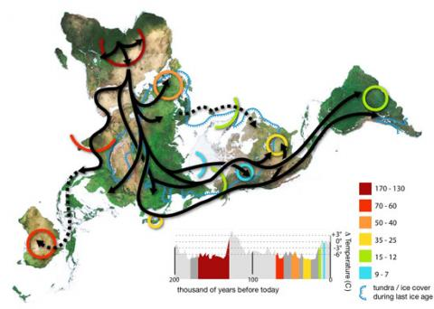
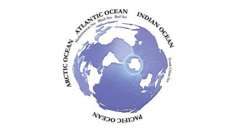
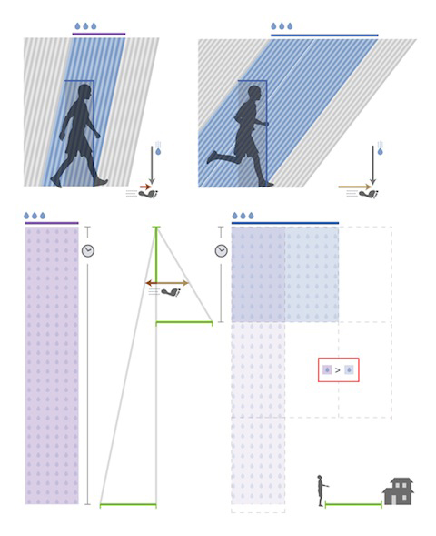

To make the complex visible. to make novel information understandable, with minimal or no words at all. The following are a series of infographs, diagrams and maps that tries to show a different view of things you are used to see. Some where made just for the fun of it. some where donated to wikipedia’s open commons and there where selected by the community as the best of the crop\*. Many made their own way to graduation thesis and books in europe, books on photography and a lecture in MIT.

<figure>

</figure>

### Human world migrations

Based on a [buckminster fuller world map](http://en.wikipedia.org/wiki/Dymaxion_Map) that has almost no distortion on land based distances, this is a map of the how, when and why humans colonized the world, based on mitochondrial evidence. Also plotted is where the ocean was ice during the last ice age, so you can see how the Great Britain was reached by foot. And note that as you can see from the temperature grid, humans migrated more when it was colder, seeking better lands.

<figure>

</figure>

### The map of the oceans

Being a south american I’ve been always fascinated to views of our world that did not centered in europe (as the mercator) or put north as “up”. This one is centered on the antipode of  [Urumqui](http://en.wikipedia.org/wiki/Urumqi), most remote city from any sea in the world. This map was donated for the wikipedian community (where it was chosen ‘featured image’) and someone there described it as “When dolphins become ultra-intelligent, their world maps will probably look something like this.”

<figure>

</figure>

### Running in the rain

_“In a near future, you will be able to write a doctorate only with images.”

Gui Bonsiepe

_

There is a mathematics book from the 19th century that proves all Euclidean theorems using shapes and colours as nouns. Running on the rain is an exercise on visual rhetoric.

The question itself is a popular saying that states that if you run under the rain you will get more wet than if you walk. This may be true, but you also get home faster. So the question is: is it worth running in the rain?

The insight was to represent all variables in this equation graphically. Speed, distance from home and even how much water you get per second are drawn as lines of constant sizes. This way time could be calculated geometrically. The total amount of water is finally calculated as an area, and by comparing those areas one can reach the final (and rather obvious) conclusion:

If you’re surprised by rain, run.

- about: Constantly made during many years..
