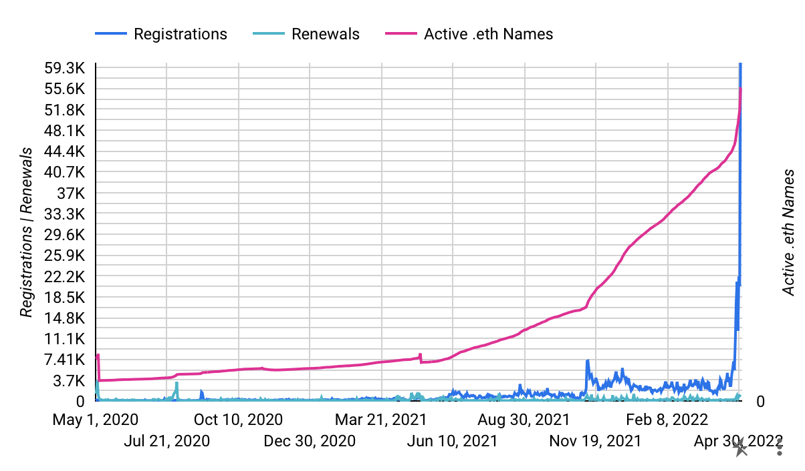
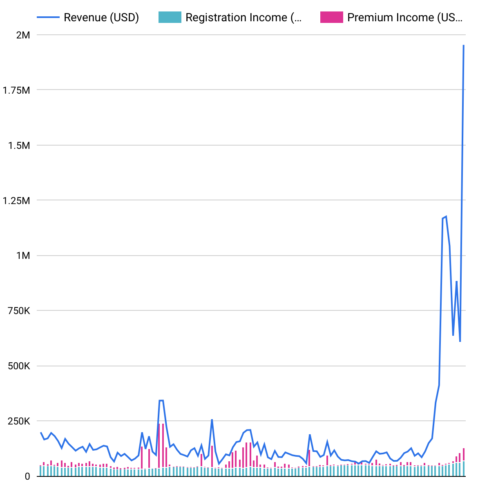
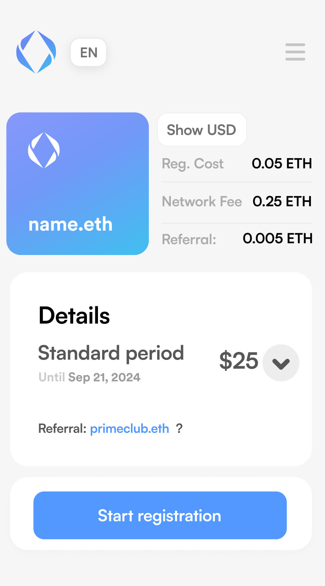

Ressurrecting this debate because I think it’s a great idea and I see no issues with that.

Below is a graph of all revenue for the DAO since the beginning of the year. In terms of registrations ENS is having the best week of the past two years, and in fact it’s the second highest revenue (after august 2020). But in 2020 most of the revenue was coming from premium names, in sheer number of registrations, the current trend dwarves everything else by a LOT. 

<figure>

</figure>

<figure>

</figure>

This can be traced back directly to the people behind 10k club. I honestly don’t think if we had paid a million dollars for an ad agency, they could come up with such strategy (in fact, if an ad agency came with me with the idea to get people to register random numbers I would be the first to tell them off!). We could create retroactive grants that would reward people on the club, but this would certainly create political attrition as there would be discussion on the subjective issues of who exactly should be rewarded, who came up with the idea, etc.

An affiliate program is much better. I propose a very standard process:

1. if someone goes into the main ENS dashboard anywhere with an affiliate ENS on their link, the we save the link on permastorage on the client side. We don’t save anything else about the user.
2. If the user clears his memory, the affiliate ENS is deleted. If he arrives again with another affiliate ENS, then that one is overwritten
3. At any point (even if weeks later for a different domain), when someone is about to make a purchase, if they have an ENS affiliate stored, they will be shown something like “10% of this purchase is going to foo.eth”
4. They should be able to click that and we could offer many options: like instead, give it to savethepuppies.eth or cancerresearch.eth or ensdao.eth or some other charities and orgs that we add to the whitelist. Among one of these we could allow them to add a custom ENS name or even an option saying “I’m selfish and don’t want to share the 10%”.

<figure>

</figure>

nick.eth:

> We’ve discussed this internally in the past. One issue is that if you make the referral program open (anyone can join onchain permissionlessly), someone will set up a “cost plus” registration UI that gives the buyer the referral fee

I see absolutely no issue with that. As outlined above, we could even add that option, transparently, on the UI, to give people a discount, and even shame them with all the good charities they could be giving away to instead. I also suppose that if someone is creating an alternative UI for selling names, they would be much more incentivized to put the affiliate link to themselves (even if it to share it with the customer somehow) and I’m ok with that.

Edit: made a mockup. Clicking on the affiliate link (is there a better name?) would open a popup with a few suggestions of charities or a custom name, which the user could put himself as (or maybe even an option to give it as a discount). I’m ok with raising the prices 11.11% to cover that affiliate fee so if the user doesn’t want it, they can use the old price.

<figure>

</figure>
