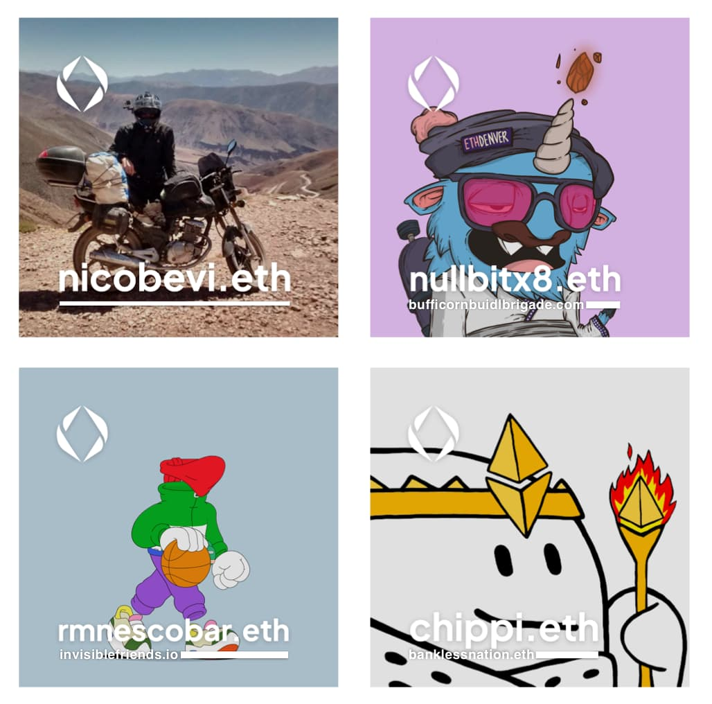

From talking to people, it’s clear the ENS avatar is a very popular feature of the ENS names. It helps communicate that the name represents a profile, and it’s quite popular with NFT holders that want to showcase their favorite ones.

Some NFT holders have asked for us to add some sort of “verified” badge on the avatar, to prove that the image truly belongs to a “verified collection”. I see this as troublesome as it adds centralization end points (the authors of the “verified” collection lists) and it doesn’t fully solve the issue. You can, after all, clone existing NFT and have a “true NFT” that has any image you want. Also, it would requiring having some sort of “non verified” badge for images, which I think takes away from people who just like having their images as their avatars.

I would propose updating the metadata service for ENS with a new layout that includes an ENS name for the NFT collection:

 
 Top left is a simple image avatar, while the others represent NFTs. Notice that some of them are not .eth names.

<figure>

</figure>

The underline on the image avatar helps promote the idea that these names are really links, and could even be websites if properly set up. When the image is an NFT the underline becomes a small text. In small sizes the url might be seen as a simple line, but in larger images you should be able to read the URL.

Because the underline is always on image avatars, someone trying to “fake” their verified NFT by just adding the verification overlay on the image, will end up with a striked out URL.

<figure>

</figure>

I’ve experimented with some other designs, like having the name be inside the line, or on the side, like a copyright notice, but the underline is my favorite so far.

<figure>

</figure>

Notice on how in smaller sizes, a properly designed line just looks like an underline:

<figure>

</figure>

<figure>

</figure>

To prevent homograph attack, I would add the requirement that the name must all be of the same alphabet. If any mixed character set was found (exception for emojis) then the metadata would display it as if it was just an image.

### How do we get the “correct” ens name for a contract?

Of course the whole proposal supposes we have ENS names for major collections of NFTs, many who are already existing and can’t change retroactively to fit a new standard. So here’s how I would propose a standard:

1. **Reverse registrar:** First, of course, if the address is set on the reverse registrar, then we use that. This is what we already do for EOA but very few contracts have support to arbitrary transactions, and even less have a specific function for the reverse registrar.
2. **Allow owner to set it:** update the reverse registrar to allow it being set if a contract has a owner() function (and maybe even if that owner has an owner). This serves a large number of contracts (specially multisigs and tokens) and was in the plan anyway.
3. **Use DNSSEC on the baseURI() or contractURI() address:** these are not part of the erc721 standard but are quite common practice in most NFT collections. Since they need to download the image from somewhere, most are just pointing to an external link. We could use DNSSEC to check if that domain is registered on ENS or if that domain points to an ENS name. This would solve a majority NFT contracts: but there are some exceptions. Namely, some contracts don’t use baseURI, others use it to point to an AWS server they can’t update records to and finally some adopt the (good) practice of using direct IPFS links. For these we’d have to find an alternative solution.
4. Only in the cases that none of these methods worked, then default to a list of addresses → ens names that uses chainlink or kleros as their oracle. This would also be useful for all sorts of other contracts.

This method would not, of course, be limited to NFT verification, but it’s also useful for ERC20 listings or even naming contracts on block explorer and would once again tie ENS to the inner workings of the ecosystem. It’s also a quite decentralized model, in which new collections can verify themselves.

We don’t need to add verification for all collections, but if we can get the top 20 largest ones to do that (or we do it for them) then we could help set that as a standard.
