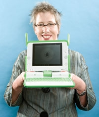

<figure class="float-right" style="width:50%">

<figcaption>Mary Lou Jepsen of OLPC</figcaption>
</figure>

If there's a trend that is universally welcome is the greener technology trend. But in most industries green is sold at a special premium: from organic food to electric cars, you are paying for your eco-conscience. But Mary Lou Jepsen has different approach.

At first when told that to go green would be more costly the OLPC was willing to sacrifice a greener XO for a cheaper but not so green laptop. But as she progressed on the design process it became clear that to build a laptop that cost less also means a laptop that consumes less resources as a whole. In her words:

> "People are trying to make a buck off of green. Green is actually cheaper. Green isn't about (sigh) buying more stuff."

According to a very inspiring keynote she gave at the [Greener Gadget conference](http://www.greenergadgets.com/) in the beginning of February the factors of making a laptop green are:

- Consume less power. According to Mary Lou if every computer in the consumer market had the power footprint of the XO, their total energy consumption could fall 95%. Also by reducing the necessary power it needs to run you put the laptop under the threshold that can be provided by some clever and surprisingly low tech sources, as cows, bicycles or cheap solar panels.
- Expand the lifetime of the product. Surprisingly enough that's a factor rarely factored in when figuring out the impact of a product: how long will it last?
- Repairing is more important than recycling. If disposed the XO battery can be "consumed by soil bacteria" but Mary Lou has a bigger point: by making the laptop easier to service will prevent it from being dumped in the first place.

You can check the highlights of the presentation above, but I would highly recommend anyone actually [watching the whole 50 minutes presentation](http://scribemedia.blip.tv/file/682463/) where she talks a bit about the purpose of her new company PixelQi, the deployment of the laptop and the history of the design.

Or if you attended you could have done as Crackhead did and actually get [Jepsen to sign your XO](http://olpcnews.com/forum/index.php?topic=1908.msg14885).
