_This is a blog format of the presentation given at the Bridges Conference of Mathematics and Art 2024 in Richmond._ [_The original paper the presentation is based on can be found on the Bridges Website._](https://archive.bridgesmathart.org/2024/bridges2024-507.html#gsc.tab=0) _You can also_ [_download the poster_](https://hexagonal.earth) _and print it in large format._

### **Is it possible to wrap a sphere using ONLY hexagons?** {#h-is-it-possible-to-wrap-a-sphere-using-only-hexagons}

This is the question that started me in this journey and the one we will be exploring. The answer has some surprising implications, from the big to the fun. In the bigger side, for instance, Uber stores almost all of its geographical information on ride and traffic data using hexagons around the earth. It argues that doing it facilitates computing [approximate radius and distance information](https://www.uber.com/en-BR/blog/h3/). Starlink also [seems to use hexagons](https://en.m.wikipedia.org/wiki/File:Ukraine_Starlink_Coverage_-_black.png) for its geographic data. I said “almost all” because these systems always uses some pentagons in order to wrap around the world.

<figure>
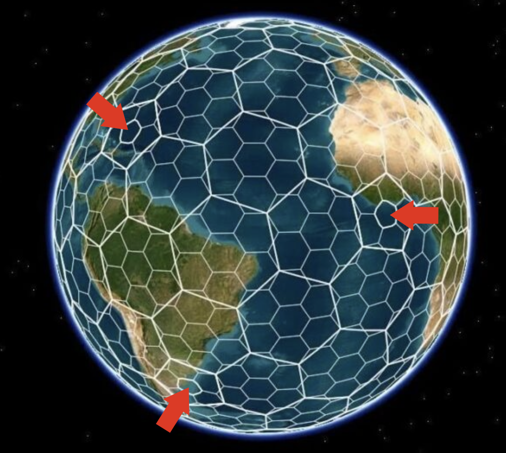
<figcaption>Uber's H3 system, pentagons are highlighted</figcaption>
</figure>

In the less serious side, many games (both digital and board game) also use hexagonal tiles because it facilitates movements, since all neighboring tiles have the same distance and you don’t need to deal with special cases of “diagonals”. Some famous examples include D&D, Settlers of Catan and Civilization (starting on version IV). Civilization is an interesting example because despite being a simulation of the world’s history, its “earth map” is [actually a cylinder](https://civilization.fandom.com/wiki/Earth_(map)_(Civ6)?file=Earth_%28Civ6%29.jpg), with unit movement wrapping around the east-west axis, but unable to go over the poles. This results in a largely exaggerated northern hemisphere, which might be intentional for gameplay.

Is there any alternative in which the map doesn’t use pentagons, nor uses a cylinder to map the earth? Standup mathematician Matt Parker, when criticizing the UK’s symbol of a soccer ball made of hexagons has called the construction [“mathematically impossible”](https://www.youtube.com/watch?v=_cAl3FlQZ9Q) and petitioned the English government to change it. Map designer David Swartz has also called such map [“impossible”](https://dmswart.com/2018/11/27/a-mathematically-impossible-hexagonally-tiled-world-map/) and when attempting to create a hexagonal map based on an icosahedron projection has simply filled in the missing bits with inexistent ocean, [not the first time this was done](https://en.wikipedia.org/wiki/Build_the_Earth#:~:text=Build%20The%20Earth%20was%20created,experience%20and%20construct%20the%20world.) with that type of map.

Well, you know what they say, when a mathematician says something is impossible…

**It’s because it is. They have proof.**

In this case the “proof” comes from Euler’s rule for polyhedron’s, which state that there is a constant relationship between the number of faces, vertices and edges of any polyhedron resulting in this formula:

 $$v - e + f = 2$$

If we assume that all faces will be n-sided polygons and each vertices connects 3 edges (more on that later), we can rewrite the function in this way:

 $$\frac{n}{3} - \frac{n}{2} + f = 2$$

Which is then rearranged in this formula:

 $$f = \frac{12}{6 - n}$$

This formula will tell you how many faces you will need in order to make a polyhedron with n-polygonal faces. It results in this helpful little table:

<figure>
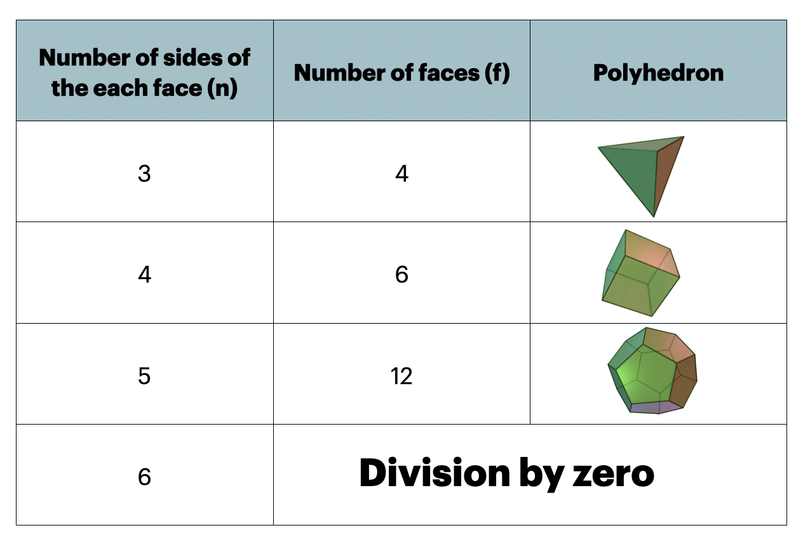
<figcaption>special case of Euler's formula applied to regular n-polygons with 3 faces per edge.</figcaption>
</figure>

This is a demonstration for the special case of 3 faces per vertice, there are longer proofs that will deal with other cases that are beyond the scope of this post. Suffice to say it’s truly impossible to make a real spherical polihedron out of pure hexagons. So am I done? Of course not.

<figure>
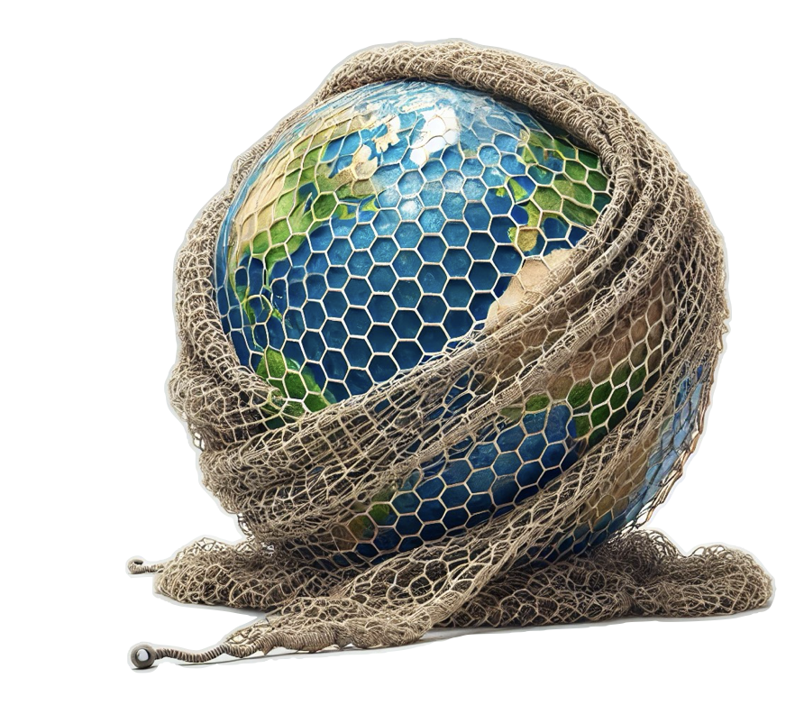
<figcaption>Wrapping a globe with an isomorphic network of hexagons. Even AI got confused with the assignment (see area near canada)</figcaption>
</figure>

But that’s not the question being asked here: rather I want to know if there are ways to **wrap a sphere using hexagons**, like an isomorphic network. This lifts a few constrains, allowing hexagons to be stretched, folded or even to connect to other neighbors in two different ways. In 2017, [Jacob Rus published a great paper](https://archive.bridgesmathart.org/2017/bridges2017-237.pdf) on Bridges showing a process that could be applied to the tetrahedron, octahedron or the tetrakis hexahedron.

### Constructing the Gosper World Map {#h-constructing-the-gosper-world-map}

In this paper we are picking the Rhombic Dodecahedron instead. I’ve chosen this shape because it’s more “roundish” than the aforementioned shapes used in Rus’ paper. A rhombic dodecahedron can also tile a space like the hexagon tiles the plane, so it feels more like the 3D equivalent of the hexagon. But most importantly for our purposes it has 12 faces which can be colored in 4 main “groups”. We then project the earth in the Rhombic Dodecahedron (based on [Carlos Furuti’s projection](https://geo20agostosbc.files.wordpress.com/2018/03/pseudoglobo-rombicdodecaedro.pdf)). Finally, we unwrap the rhombic dodecahedron in it’s corresponding network. It gets its name from its “Rhombi”-shaped like faces which are almost a golden rhombus (two equilateral triangles) so let’s stretch each rhombus a little bit until they all fit together.

<figure>
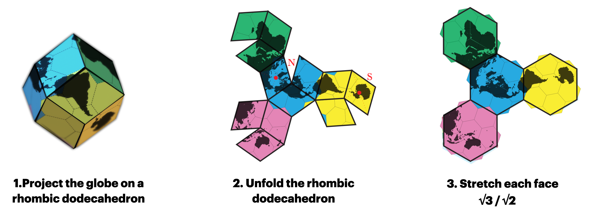
</figure>

The result is the world tiled in four hexagons. Each hexagon connects to the other 3 hexagonal tiles in exactly two ways. The result is that if you have two sets of each tile you can create a very simple board game in which pieces move in any of the six hexagonal direction and it allows them to traverse the globe even through the poles. In this animation we can see the pawn on our little game starting in Africa and going in a straight direction, crossing over Asia, the Pacific Ocean, then South America near Antarctica and back to Africa.

<figure class="youtube">
<iframe src="https://www.youtube-nocookie.com/embed/xrAzKjfbSiQ" title="YouTube video" loading="lazy" allowfullscreen allow="accelerometer; autoplay; clipboard-write; encrypted-media; gyroscope; picture-in-picture"></iframe>
</figure>

There are some other interesting arrangements we can find by moving our pawn around. This is one of my favorites:

<figure>
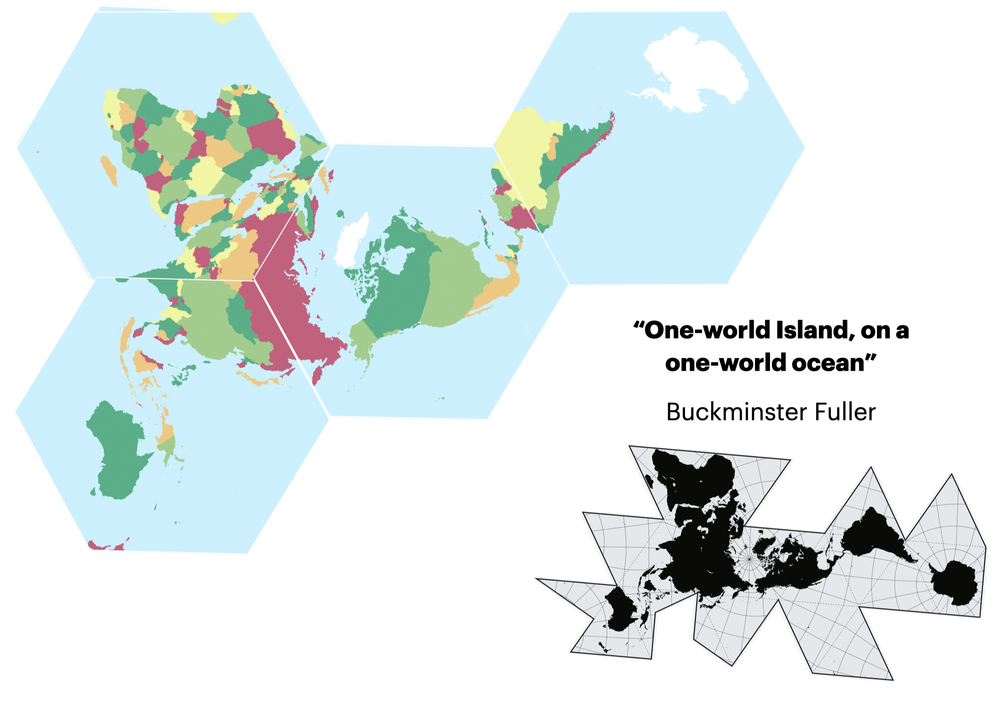
<figcaption>The Dymaxion map compared to a similar arrangement of the Gosper map.</figcaption>
</figure>

It reminds me of Buckminster Fuller’s Dymaxion map, which is one of my favorite maps ever designed. Fuller created it in an attempt of showing the world not as separate continents but rather a single continent, surrounded by a single ocean, as a reminder that we are all one people traveling together in this spaceship earth. It’s a beautiful and striking map, but some people might be turned off by its weird spiky border. Using this technique we were able to recreate the same “spaceship earth” view with a more simplified hexagonal border. We can still go one step further: since all hexagons are flat, we can actually cut and rearrange them in any way we want, making making your own map as simple as putting a puzzle back together.

<figure>
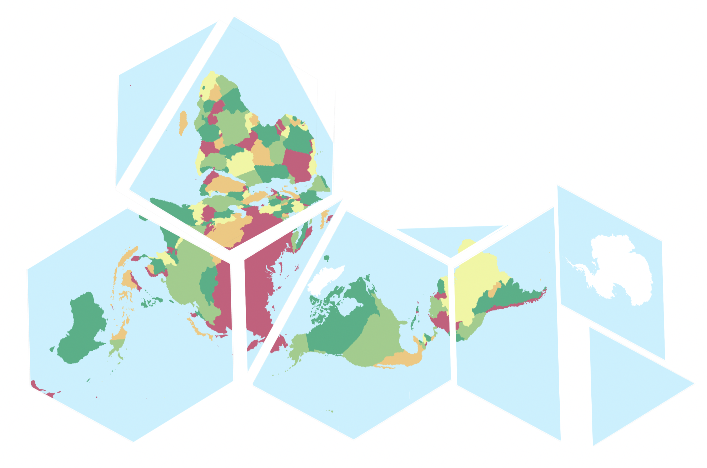
<figcaption>Removed a slice from the African Tile so that Brazil could be in one piece.</figcaption>
</figure>

One of the most interesting arrangements we found was this one, in which the Americas, Europe and Africa are in a more classic north-south arrangement, Australia is now “up” and we can still see Antarctica as a whole continent instead of spread out in the bottom. Even New Zealand is there.

<figure>
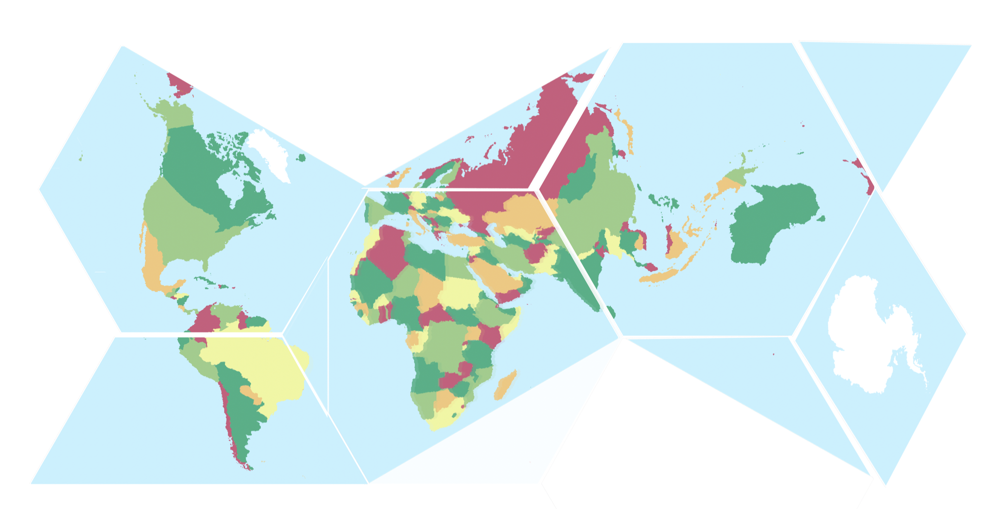
<figcaption>Arrangement found by Felipe Van de Sande Araujo, from NTNU</figcaption>
</figure>

Of course, this uses only the original four hexagons. But one neat thing about a hexagonal grid is that it can be subdivided into smaller hexagons to any resolution we desire. The only issue is that hexagons can’t be perfectly subdivided into smaller ones and there will be some weird overlaps between hexagonal children (in Uber’s H3 system cells will change their parents depending on the resolution). This can be avoided by using instead the Gosper Island, a fractal which is the result of an infinite subdivision of hexagons. It has the same six-sided connectivity of the hexagon, but it can be split into seven perfectly self similar copies of itself.

<figure>
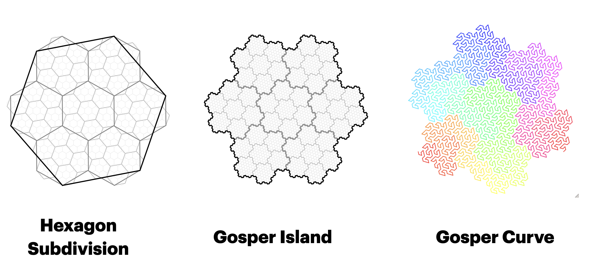
</figure>

### The resulting map {#h-the-resulting-map}

Putting it all together here is the Gosper World map, a map unlike any you’ve ever seen before:

<figure>
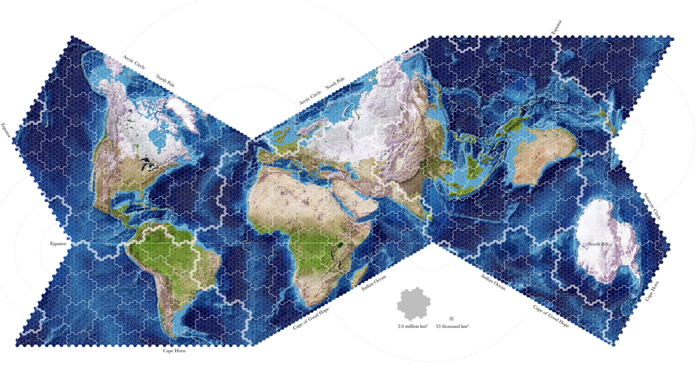
<figcaption>The Gosper World map in all its glory, using the Blue Marble imagery from Nasa</figcaption>
</figure>

Some things to note about the map. The areas are constant, so the sizes of continents you see more closely resemble what they truly are. If we leave the original grid visible, it becomes even easier to estimate areas by counting. By an interesting coincidence, the big Gosper arrangement highlighted has approximately 2.6 million square kilometers, or 1 million square miles (one of the rare examples you’ll find of me using imperial units). By counting them, it’s obvious that Africa fills about 12 of the big gosper shapes, while Greenland barely fills one: and indeed Africa has 11.7 million square miles (30 M km²) while Greenland has only 2 M km² or 0.8 million square miles (a relationship that is not immediately obvious by, say, [looking at google maps](https://en.wikipedia.org/wiki/Web_Mercator_projection#/media/File:Web_maps_Mercator_projection_SW.jpg)).

Unlike [other constant area maps](https://en.wikipedia.org/wiki/Equal-area_projection#/media/File:Lambert_cylindrical_equal-area_projection_SW.jpg), however, continents are easily identifiable, its easy to see how they connect to each other and Antartica can be seen in it’s full shape and not as a distorted band in the bottom. As mentioned previously, you could simulate a transpolar route by simply making simple hexagonal movements. It’s also possible to understand where each part of the map wraps around to by following the arrows.

Distances however do vary a little bit more, but that distortion is roughly constant on the whole map, instead of concentrated on the edges. A good tool to see how that distortion works is by drawing circles of the same size on the globe and seeing what happens on the resulting map. It’s called a Tissot Indicatrix and it here it is for the Gosper map and some other more classical maps.

<figure>
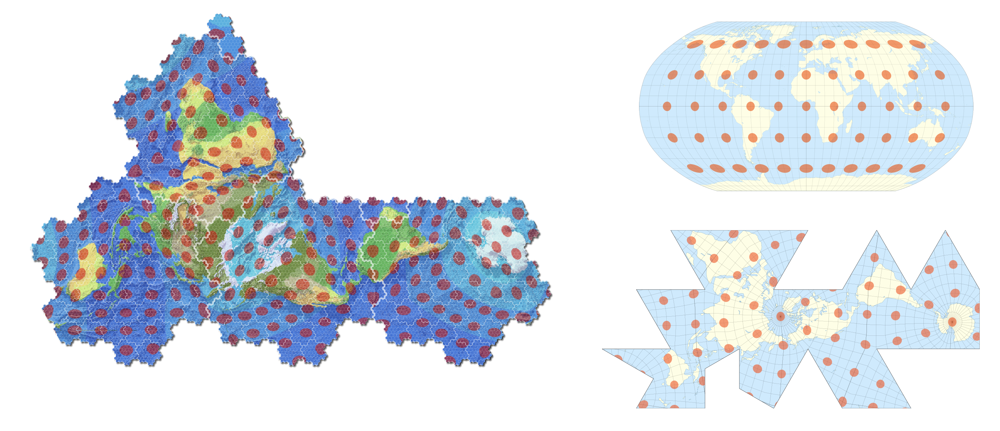
<figcaption>Gosper projection on the left, Robinson on the top-right, Dymaxion on the bottom-right</figcaption>
</figure>

And so this is it. I hope I have convinced you that this method creates rather interesting maps with very useful properties. And it can even be used to make a soccer ball made only of hexagons!

<figure>
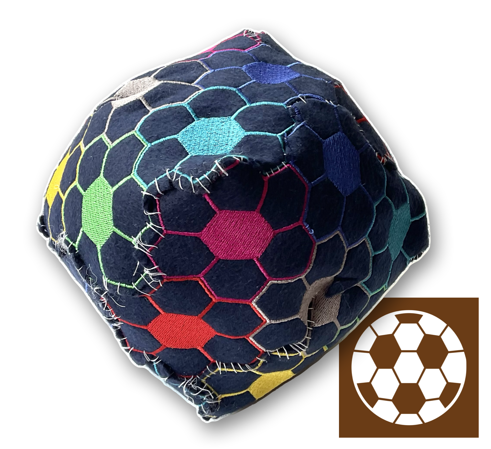
<figcaption>It's not very round, nor very pretty (it's my first time sewing anything in decades) but the "impossible ball" is very much possible.</figcaption>
</figure>

---

### “Show us where you cheated!” {#h-show-us-where-you-cheated}

At this point the presentation ends and we have a few minutes for questions. A hand goes up in the back.

– HOW DARE YOU!

It’s mathematician and standup comedian **Matt Parker**, who at this point I had no idea was in attendance.

– NOW GO BACK TO YOUR SLIDE AND SHOW YOU WERE YOU CHEATED

This is completely true story.

I wasn’t expecting him so I tried answering as best as I could at the moment. But before I show the “cheat” here, let me explain how in the world was Parker in my short, 10 minute lecture.

Initially, one of the featured Keynote speakers for Bridges 2024 was supposed to be Grant Sanderson from 3Blue1Brown. For personal reasons he wouldn’t be able to attend so Matt Parker was invited instead. Matt, of course, is known among other things for [petitioning the UK government to change its signs depicting the “impossible soccer ball”](https://www.espn.com/soccer/story/_/id/37536880/uk-government-answers-petition-change-football-geometry-road-signs). I had originally intended my work to be applied to maps, but once I heard this news I decided to take a look on what the process would look like with an actual soccer ball, and, inspired by [John Paul’s balls](https://www.tiktok.com/@jonpaulsballs/video/7242269745716776234), I started to (re)learn how to sew.

The conference started on a Thursday, my talk was Friday and Matt’s talk was Saturday. I had no idea how accessible Matt would be: maybe he would come in the same morning, give his talk and then fly away to another show, surrounded by a large security detail. If I was lucky I could use my prop on the presentation and then use a photo opportunity to give him before he was whisked away by men dressed in black.

Instead I was pleasantly surprised to bump into him on the very first day. He was there the whole conference, quite approachable and friendly with everyone, so I ended up giving him the badly sewn together ball the first day of the conference. And I guess this picked his curiosity enough for him to attend the talk and ask me a question.

<figure>
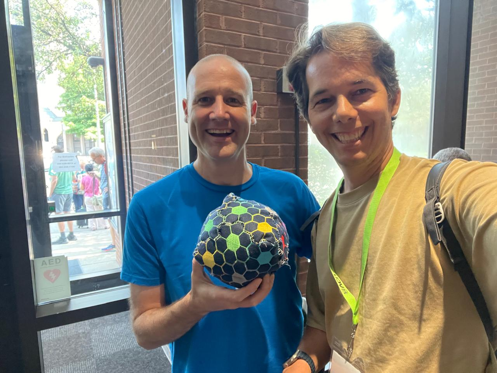
<figcaption>"practical question before I take this home with me: what is it made of?", asked Parker, "You promise me there are no drugs inside?"</figcaption>
</figure>

**So, detour over: _where’s the “cheating"?_**

<figure>
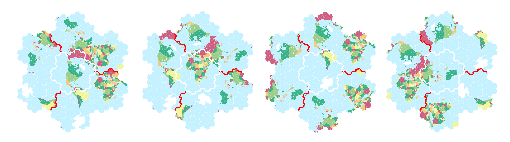
<figcaption>Different arrangements of the 4 basic tiles. Each tile connects to the same neighbor twice in a different manner.</figcaption>
</figure>

As mentioned previously, a real polyhedron made solely of hexagons is impossible, so instead I am treating the hexagons as a polymorphic network, meaning that the most important bit is that every point on the network is able to move in six different directions. Remember how I mentioned that the planet is transformed into 4 hexagonal tiles that can connect to each of the other 3 in different ways? That’s the trick.

At any resolution there will always be a few hexagonal tiles that will connect to a neighbor twice. However that doesn’t mean the connection is the same: each of these will result in arriving at the new tile with a new rotation of the “forward direction”.

<figure>
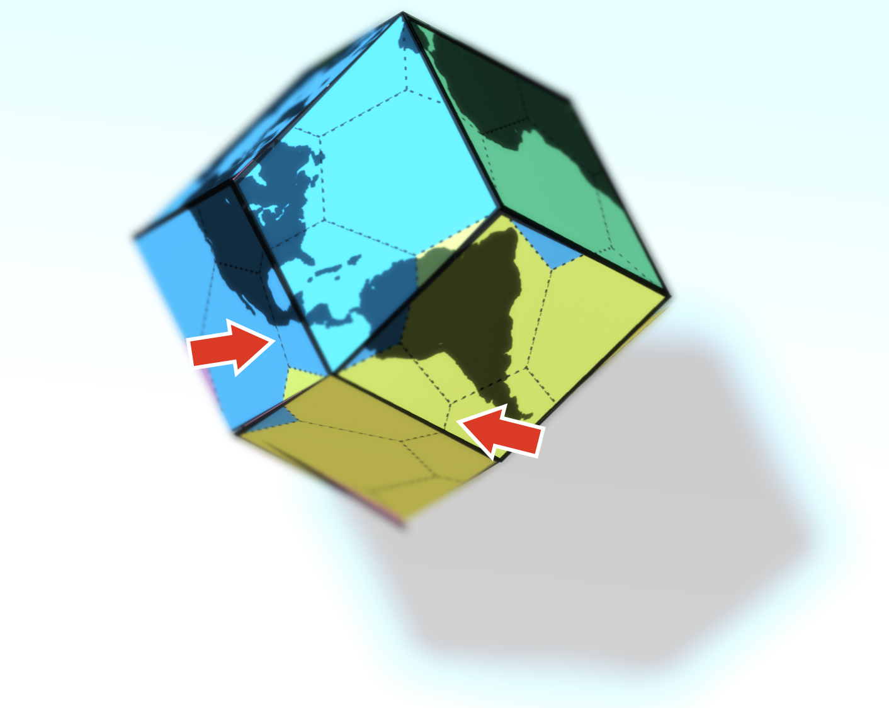
<figcaption>Are those tiles "true hexagons" or Pentagons in hiding? Your call.</figcaption>
</figure>

If you build a paper (or cloth) model this will result in a few “pointy bits” in your model. You can see this on the highlighted area of the 3D model of earth. In three dimensions you can also think of when two half pipes meet at an angle, forming a triangular cut. Are these true hexagons? Or like [“Parker’s square”](https://www.bradyharanblog.com/the-parker-square) they are really just pentagons disguised in the third dimension? It can be a matter of definitions. I would argue they’re not isomorphic to pentagons because the two connections are not identical: taking each will result your pawn is now moving in a different direction.

If you want to try it out for yourself, I encourage you to [download this PDF](https://drive.google.com/file/d/15vduoPguDLWmGideay7MbuQKQBZB-kCC/view?usp=sharing) and print (or sew) your own “Gosperahedron”.

<figure>
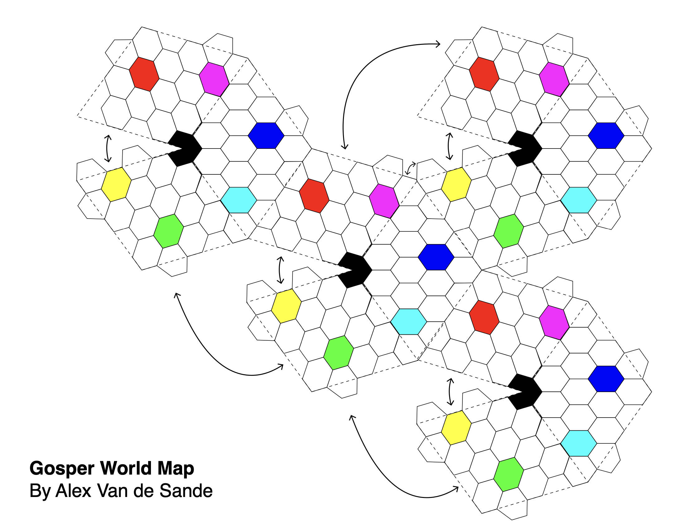
<figcaption>A DIY template for printing your own impossible soccer ball is available.</figcaption>
</figure>

All models are wrong, some models are useful. Wrapping the globe (or a soccer ball) in hexagons in this way has been useful to create a rather interesting and novel world map, one that hopefully can help us all understand better the world we live in and our place in it. Maybe that’s what really matters.

<figure>
<!-- The picture that stood here was already gone on Paragraph: only its caption was left. -->
<figcaption>Warning: if your child has one or more of these printed geometric paper models, it could be a sign that he is a mathhead. Investigate his search history for keywords like "hyperdimensional fractals" or "aperiodic tiling".</figcaption>
</figure>

### **Available for printing!** {#h-available-for-printing}

If you want to decorate your (or someone’s else) office or classroom, [the poster can be downloaded at hexagonal.earth](https://hexagonal.earth) and printed as large as you like. My goal is more to share a new vision of the world.

<figure></figure>
