While it typically falls outside my primary areas of research in crypto usability, I've recently found myself exploring a different rabbit hole. My journey began with an attempt to improve upon Uber’s H3 system, involved a phase of laser printing numerous paper rhombic dodecahedrons, and finally culminated in a novel map projection. This map not only enhances the aesthetic appeal of Buckminster Fuller’s “Dymaxion" model of a continental Earth, but also integrates a more organic, fractal-based round border.

### The problem with maps {#h-the-problem-with-maps}

<figure>
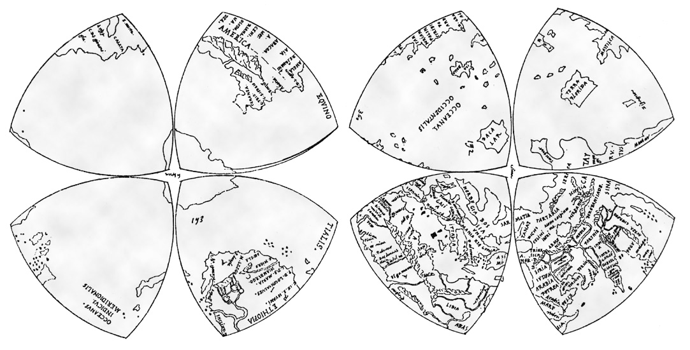
<figcaption>A map found in Da Vinci's library, of uncertain authorship, probably meant to be displayed as a globe.</figcaption>
</figure>

Beyond their practical applications, maps serve as a representation of our perception of the world. Even before Mercator introduced his infamous map projection, a famous map found in Da Vinci's personal library (though authorship is disputed) depicted the world in a four-leaf clover format, which in turn might have inspired the cartographer Cahill. In 1909 he published a world map that was later expanded upon by Waterman in what came to be known as the “Butterfly" map. It portrays the world as a set of wings spread out in an impressive arrangement.

<figure>
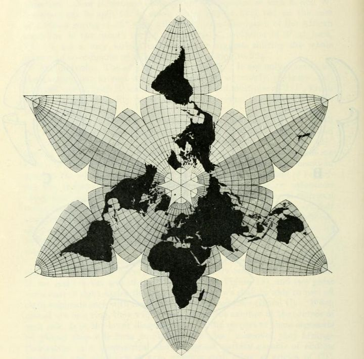
<figcaption>Cahill's Butterfly map was also presented as a six leaf clover with Americas duplicated</figcaption>
</figure>

Later, in 1943, Buckminster Fuller introduced the Dymaxion Map projects the globe onto an icosahedron. This model can then be unfolded to depict all continents unified as one landmass, a concept Fuller coined as Spaceship Earth. Intended for educational purposes, it was designed to be assembled as a puzzle by students, thereby enabling them to create their own vision of the world.

<figure>
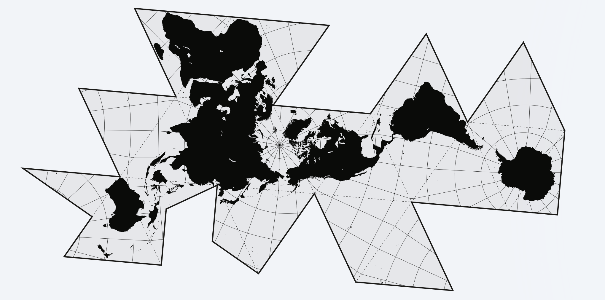
<figcaption>Buckminster Fuller's map is intended to show Earth as a united island, or "spaceship"</figcaption>
</figure>

While the Dymaxion Map is celebrated for its minimal distortion of landmasses and its striking visual appeal, it has also faced criticism due to its jagged coastlines and seemingly inelegant whitespace.

<figure>
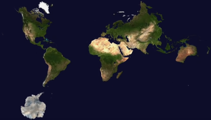
<figcaption>Dymaxion but with the oceans all wrong.</figcaption>
</figure>

Videogames present another interesting domain where different types of maps are experimented with. When YouTuber PippenFTS embarked on a collective project to reconstruct Earth in a square grid within Minecraft, they opted for a Dymaxion projection but modified it to give the Americas a more traditional north-south orientation. The game Civilization employs a hexagonal grid, but its maps are cylindrical rather than spherical, with inaccessible poles and sides that wrap around. Its "real earth map" uses a custom projection that deliberately enlarges areas of high player interest, such as Europe, North America, Japan, and the British Isles.

<figure>
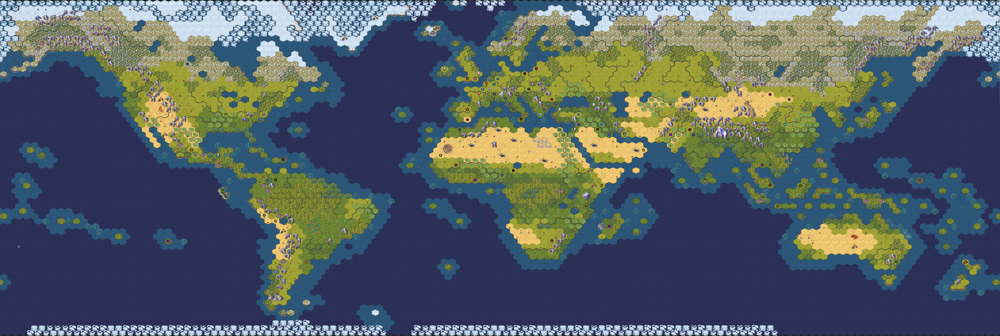
<figcaption>Compare the sizes of the United Kingdom and Africa in this Civilization map</figcaption>
</figure>

### A better grid {#h-a-better-grid}

<figure>
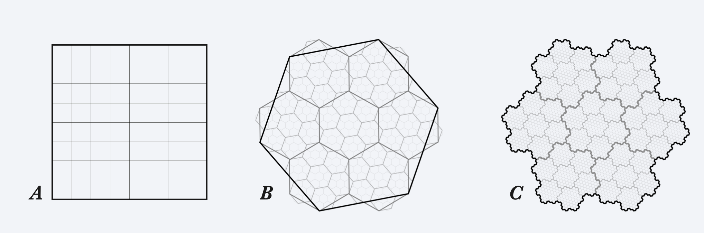
</figure>

The square grid is by far the most common: it’s simple to build and can be subdivided into identical squares. Given that all their neighbors are equidistant, hexagons facilitate a more accurate approximation of distances, areas, and radii. While hexagons can be divided into smaller hexagons, they don't fit precisely within the parent hexagon, resulting in distortions.

For instance, Uber employs a hexagonal grid for storing and analyzing geographical data, allowing for multi-level hierarchical data sampling. Uber’s world map draws from Fuller's icosahedral division of the world. However, since an icosahedron cannot be tiled purely by hexagons, it incorporates 12 pentagons at every level. At its highest level, it uses 110 hexagons to encapsulate the globe, each of which is subsequently subdivided into seven smaller hexagons. Each pentagon is further divided into five hexagons and one smaller pentagon. Because child hexagons don’t fit perfectly within parent hexagons, a given coordinate could fall into different hexagonal parents, depending on the resolution level. The H3 grid system is never meant for the end users and therefore they never attempted projecting the word in a single flat image.

<figure>
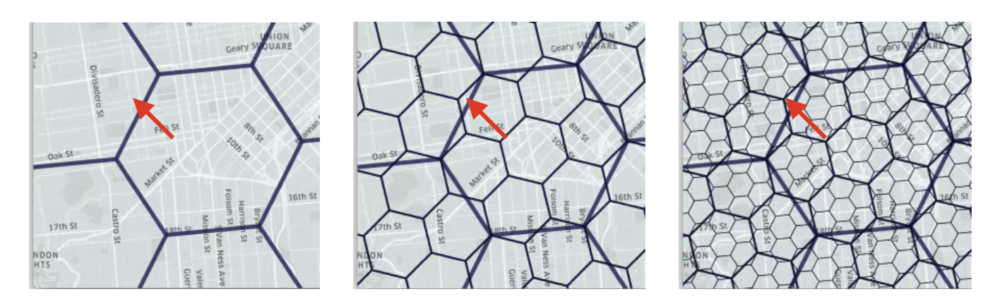
<figcaption>Uber's H3 Hexagonal Grid: the red arrow remains in the same place but it's parent hex changes depending on the resolution used.</figcaption>
</figure>

While H3 serves Uber’s data analysis purposes efficiently, it may not be as useful in other contexts: it cannot be neatly unfolded onto a flat area, and if you're developing a hexagonal game or simulation, the unavoidable pentagons pose a problem.

A potential compromise between both grid systems might be the use of a fractal known as Gosper Island, which forms the border of the Gosper Curve or results from subdividing a hexagon into infinitely smaller hexagons. But can you tile a sphere with it? Not without some compromises.

<figure>
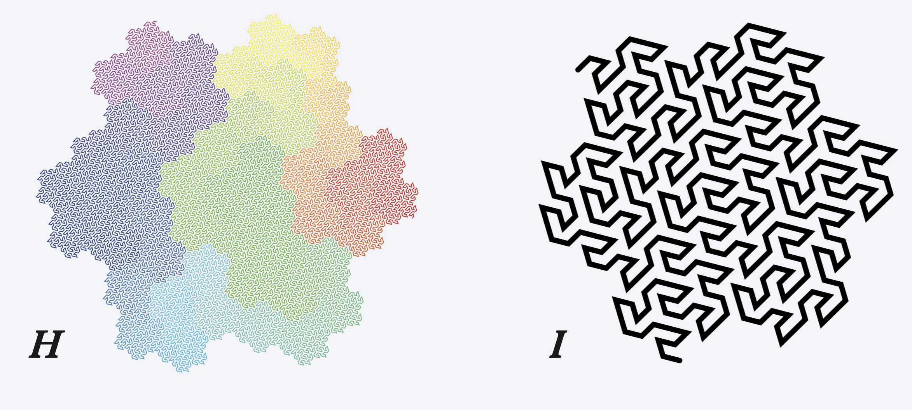
<figcaption>The beauty of the Gosper Curve, which at its boundaries creates the Gosper Island.</figcaption>
</figure>

A hexagon can be folded into several polyhedra, provided you're willing to accept certain concessions, such as allowing a few hexagons to connect to other hexagons in more than one way. While some might argue that this makes them isomorphic to a pentagon (or in reality, an octagon, since in this shape two of these special edge cases always come in contact), the crucial point is that they can still be simulated and folded as hexagons.

<figure>
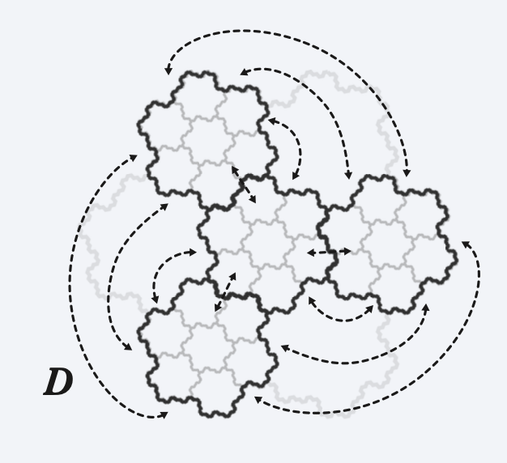
</figure>

A Rhombic Dodecahedron—the shape derived from spheres arranged in a hexagonal grid—can have its faces divided into four groups of three rhombi, collectively forming a close approximation of a hexagon (Fig E). This structure can be unfolded into a central hexagon surround- ed by three others, matching the initial hexagonal subdivision of our fractal. By subdividing the Rhombic Dodecahedron in this manner we achieve a new polihedra with fractal faces we are calling the “Gosperahedron” (Fig F, G).

<figure>
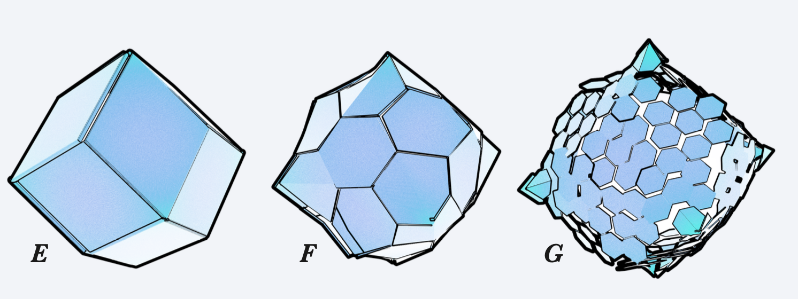
</figure>

I haven’t been able yet to define it more properly other than constructing it with some degree of error in my methods but by folding it in paper it’s clear that the shape accommodates the Gosper Islands very naturally. One interesting aspect is how the “edge cases” of the two hexagons that connect to each other twice are always at 90º angles from each other, allowing the faces to connect like two cillynders connecting at each other with a 45º cut.

<figure>
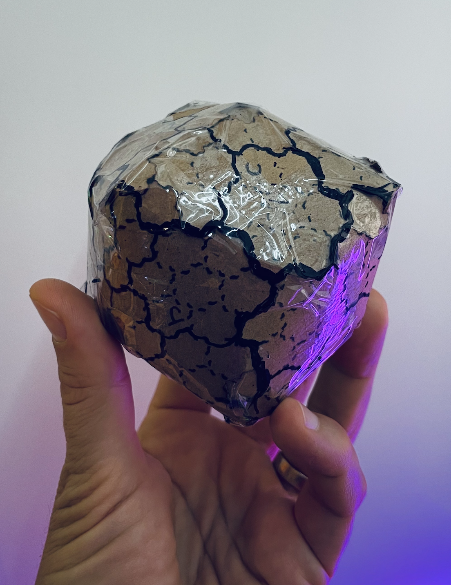
<figcaption>A paper model of the gosperahedron</figcaption>
</figure>

### A beautiful new way to see our planet {#h-a-beautiful-new-way-to-see-our-planet}

Fuller's Dymaxion map was envisioned as an educational tool—a classroom puzzle—challenging students to create their own map projections, centered as they wished. By using a Gosper Island to project Earth onto a Gosperahedron, the puzzle can be simplified to only four pieces. These pieces can be rotated into various configurations, enabling students to more accurately compare areas, distances, and traversal options on the globe.

<figure>
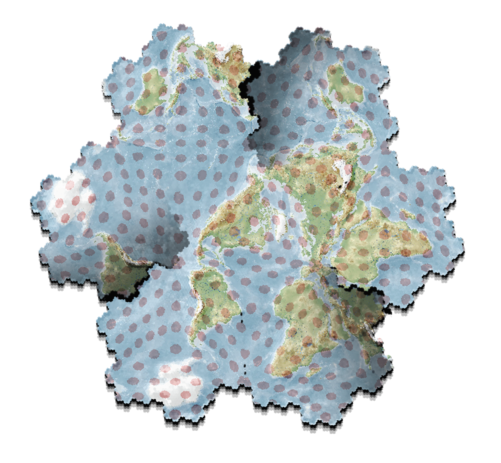
<figcaption>3 pieces arranged in a gosper island (with the non-center pieces duplicated). Each red ellipsis should correspond to a circle of same area on earth.</figcaption>
</figure>

The map above displays multiple configurations of a projection centered on the North Pole. The representation of areas and distances is consistent, exhibiting minimal distortion. To illustrate how they connect to each other, the Oceania, Africa, and South America pieces are replicated. By rearranging the pieces, a similar map can be produced with any continent at the center.

A more impactful view can be achieved by relinquishing the conventional orientation of continents, instead aiming to portray Earth as a single island—the "Spaceship Earth"—which humans have gradually discovered and navigated.

<figure>
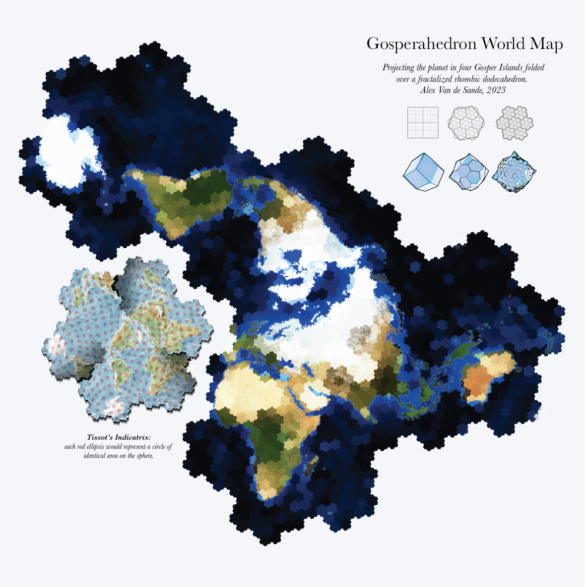
<figcaption>Blue Marble's Earth, highlighting the Gosper Islands that make the grid. (I'm sorry about the Iberian Peninsula, but they had it coming.)</figcaption>
</figure>

### More to explore {#h-more-to-explore}

**Geocoding**: Any location on Earth (or the sky) can be referenced by a unique index, based on either the Gosper Curve (Fig H, I) or the H3 binary index. This index can be represented numerically or textually, providing an open-source alternative to systems like "what3words."

**Planetary-Sized Simulations**: The fractal nature of the indexes facilitates the creation of simulations or games on a planetary scale for scale-independent phenomena. The system accommodates variable resolution; areas of high interest can be rendered in finer detail, while less relevant areas can be simulated at a coarser resolution. At the boundaries, computations are performed at the level of their parent cells, recursively reducing in detail until, for areas of minimal interest, simulations are computed for just a few very large hexagons.

**Spherical Imaging:** This offers an easy way to store spherical images and videos in a two-dimensional square format. Fractal indexing can enable progressive resolution loading based on bandwidth requirements.

**The Earth as a Puzzle:** This unique projection enables Earth to be represented by four separate Gosper tiles. These can be rearranged in a classroom or board game setting to help students understand a 2D projection that maintains area and traversal relationships between continents. All hexagons on the ap represent the same area and distances, helping them understand how big and how far things are. By rearranging the pieces, students can gain a better understanding of the distances between areas, including those across the poles.

<figure>
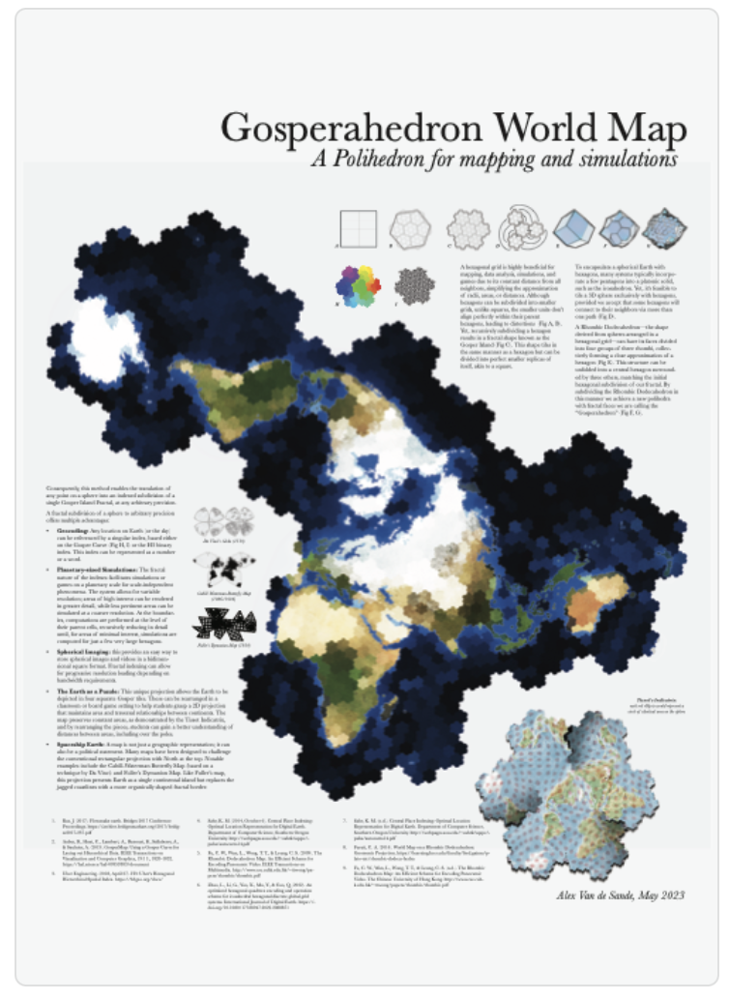
</figure>

> [Download a summary PDF version of this article](https://drive.google.com/file/d/1Gys27GPD9CY4MgsoY1uNVMxlKxm0Tj3j/view?usp=share_link)

If you liked this, feel free to reach out to me at avsa at ethereum dot org, or follow me on avsa.eth.limo on Bluesky
