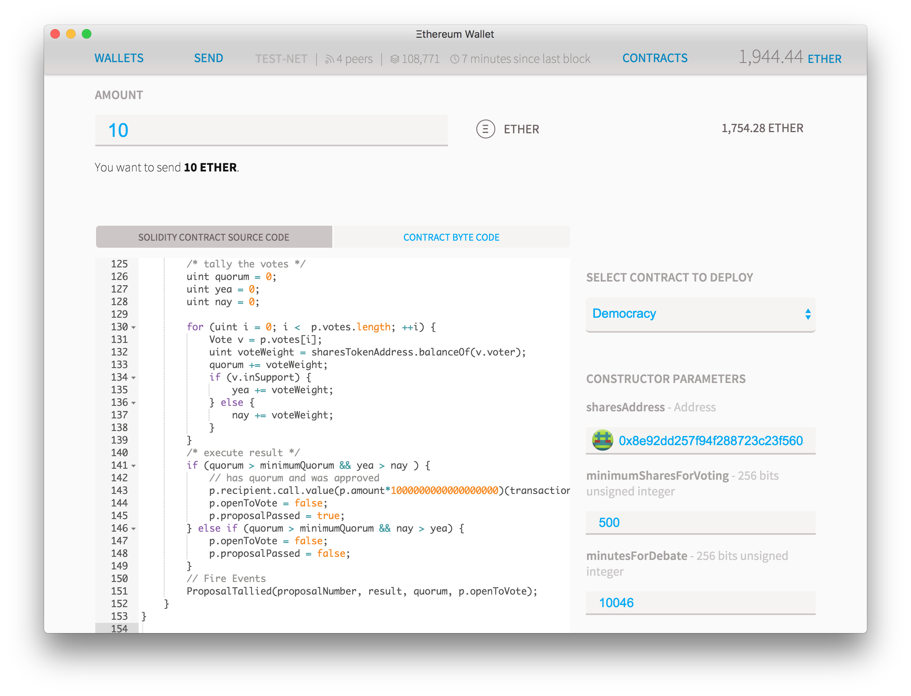
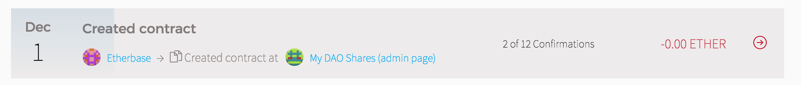
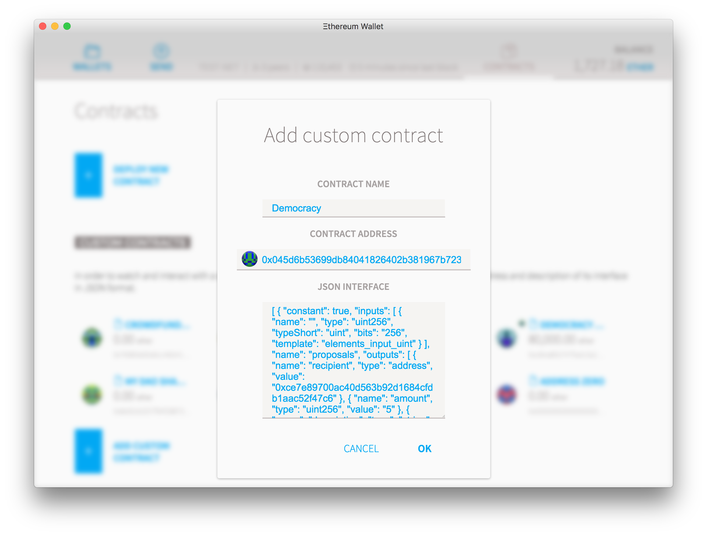
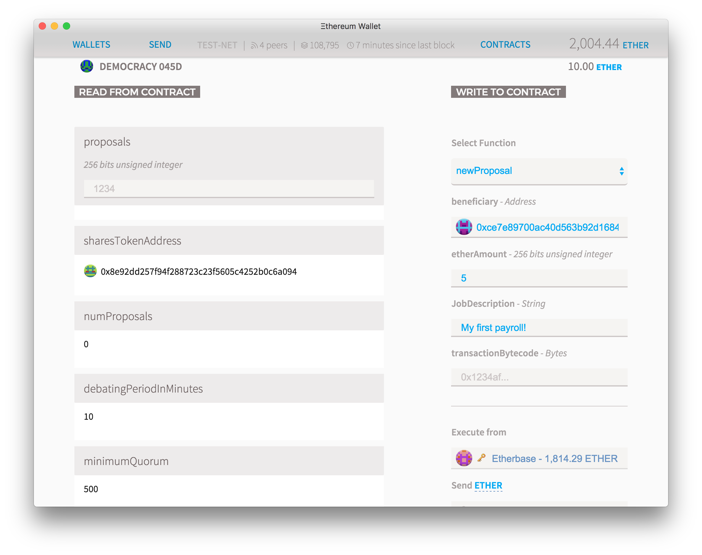
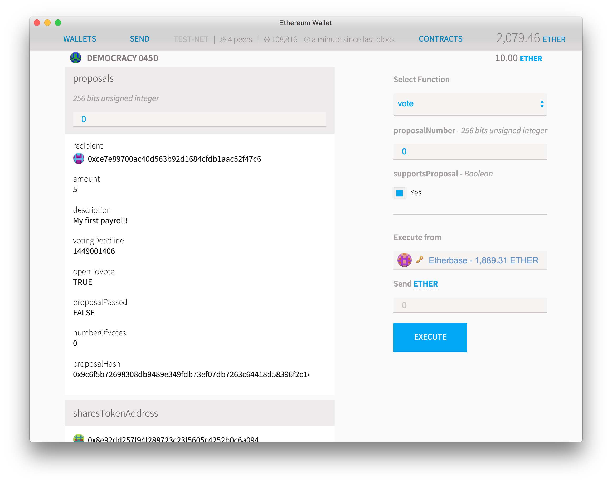
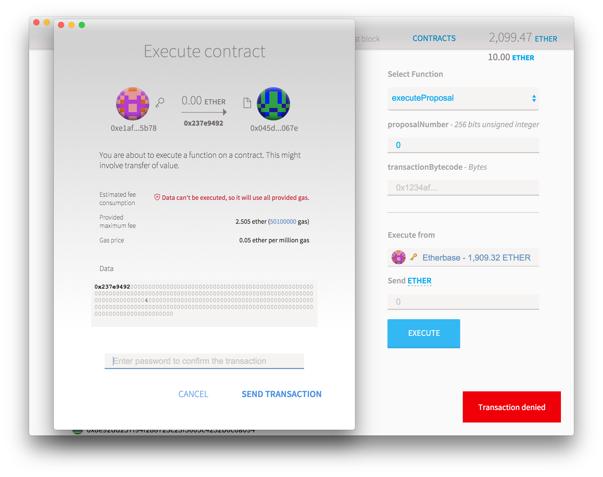

This is a second post on a series on how to use the current Ethereum tools to build smart contracts without needing programming experience. [Download the latest version of the Ethereum Wallet](https://github.com/ethereum/mist/releases/tag/0.3.7), [read the first part](https://blog.vandesande.design/how-to-build-your-own-cryptocurrency) and let's have fun!

[Creating a token is fun](https://blog.vandesande.design/how-to-build-your-own-cryptocurrency), but what is the value of a token that doesn't do anything new? We are now going to create a new contract that uses the tokens we just created. The contract will be a Democratic organization that lives on the blockchain and that anyone holding a share token will be able to vote on proposals.

So let's go back to "**Contracts**" and then "**Deploy Contract**" and paste the [DAO source code](http://chriseth.github.io/browser-solidity/?gist=192371538cf5e43e6dab) on the **"Solidity Source"** field. Choose the contract "Democracy" on the Picker and then select these parameters:

- On the **amount** field you can add any ether amount you want your DAO to start with. Since you can send ether to it at any time in the future, if this is the first time you've been doing this then keep the amount at 0 and send the money later.
- On the **sharesAddress** field, paste the address of the token contract you just created. Pay attention to the icon and color of the little circle that appears by the side of the address. If it doesn’t match exactly the one for the contract you created previously, then there's an error.
- On **minimumSharesForVoting** pick what is the minimum quorum of shareholders that need to vote on an issue before it passes. Here you must put the integer number of the minimum token possible, so if you created a token with 2 decimal places, putting 500 here will mean that in order for a proposal to be executed then the number of votes must be more than 5% of the total shares of the company.
- **minutesForDebating:** this is the minimum time a proposal must be discussed and voted on before the results can be tallied up. Put a small number like 10 minutes if you want just to create something for testing, but put something like 20,000 if you want to store large amounts of ether, so all proposals must stay there for at least two weeks.

Your contract should be looking something like this:

<figure>

</figure>

After a few seconds you'll be redirected to a the dashboard where you'll see your new contract being created:

<figure>

</figure>

You can also see the link to the new contract on the "Contracts" tab. If it's not there (for example: if you are adding a contract that you didn't create) then you'll have to add it manually. To add that you'll need the contract's address and it's JSON interface, a string of text that explains to the wallet how to interact with the code. You can pick any name you want and press OK.

<figure>

</figure>

Click your new contract box and you'll see a contract page. If you haven't already deposited some ether on that contract, click on deposit and put some small amount of ether so you can test how this particular democracy works. If the contract already has some funds, click the "show contract info" button.

On the **"read from contract"** you can see all the functions you can execute for free on the contract, as they are just reading information from the blockchain. Here you can see, for instance, that the "sharesTokenAddress" is indeed the correct address or that there are currently 0 proposals on the contract. Let's change that.

On the **"Write to contract"** you have a list of all the functions that will attempt to do some computation that saves data to the blockchain, and therefore will cost ether. Select "newProposal" and it will show all the options options for that function.

<figure>

</figure>

For "beneficiary" add the address of someone you want to send ether to, then put how many ethers you want on the "etherAmount" (must be an integer) and finally some text describing the reason you want to do this. Leave transactionByteCode blank for now. Click execute and type your password. After a few seconds the numProposals will increase to 1 and the first proposal, number 0, will appear on the left column. As you add more proposals, you can see any of them by simply putting the proposal number on the "proposals" field and you can read all about it.

Voting on a proposal is also very simple. Choose "vote" on the function picker. Type the proposal Number on the first box and check the "Yes" box if you agree with it (or leave it blank to vote against it). Click "**execute**" to send your vote.

<figure>

</figure>

When the minimum voting time has passed, you can select **"executeProposal"**. If the proposal was simply sending ether, then you can also leave the "**transactionBytecode**" field blank. After pressing "execute" but before typing your password, pay attention to the screen that appears. If there is a warning on the "estimated fee consumption" field, then this means that for some reason the function called will not execute and will be abruptly terminated. It can mean many things, but in the context of this contract this warning will show up whenever you try to execute a contract before its deadline has passed, or if the user is trying to send a different bytecode data than the original proposal had. For security reasons if any of these things happens, the contract execution is abruptly terminated and the user that attempted the illegal transaction will lose the all the ether he sent to pay transaction fees.

<figure>

</figure>

If everything went well you should be able to see the results of the vote in a few seconds. The "**openToVote**" parameter on the first box will turn to false while the **proposalPassed** will reflect if the proposal has been accepted or not. You should also be able to see that the Ether balance of the contract will go down and the equivalent ether will be sent to the beneficiary of the ether you wanted to send.

Now take a moment to let that in: you just created an organization that only exists on the blockchain, that obeys votes based on completely digital tokens, but yet it can move real value around and create a very real impact on the world. Also notice that the organization is not under your control anymore: it will execute only the exact code you used to create it, forever. You can't bribe it, you can't earmark it and the same rules apply either you are moving 0.01 or 1,000,000 ethers.

Can it get any better than this? Actually, it can. [On our next post we will explore how you can use "transactionBytecode" to allow the DAO to execute any kind of ethereum transaction](https://blog.vandesande.design/how-to-build-your-own-transparent-bank), even owning or creating other contracts. We'll also modify the token code to allow the DAO to control the amount of a token that exists on circulation and how to send it forward.
