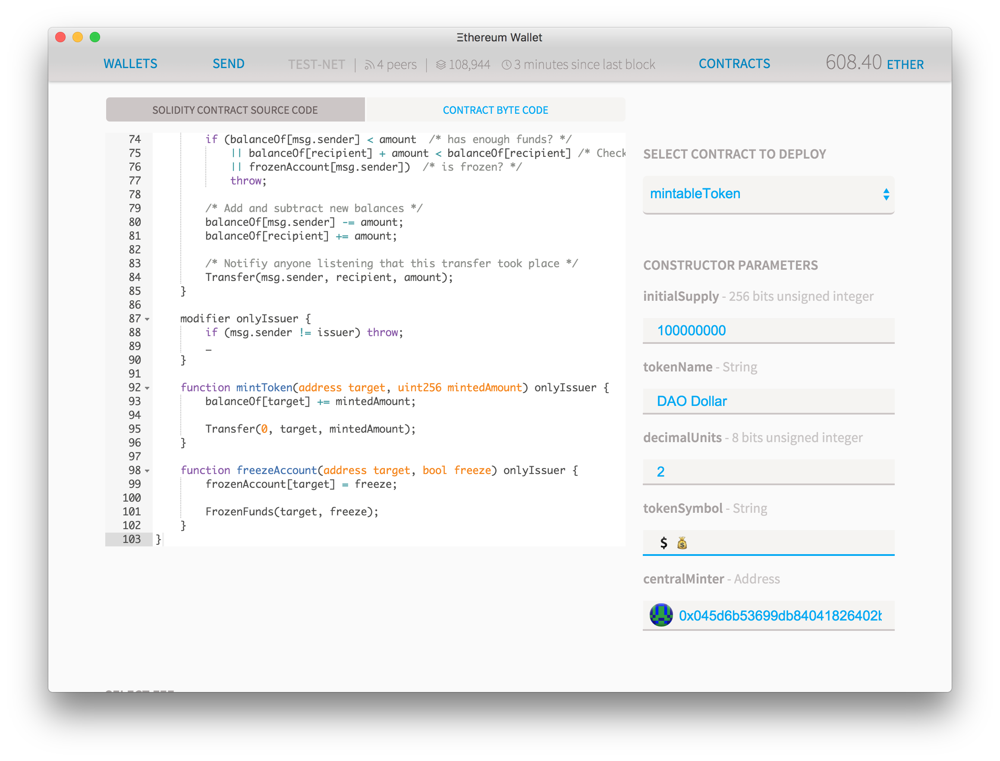
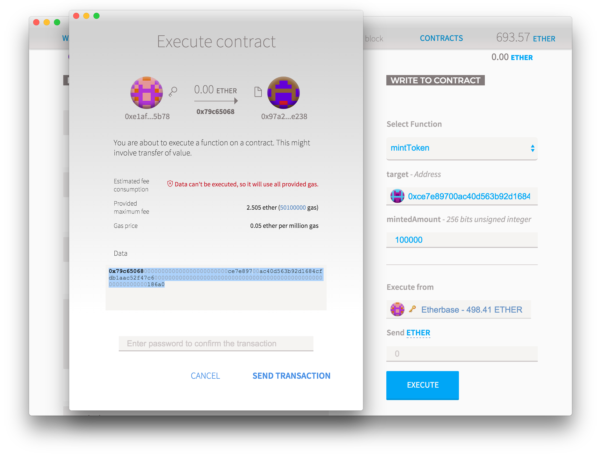
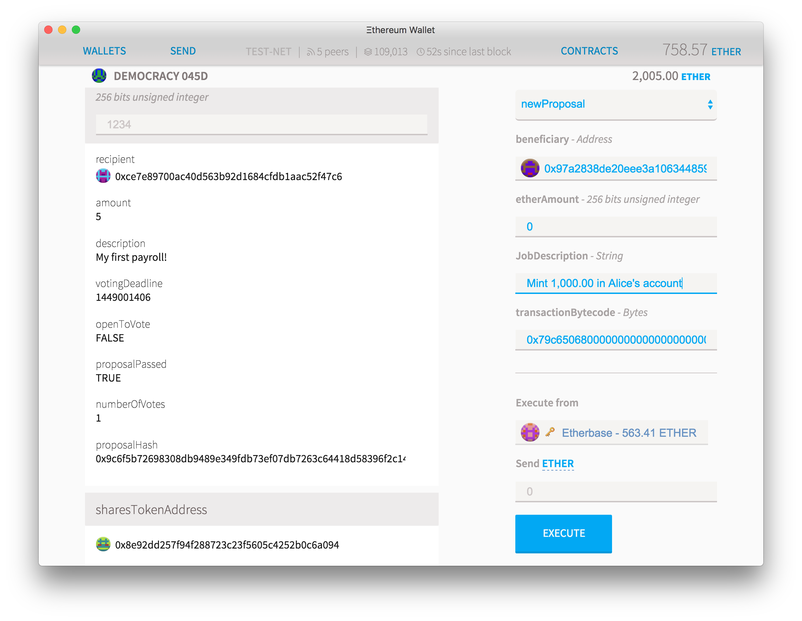
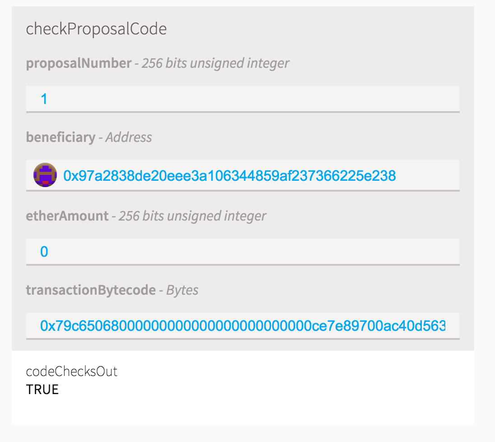
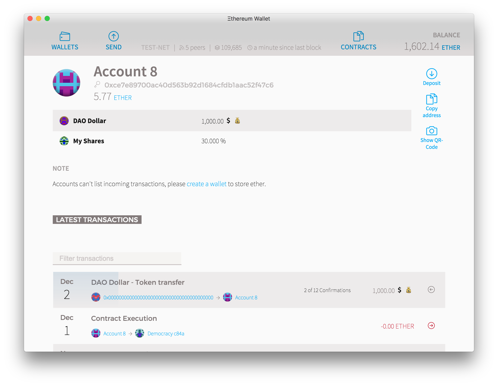

This is the third and final post on a series on how to use the Ethereum Wallet to create your own autonomous organisations. On the [first post we detailed how to create a token](https://blog.vandesande.design/how-to-build-your-own-cryptocurrency), and on the [second we shown how to generate a digital democracy controlled by these tokens](https://blog.vandesande.design/how-to-build-a-better-democracy). Now we will do the full circle and create a token _controlled_ by the Organisation!

We are going to modify the token contract to allow it to be minted by your DAO. So save the address of your current DAO in a note pad (pay attention to the icon) and [grab this source code](http://chriseth.github.io/browser-solidity/?gist=1e8ebf35ff1fd48aca46) and you know the drill: **contracts > deploy new contract > solidity source code > pick contract**

You can fill the parameters any way you want (yes, emojis are permitted on the string fields) but you'll notice one new field that didn't exist before: Central Minter. Here add the address of your newly created democracy contract.

<figure>

</figure>

Click Deploy and let's wait for the transaction to be picked up. After it has at least two confirmations, go to your democracy contract and you'll notice that now it owns a million of your new coins. Now if you go to the Contracts tab you'll see that there is a new **DAO dollar (admin page)** contract on your collection.

Select the "mintToken" function to your right and then put any address you own as the "target", and then the amount of new mints you want to create from thin air in their account. Press "**execute**" but **don't press send**! You'll notice that there is a warning saying that the transaction can't be executed. This happens because only the **Minter** (which is currently set to the DAO address) can call that function and you are calling it with your main account. But the calling code is the same, which is why you can simply copy it.

Instead, **copy the contract execution code from the "data" field** and put it aside on a notepad. Also get the address of your new "Mint" contract and save it somewhere.

<figure>

</figure>

Now go back to the democracy contract and create a new proposal with these parameters:

- As the **beneficiary**, put the address of your new token
- Leave **etherAmount** blank
- On the **jobDescription** just write a small description that you are minting new coins
- On the **transactionBytecode**, paste the bytecode you saved from the data field on the previous step

<figure>

</figure>

In a few seconds you should be able to see that the details on the proposal. Unlike the other fields, transactionBytecode can be extremely lengthy and therefore expensive to store on the blockchain. So instead of archiving it, the person executing the call later will provide the bytecode.

But that of course creates a security hole: how can a proposal be voted without the actual code being there? And what prevents a user from executing a different code after the proposal has been voted on? That's why we keep the hash of the bytecode. Scroll a bit on the "read from contract" function list and you'll see a proposal checker function, where anyone can put all the function parameters and check if they match the one being voted on. This also guarantees that proposals don't get executed unless the hash of the bytecode matches exactly the one on the provided code.

<figure>

</figure>

It's an older code, but it checks out

Now everyone can vote on the proposal and after the voting period has passed, anyone with the correct bytecode can ask the votes to be tallied up and the contract to be executed. If the proposal has enough support then the newly minted coins should appear on Alice's account, as if it was a transfer from address Zero.

Why a transfer from address zero? Because doing the opposite, sending a coin to 0x00 is a way to effectively destroy it, but more importantly, because it says so on the contract code. You can change that as you prefer.

<figure>

</figure>

And now you have a central minter contract that exists solely on the blockchain, completelly fraud-proof as all their activities are logged transparently. The mint can also take coins from circulation by simply sending the coins it has to address Zero, or by freezing the funds on any account, but it's **mathematically impossible** for the Mint to do any of those actions or generate more coins without the support of enough shareholders of the mint.

Possible uses of this DAO:

- The creation of a universal stable crypto currency. By controlling the total amount of coins in circulation the Mint shareholders can attempt to create an asset whose value doesn't fluctuate too wildly.
- Issuance of certificates of backed assets: the coins can represent an external currency or items that the Mint owns and can prove to it's shareholders and token holders. When the Mint acquires or sells more of these assets it can burn or generate more assets to guarantee that their digital inventory will always match their real counterpart
- Digitally backed assets. The Mint can hold ether or other ethereum based digital currencies and use that to back the value of the currencies circulating

## Improvements Suggestions

There are multiple ways that this structure can be yet improved, but we will leave it as an exercise and challenge to the reader:

Right now votes are made by shareholders based on freely tradable tokens. Can instead membership be based on invitation, each member getting a single vote (or maybe use [quadratic voting](http://ericposner.com/quadratic-voting/) or [liquid democracy](https://en.wikipedia.org/wiki/Delegative_democracy))?

What about other voting mechanisms? Maybe the vote instead of being a boolean could be a more flexible arrangement: you could vote to postpone the decision, or you can make a vote that is neutral but still count to the quorum

Currently all proposals have the same debating period. Can you make that proportional to the value transfer being proposed? How would you calculate that to tokens?

Can you create a better token that can be automatically created by sending ether into it, which can then be retrieved by burning the token, at a fluctuating market price?

What else can the DAO own or do, besides tokens?
