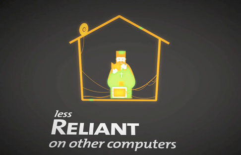

<figure class="youtube">
<iframe src="https://www.youtube-nocookie.com/embed/IMWJtQnz08g" title="How to sell computers to orthodox monks" loading="lazy" allowfullscreen allow="accelerometer; autoplay; clipboard-write; encrypted-media; gyroscope; picture-in-picture"></iframe>
</figure>

A video about how technology may affect certain cultures, and what could be changed in the computer as it is today, so we will not need to change the cultures themselves. How to sell computers for monks is a proposition that designers should start thinking about the laggards, the last people to adopt technologies, as benchmarks. Because if we can fit their requirements of a non-intrusive and fail-proof equipment, then we will build a better machines for all of us.

If you like this you can see a first video draft (with a different script) here:

<figure class="youtube">
<iframe src="https://www.youtube-nocookie.com/embed/S-EJi2tAwjQ" title="Computers to monks, the first draft" loading="lazy" allowfullscreen allow="accelerometer; autoplay; clipboard-write; encrypted-media; gyroscope; picture-in-picture"></iframe>
</figure>

<figure>

</figure>

<figure>

</figure>

<figure>

</figure>

<figure>

</figure>

<figure>

</figure>

- about: Made in 2006/07 as a final diploma project
