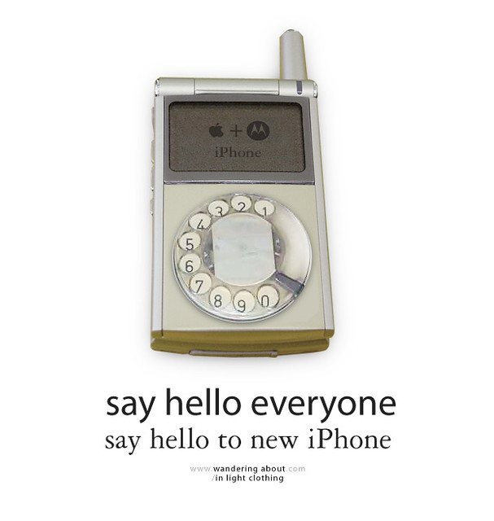

<figure>

</figure>

Since Motorola and Apple announced a partnership the tech world started to speculate Apple releasing an iPod cell phone (which one can easily bet would be called iPhone iTalk or iAnything similar). Some initial images pop’d showing disappointing ordinary cell phones with built-in iTunes, without the iconic iPod click wheel. Later some pictured something a lot more applesque, but still a with a shy click wheel. The above is my contribution to apple: what better way to join wheel with a telephone than a beautiful dial-wheel phone?

The only things that are certain are less hype, but equally tasty. Apple licensed iTunes software for Motorola, long with it’s own digital rights manager, the Fair play. This does means a lot. Apple holds an almost monopoly in portable music players (read iPod). iPod only plays music bought from iTunes Music Store (or downloaded in the rule-less mp3). And, until now, the only player that could play music from the iTunes Music Store was the iPod. That means if you want to legally download some music and if you have (or wish) an iPod, you have to buy it from Apple. And today there no music player that can jeopardize iPod’s ubiquity, unless, the cell-phone. With this deal Apple is insuring it’s market dominance in digital music sale (and maybe in the near future, music recording), and Motorola can announce a cell phone that is friend with iPod users.

But what about an apple phone? As with the possibility of an Apple digital camera, only if Job’s designers can figure out something unique, advanced. Apple does not enter in a already saturated market to be one more. Never enter a war that you are not sure to win.
