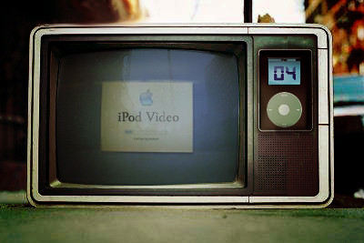

<figure>

</figure>

probably anytime before we start writing down our christmas lists apple is going to release it's new ipod, an all bets on the net are that is going to have video support. There is not much inovation on that single piece, and in a market where windows media mobile failed to get off, where sony's PSP have a comfortable large screen for playing games and watching videos and most important cell phones are already able to stream any video to their screen apple is going to have to justify it's next step. But there is still another bigger challenge on portable video players: what are they for?

Videos, unlike music, requires your full attention and are unapropriate for jogging, walking, working and may be even ilegal while driving. An average everyday commute seldom lasts enough for your average 40minutes sitcom episdode. And if you do have a commute longer than that you probably won't want to show off that you are carrying a 400 dollars portable device, let alone rest it in your lap. Maybe you could want it during a trip, unless it's an air one as most airplanes have individual screens for low budget seats.This restricts drastically the usable window for a video iPod but apple seems to insist on it. They are smarter than me so, let's try to figure out why: My bet, think about portable, not mobile. A mac mini is a portable computer, but is far from being a mobile computer. It´s easy to carry it around, but you are not carrying it all the time. If ipod tries to be an all media in one, in your pocket, then I´m with microsoft in the opinion that thei´ll be won over by cell phones. But I trust apple´s inteligence on not going in that direction, but surprising us all. The new iPod could be:

1-Your personal mtv

That´s where apple want us to look. Just a natural extension of your music iPod, but instead of buying music you buy video clips at the ITMS, and let the thingy playing over your deck. But video could go way beyond that

2-Be your media center

Throw away your phillips DVD player. Have an iPod deck with video output. Leave you iPod there, and it´s all the media you need. An iPod as your home media center works as a concurrent of the huge and not so sucessfull windows media center PC. Or maybe the Xbox, which microsoft is selling as more than a video game but a whole media center (videos, music, games) for the teenager. And if you want to go to a friend´s movie party, why not take it all with you?

3-Be your remote control

It´s reasonable to believe the next iPod will come with bluetooth. It´s logical to think your iPod dock (or your macmini connecetd to your home theather) will also have. So why do not control all your movie functions from the wonderful-easy-to-use-patent-pending iPod interface. A quick look in the average home user and his one hudred buttons among his 10 remote controls in his living room reveals to anyone how much we need an upgrade in that system.

Maybe your next home theather may even come with bluetooth. Or your movie party friend´s.

4-Never rent a movie again

Never go to a blockbuster again. You could buy whole movies from your ITMS for a reasonable price and download directly from apple. The difference between buying or renting a movie are not so big in the end, you rarely get to see the same movie twice, downloading a movie from apple would be like a long term renting: you got the right to watch again the movie you picked up last week.

5-Be your TIVO

At the side of each podcast in the new iTunes you will se a column entitled "price". Althought until now are podcasts are free, the fact that this columns is there itches a lot of people. But althought everyone agrees that it would be foolish and absurd to try to charge for subscribing to a podcast when there are so many excelent ones free, most of us wouldn´t be offended if they charge you to subscribe to a sex and the city sitcom. What if the biggest TV series start being podcasted? Then apple´s iTunes may be the next big television...
