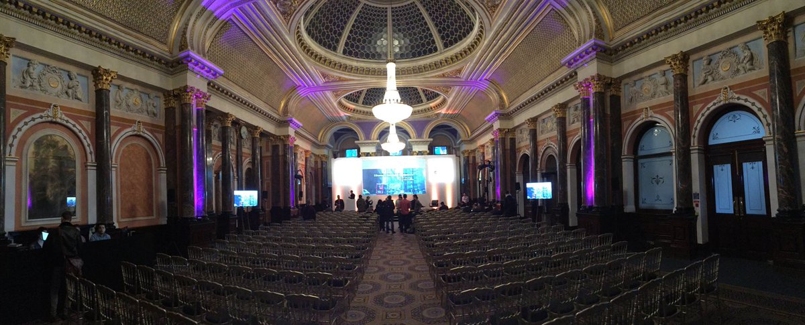
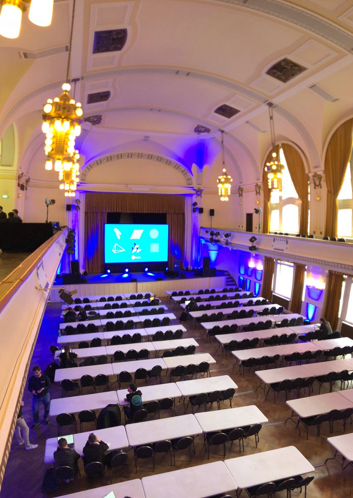
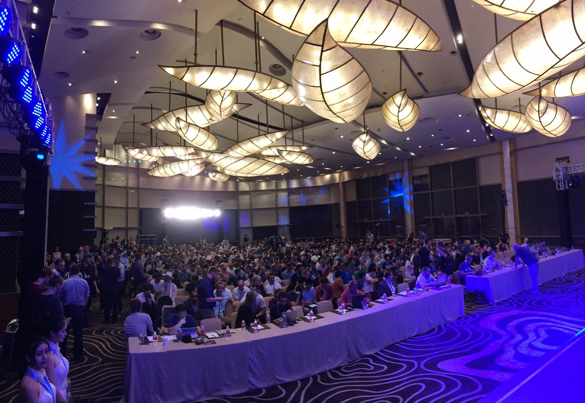
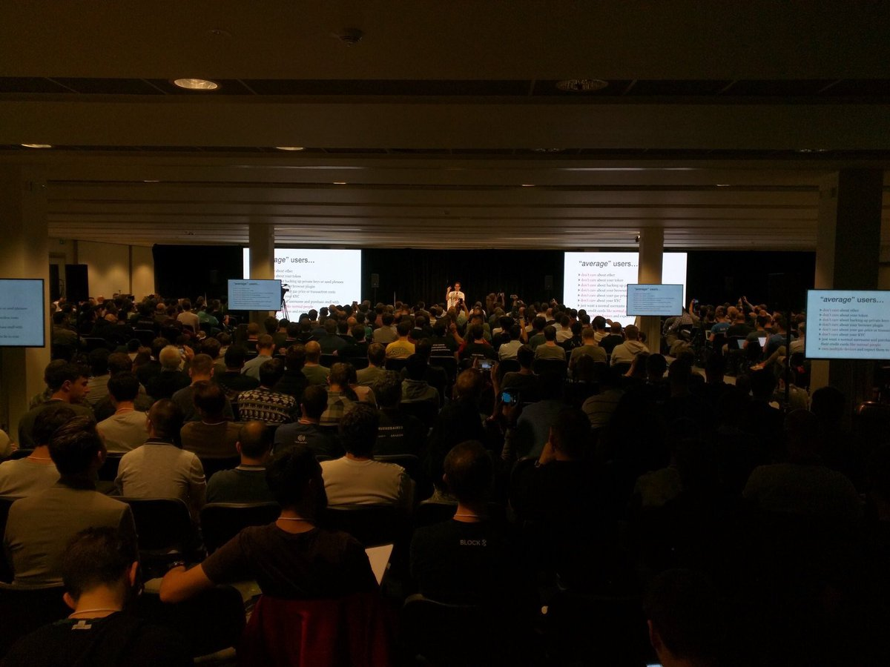
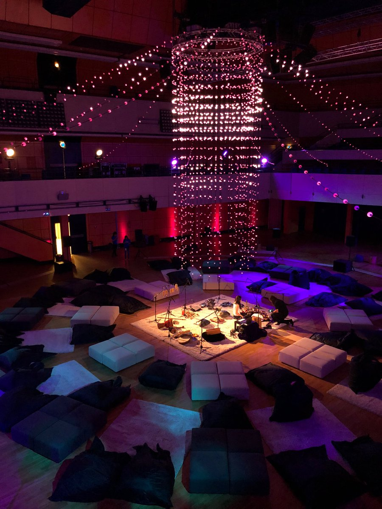
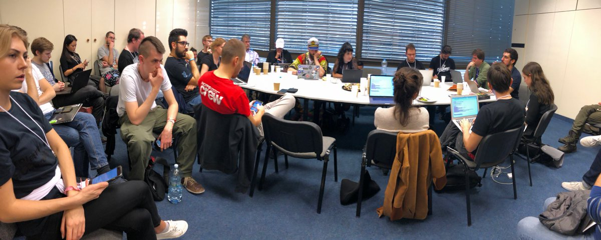
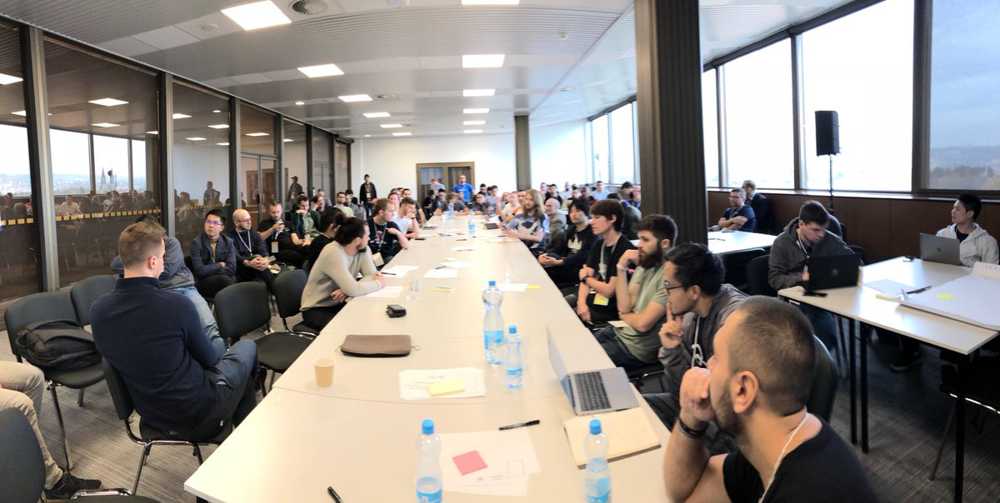
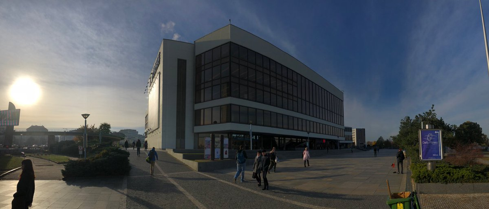
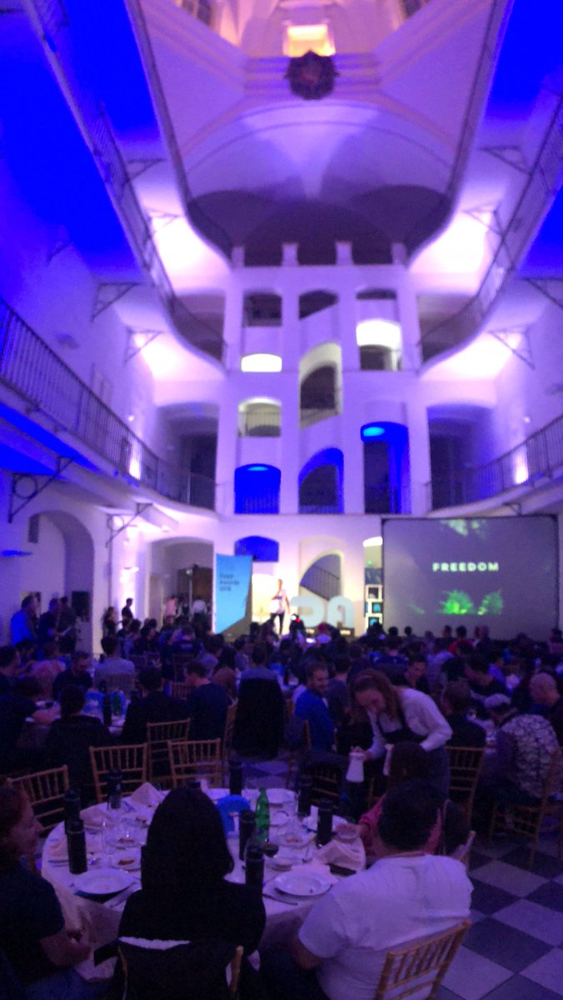

I’ve been to all devcons (except Cancun) so here’s a perspective and pics.

The first devcon (obviously we start counting at 0) could barely be called a “conference” it was mostly a team retreat. About 50 people, many meeting together for the first time, presenting their work

Devcon1 was in London, about 300 people. The whole conference would fit in the main hall at the National House Smíchov which had three more floors of rooms and hosted many satellite events (Cryptolife Hackaton,  Philosophers Salon, Magicians council, the ECF alumni show & tell).

Devcon2 was in Shanghai and doubled in size to about 700 people. That’s the same headcount as the Prism sidestage, which ran on day 0 at full capacity.

Devcon3, Cancun was more than twice the size of the year before, about 1500-2000 attendants, and for the first time had two parallel tracks. (I don’t have any picture of the room as I wasn’t there for personal reasons)

This years devcon had 8 parallel tracks!

And also two rooms running person to person events and a series of rooms available for setting up ad hoc meetings. And of course, the Neptune room, where an artist was giving a constant performance of ambient sounds where people could go to relax and do quiet work.

<figure>

</figure>

Those ad-hoc, off-schedule meetings where crucial as they allowed teams that wanted to coordinate changes or discuss standards to do anytime. I’ve personally seen a Meta-transactions roundtable, news interviews and Amir Taaki giving a talk on the fall of western civilization.

Devcon4 has about 3000 badges printed. I personally hope it doesn’t double in size again, because a 6000 person conference sounds unmanageable - and because often the main stage was quite empty, with most people crowding in the smaller and more personal workshops

<figure>

</figure>

In those you had more  opportunities to interact with the presenters—some people skipped talks altogether and were just mainly networking around the (great) food tables.

If there’s demand, I hope it grows horizontally, with more independently organized events to take on the overflow of devcon attendees. Maybe we can come up with a system where the badges work more like passports that can be stamped and used as ID in other events.

<figure>

</figure>

But as so many have said before me, the organization was fantastic. I felt it captured the intimate person to person work meetings of the early devcons, with space for the big messages from keynote speakers. Congrats to @mames and @mi\_ayako\
See you all again at #DevCon5!
