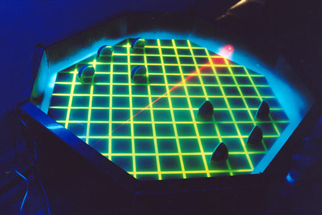

<figure>

</figure>

This link appeared here and there even got a minor digg, so a lot of people seemed interested into building thier own laser chess game

[What are we talking about?](http://www.wanderingabout.com/thingswithlaser/index.php)

#### How the table was made?

It was a rather big game, a tabletop size. It had a wooden structure, covered in the outside with plastic (polyesthyrene if I remember well) sheets

#### How you make the laser visible?

If you don't make the laser visible you will be rather disappointed, having to search for where the red point had gone since you moved the mirror. You need particles in the air, and anything from clapping a chalkboard or smoking on the board will do. We decided to use dry ice, as we didn't have a smoke machine to spare, and the dry ice provides a quite simple set-up: just drop it on water. If you see closely there is a ditch around the table, it's where we filled with water and dry ice. Be careful: the dry ice doesn't give much smoke so make the ditch as small as possible to get the dry ice inside, but not too deep. Remember to make it impermeable, with plastic sheets and resin. We put a blue snake lamp for the effect. yes we could have used a smoke making machine, and we kept promising we would someday. But we never did, you know how those things go... Also: remember the thicker the smoke there will be a decay in the laser, as you can see one picture. It can be a part of the game rules, as you have to hit the goal, but you have to make the laser travel less than x meters or it will weaken too much

#### How you made the laser pointer?

That's amazingly more easy than it seems. We bought a couple of cheap laser pointers from the street vendor and opened it up to figure it out. I was a first year student, and my only experience in electronics was making cardboard lanterns with two A batteries. If you can build a lamp, you can build a laser pointer: open it up, put some cooper cables where the batteries used to be and link them to some AA batteries and add a on/off switch.

#### What about the pawns?

Those round pawns are made of semi transparent resin (so they look cooler when hit by the laser). We used a halved billiard ball as mold and asked a local glass shop to put the mirrors on it.  **Those yellow lines looks so cool!**

Thank you buts that's more due to the lighting than from the lines themselves. We had a black wooden board painted in black, masked and sprayed up the lines. We used a neon colored yellow, nothing special. But put it under a ultraviolet lamp (those that you see in night clubs, I hope they aren't exactly the cancer emitting ultraviolet types) and the yellow neon will look infinitely cool. We also painted ourselves in invisible paint that shines on that lamp and put some techno music to impress our teacher

#### did it impress you teachers?

No. He was expecting us to make lego stack able bricks. The only thing stack able were the round pieces and they were merely complementary. But all our colleagues loved it.

#### What are the goals of the game?

They are two acrylic tubes, folded in heat in a L shape. We drilled two holes at the sides, and put it trough it, so when you hit the bottom the whole stick lightens up

#### Are there any game rules?

Well yes but I suppose you will want to make them yourself. Ours were not very imaginative: each turn you get to move and rotate one pawn, in order to try to reflect the laser to the opponents goal. If you move into an square occupied by an opponent, you capture it, which means the two pieces become one big non-reflective piece you control and can use to block the laser.

Laser Chess was designed and built in 2001, in participation with Ricardo Bacellar, Rodrigo Rego and Daniel Veloso. Those images are actual unaltered photographs of the working model.

|

[www.wanderingabout.com](http://www.wanderingabout.com)

This website is a repository for design works and ideas by a brazilian student called Alexandre Van de Sande.

If you want to know more you can read about [who is he](http://www.wanderingabout.com/myself/index.php)  or try to [contact](mailto:WVITMUIXCFTM@spammotel.com) him.
