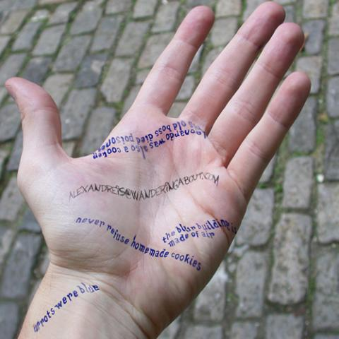
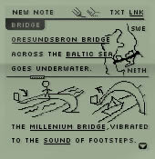

<figure>

</figure>

Mind the pad is a mind-tracker application-concept for cell phones and PDAs that is at the same time a scribble & write sketch pad, an address book, agenda and file organizer.

The main principle behind the application is that information is not saved on a fixed location, but is stored as separate pieces that are auto organized as the user reach for it. Each piece of information, or meme, is a small text file along with a drawing (superimposed over the text), which can be linked to images or any file. Upon reading the user may underline some words and they will be transformed on special index words. When the user clicks an index word all information is re-organized and every data containing this index will be joined. Consequently, the user will be able to bridge ideas and concepts while searching for different data or files.

<figure>

</figure>

Each index is also associated to data fields as email or telephone number, so his address book is seaming less joined into the idea flow.

As the user does not need to previously organize it, information can also be inserted by medias such as voice and images. With a built-in text-to-speech technology, he may insert multiple, unrelated, voice memos during the day, which will automatically be converted into easily retrievable, therefore useful, data.

If the hardware has a camera, Mind the Pad becomes even more powerful. The user may add a voice comments to each photography he takes, that will be converted in an associated meme so he will be able to navigate thought his image library much in the same way his brain works when he is telling a story about a trip: by bridging and information association.

Later, the user can use the built in optical character recognition, to retrieve information about some images. Then he may quickly photograph an advertising, a note on the wall or a business card to insert the information about it.

- about: Mind the pad was designed in 2004 as a personal project
