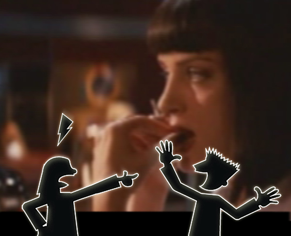
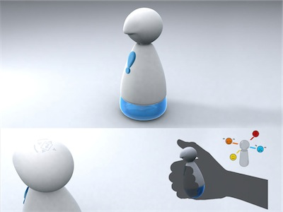
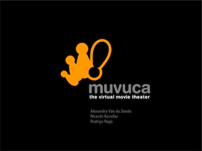
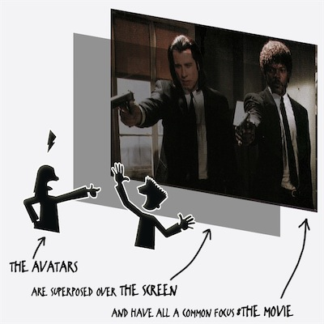
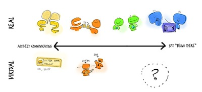

muvuca is about connecting distant friends through some kind of non verbal sharing. throught their avatar on the movie screen they can sense that their friends have a common focus of attention.

<figure class="youtube">
<iframe src="https://www.youtube-nocookie.com/embed/Bm6tFNpELRk" title="Muvuca, the short movie" loading="lazy" allowfullscreen allow="accelerometer; autoplay; clipboard-write; encrypted-media; gyroscope; picture-in-picture"></iframe>
</figure>

<figure>

</figure>

It’s a virtual movie theather, where all friends watch the same movie at the same time. The avatar, controlled by a puppet-like remote, allows the users to hav movements without sounds to allow silent comunications. Also, it can act as a passive microfone transforming the audio in semi controlled movements from the avatar.

<figure class="youtube">
<iframe src="https://www.youtube-nocookie.com/embed/Sn-rhyY8Mj0" title="Muvuca and Bill" loading="lazy" allowfullscreen allow="accelerometer; autoplay; clipboard-write; encrypted-media; gyroscope; picture-in-picture"></iframe>
</figure>

<figure>

</figure>

<figure>

</figure>

<figure>

</figure>

Also see this [Bill gate’s comment on the project](http://www.youtube.com/watch?v=Sn-rhyY8Mj0)

<figure>

</figure>

<figure>

</figure>

- about: Made for the Microsoft Research Design Expo 2003 contest, along with Rodrigo Rego and Ricardo Bacellar
