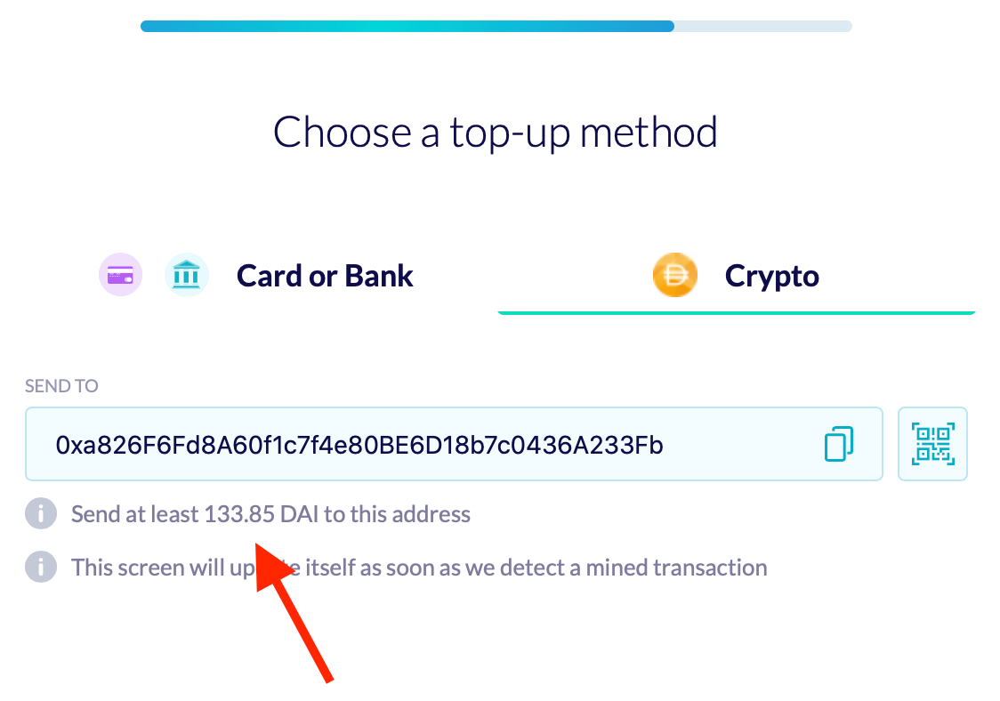
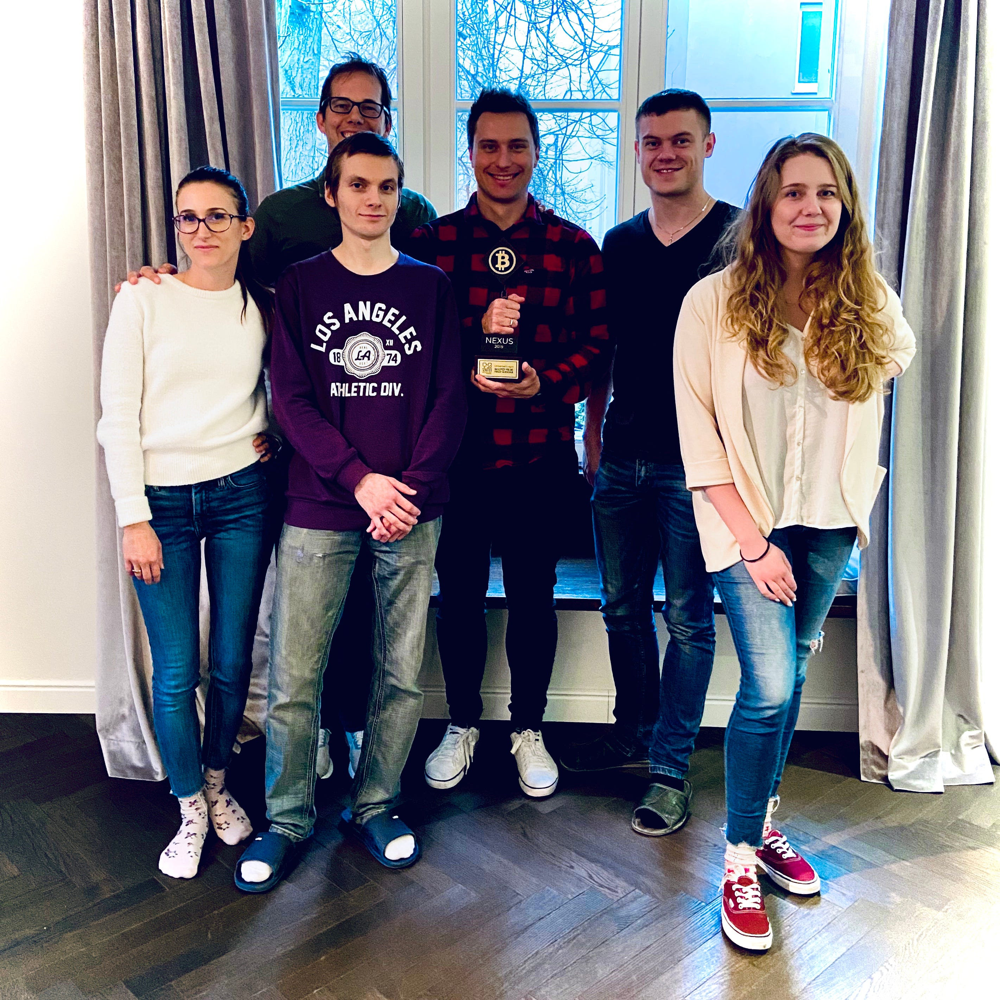

UniLogin is out of gas.

Not necessarily out of money, but the current Ethereum gas market, the rise of DeFi, and new browser standards have changed the game significantly enough that we don’t see a way forward with the project.

UniLogin started [two years ago with a vision for a Universal Login standard for Ethereum](https://www.youtube.com/watch?v=qF2lhJzngto&t=1s), a way to onboard new users to Ethereum directly from the browser, using smart accounts and abstracting away all the gas. While the idea was very well received by the community ([we packed the second largest stage at Devcon 2018](https://www.youtube.com/watch?v=TztR_7IehjU)), we made some bets on a few assumptions that turned out to be untrue.

#### Incorrect Assumption #1: Browsers could be counted to store low value secrets

A big part of the magic behind “create any account without downloading or installing anything else” was that we were using localstorage for initial secrets.

We knew localstorage had a lot of issues: a malicious browser extension can access all your browser info, a DNS attack could be used to phish users, etc. Our strategy for that was to push users towards multisigs: every time you logged in from a different browser or device we would add another key, meaning that if one of them was stolen, the others could be used to prevent or limit any harm. We could even add further security by making stronger requirements for larger amounts (e.g., to move anything over $20 you need to install a phone based app).

But we didn’t expect to be caught in a fight between Internet giants. Localstorage, cookies, and any sort of client side memory is widely used and abused by marketers to track users across the web. Some browser vendors (most prominently Apple) are fighting back by being more aggressive on their memory wiping policy, [including erasing all memory if the user doesn’t visit a site in 7 days](https://webkit.org/blog/10218/full-third-party-cookie-blocking-and-more/). As a result we (and ironically, a lot of privacy preserving “burner wallet” websites) simply can’t rely on that method anymore.

As a result, we had to change our roadmap to include signing in via email. We thought it would be the least invasive of the authentication methods (e.g., compared to social media sign in) but it did mean that now we would be hosting (client-side encrypted!) our users wallets. It also significantly altered our flow, since we wanted the only identifying information for the user to provide to be an [ENS name](http://ens.domains/).

#### Incorrect Assumption #2: Scalability wouldn’t be a problem

This was an explicit assumption in our presentations: usability was more important than scalability, and given that there were so many deployed L2 solutions on the market (like xDai), as soon as scalability became a problem we would all move there.

This turned out a deadly assumption: as soon as we had our email sign-in solution ready, gas fees on Ethereum made the whole process unworkable.

<figure>

<figcaption>Step 2 of onboarding flow: send $133 to the miner</figcaption>
</figure>

UniLogin is particularly sensitive to gas prices because _before onboarding any users_ we were deploying on their behalf a new multisig wallet, registering an ENS name, and sometimes using our relayer to add a Dai transaction. After that, _every new sign-in on a different device required a new on-chain transaction_ (to add a new key) and _every transaction would be a bit more expensive_ due to the relayer. **Some days the whole process of onboarding a new user was costing over $130!** Meaning you could buy a hardware wallet for the price of signing up on our app.

We don’t consider this to be a temporary problem. Even if the gas situation improves and makes the cost of user onboarding 10x or even 100x better that would still be a deal breaker for many mainstream applications with millions of users.

#### Incorrect Assumption #3: Ethereum is meant for everybody

I still hold this belief and hope it will be true again in the future, but at the moment Ethereum has been going [through a process of gentrification](https://twitter.com/ameensol/status/1293077109347250176), where big defi users are pricing out all other usage of the network. Games, NFTs, DAOs, and many other exciting use cases are simply inaccessible at the cost of multiple dollars per transaction. Of course, the natural course will be that a lot of new stuff will move to L2 or their own chains, but right now at the moment the process is scattered, where many apps are using different scalability solutions.

The result is that it’s quite hard for someone to build a system right now as the **One Universal Account**. For the foreseeable future (which is very short in crypto!) I expect that a lot of interesting use cases will migrate to xDAI, and that some stark/rollup solution will be the basis of a trading-specific chain.

### Conclusion

Because our team is small and lean, we could easily squeeze out another six months of product development and maybe try to find a bridge investment (you can add a #4 to a list of incorrect assumptions: “that a global pandemic and recession wouldn’t dry up a lot of VC capital in early stage startups”).

One more direction we considered would be to do a _full pivot into a L2 defi focused wallet or a sign-in solution only for a smaller set of products in xDAI_. However, this would be almost a restart of the project and so we decided simply to return the remaining cash to investors and then go on the next opportunity.

The wallet market was very hot two years ago, and now that yield farming is the new hot thing, wallets are going through a natural consolidation. [Portis is now ShapeShift](https://medium.com/portis/portis-is-now-part-of-the-shapeshift-family-c86fc402882b). [Fortmatic is now Magic](https://medium.com/fortmatic/fortmatic-is-now-magic-reinventing-identity-for-a-more-secure-and-authentic-web-4c6a1608ddcb) and is focused on [passwordless signups](https://medium.com/magiclabs/magic-raises-4m-to-end-the-era-of-passwords-f14dda572919). Argent (which I consider to be the closest implementation of the original vision I had for Universal Logins) announced their login SDK at EDCON 2020, but haven’t deployed it yet. Also a shoutout to our friends at Authereum which are still working hard on figuring this gas thing out!

Because we always used the open philosophy of putting users in charge, we can’t actually shut off access to user wallets, because they are actually just a standard gnosis safe. We will continue running relayers at least until the end of the year to facilitate users migrating their interfaces and funds elsewhere. If after that you still need some help feel free to contact marek@ethworks.io and we will help you figure out what you need.

### Whats next?

My co-founder Marek, along with the rest of the team, will be joining the ranks of [Ethworks](https://ethworks.io/) — setting out on a journey to become one of the top Ethereum and blockchain service companies worldwide.

For me personally it was quite an adventure. I travelled to many places, met a lot of great, lovely, beautiful, intelligent, inspiring people, stepped out of my comfort zone, had great conversations with VCs, founders, and builders of all walks of life and did things I had never done before. I’m thankful of everyone who I met in this road and hope to see you soon on whatever my next step is.

_So long and thanks for all the fish._

<figure>

<figcaption>Our team, from left to right: Natalia, Alex (behind), Albert, Marek, Jarek, and Justyna. Not pictured: Brantly, who greatly helped communications.</figcaption>
</figure>

---

[Out of Gas: We’re Shutting Down UniLogin](https://blog.vandesande.design/out-of-gas) was originally published in [UniLogin](https://medium.com/universal-ethereum) on Medium, where people are continuing the conversation by highlighting and responding to this story.
