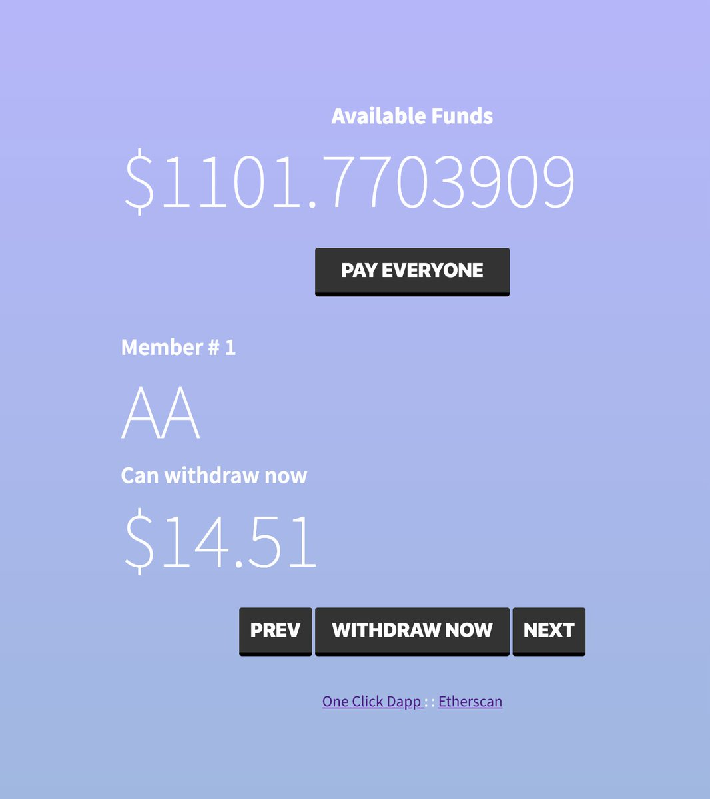

Today I was able to pay my whole team with a single click. Could have been none but the scheduler service failed. This little tool really shows how much ecosystem evolved that  we can solve simple real world problems today by connecting multiple contracts.

<figure>

</figure>

I spent a half a day and was able to build a contract that keeps DAI in compound, but withdraws when it wants to make specific payments. I added yearly salaries of all team members and spent another half day in making a nice interface so they can request payment at anytime.

I recently posted how after being paid in BTC and ETH I was now receiving in DAI. But there's a lot more to the story. In fact my whole team has been receiving in ether for years but we had a lot of trouble doing so.\
[x.com/avsa/status/1087730019055616000](https://x.com/avsa/status/1087730019055616000)

First of all, it's actually quite hard – purposefully – to move funds. Some of the bigger wallets the foundation has have been an original multisig code, which is safe but only works with command line tools. At some point we had to wait for busy people like Vitalik to sign a tx.

Also, payments in ether are complicated for accounting due to volatility. Do you use the exchange rate of the invoice or the day the tx is sent? People send invoices in different days, it takes some time for the person responsible to go through payments, it's not trivial.

The result is that for a long time the decision was that the exchange rate used would always be either the 1st or 15th of the invoiced month, depending on when the invoice arrived. It simplified things for one side, but also created an inconvenience for those being paid.

In highly volatile months you could receive 30% more or 50% less than you expected. While it can lead to some good surprises, people don't like to gamble their salary usually. So I proposed a solution for my own team: they would invoice to a buffer contract.

The buffer would pay them immediately on the latest exchange rate and then at some point it would be paid back at whatever exchange it was sent to. It had other functions too, requiring secondary approval, listing individual invoices, even a place to put swarm files.

But mostly it became just a way to make sure everyone got paid on time, while it reduced the overhead from HR people that now only had to make one transaction to pay many invoices, since everyone asked to the same address. But it did increase my overhead as I now had to manage it

Since it required a 3 step process for paying (submit, approve, execute), it would meant to pay 4 people I would need to sign 12 transactions or more (I also had to manually add the day rate).  The move to DAI could help most of these points.

At first I considered using Aragon's "Payroll" app, which inspired the idea of setting a yearly salary and allow you to be paid per block. But that app is under development and the buffer dai would stay locked on the contract, not generating interest. So I decided to build my own

As a final touch, I set the default function to pay all amounts due and be public, so it allows a service like ethereum alarm clock to schedule a call for a given day of the month. We recently tested today and it all worked like a charm. Here's the code:\
[github.com/alexvandesande/payroll/blob/master/contract.sol](https://github.com/alexvandesande/payroll/blob/master/contract.sol)
