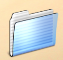

<figure>

</figure>

A lixeirinha que voce joga coisas fora, assim como as pastas as janelas e icones da área de trabalho, já fizeram 20 anos de vida O mouse com que você mexe tudo isso já passou de muito disso. 2007 foi definitivamente o ano que produtos com interfaces totalmente diferentes chegaram ao mercado mainstream mostrando que outra interação é possível e que ela vai além do nosso computador pessoal.

\<iPhone e seu Multitouch. Touchscreen já existe há duas décadas, mas era tão natural quanto tentar arrumar seus papéis com um dedo só. Poder usar mais de um dedo significa poder girar a mão, apertar, soltar. E adicionar elementos de física, inércia, desaceleração para os elementos da interface são mais do que uma animação decorativa, tornam tudo mais natural. Que 2008 as interfaces pareçam com elementos do mundo real.

Wii e seus vários sensores. O wii tem tantos sensores que fazem você esquecer que ele tem quaisquer sensores. Jogar com ele é usar a imaginação e brincar sacudindo sua espada invisível, apontando um arco e flecha não existente. Que em 2008 interfaces levem mais em consideração o objeto como um todo e sua posição no mundo real e não só os botões que você aperta.

Google Android. A plataforma open source para celulares do google parece já ser campeão antes mesmo de existir. O iPhone só se tornou realmente útil depois que fo hackeado com novos aplicativos. Quem em 2008 plataformas sejam abertas.

XO e o sugar. Claro que não podia deixar esse menino de lado. Apesar de usar a mesma interação básica: teclado e mouse, o Sugar se destaca imensamente por ter toda uma nova metáfora da computação emprestada da web, onde tudo gira em torno de colaboração. Que 2008 possamos aceitar e aprender novas metáforas para nossos sites e softwares.

<figure>

</figure>
