Only capital of a country in Europe to be outside Europe.

I’m actually considering doing a whole new thread like Sunny’s, just with Brazilian historical trivia. Hands up if I should. [x.com/sunnya97/status/1271313741812883457](https://x.com/sunnya97/status/1271313741812883457)

---

The Amazon is manmade. Its highly fertile soil is the result of purposefully mixing broken pottery, manure and fish bones for large scale agriculture. Many native species that were believed to be wild are now known to have been domesticated over thousands of years.

<figure>
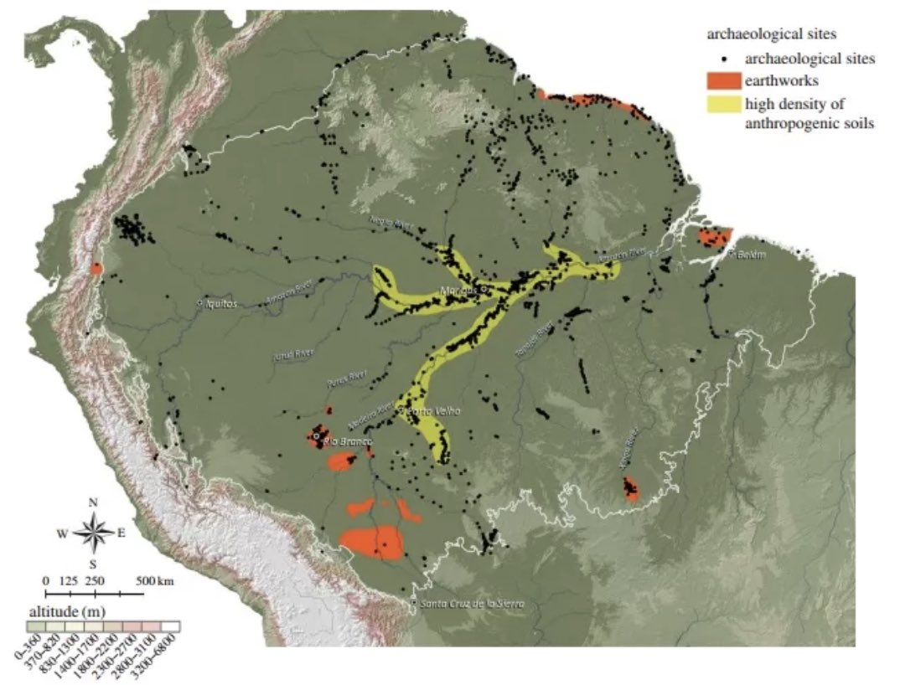
</figure>

References:\
Terra Preta: [en.wikipedia.org/wiki/Terra\_preta](https://en.wikipedia.org/wiki/Terra_preta)\
Domestication of plant species in the Amazon: [sciencemag.org/news/2017/03/hundreds-years-later-plants-domesticated-ancient-civilizations-still-dominate-amazon](https://www.sciencemag.org/news/2017/03/hundreds-years-later-plants-domesticated-ancient-civilizations-still-dominate-amazon)

---

The first European on the Amazon reported it densely populated, which was later considered an exaggeration. Recent deforestation have uncovered hundreds of geometrical patterns now understood to be remains of wooden temples (the region lack stones) of yet unknown civilizations.

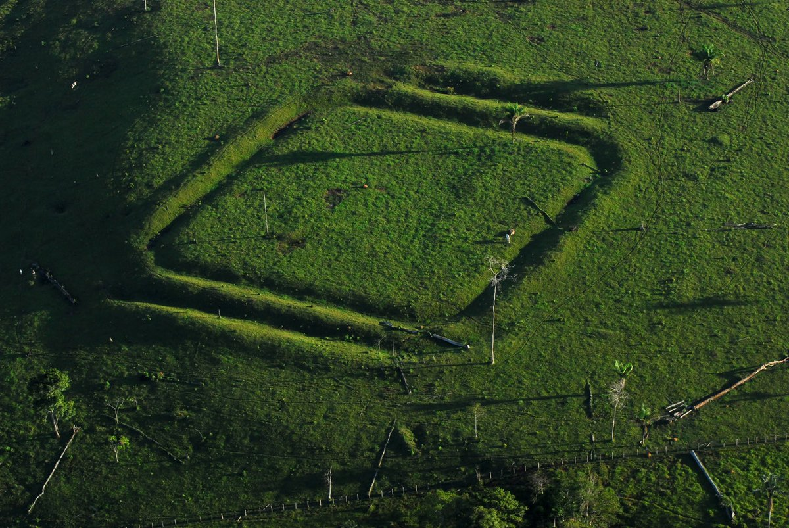
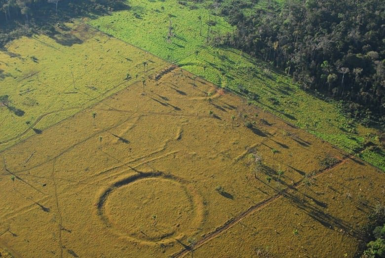
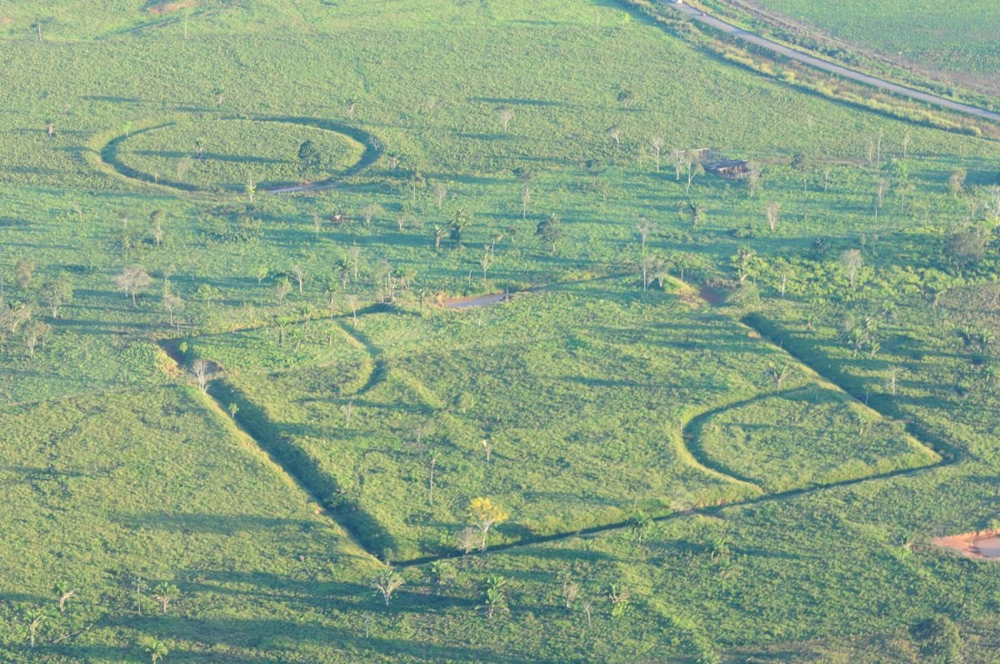
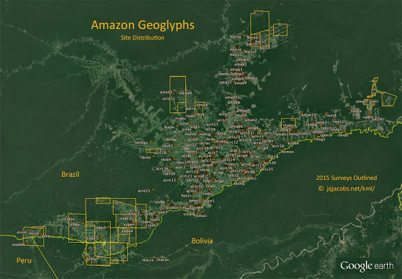

---

All the tribe members had bows, and when they saw white men coming down their river in a weird boat, they welcomed them with arrows. The Spaniards barely made it home alive, but were so impressed about the mythical women warriors they called them the “Amazons”.

<figure>
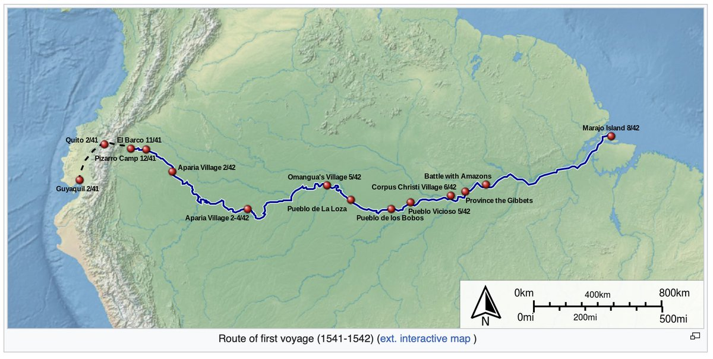
</figure>

---

Uncharacteristically for nomadic tribes, some Amazon people (Kambeba, Marajoara) have a class based society, further evidence they descended from a more complex agrarian society. The Kambeba even did cranial mods to differentiate themselves from other inferior "forest savages”.

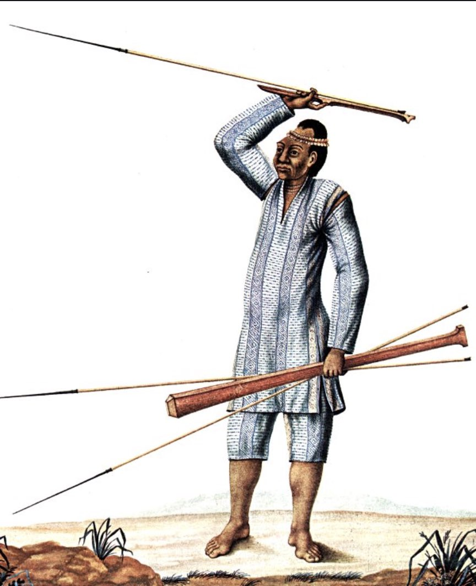
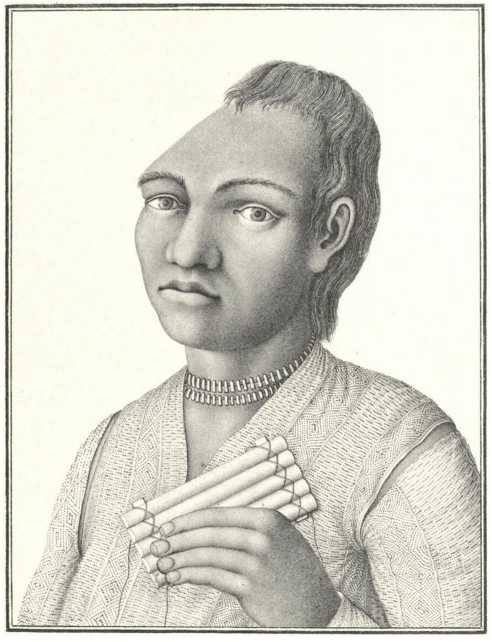
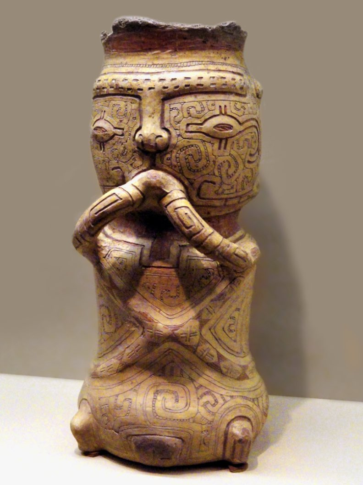

I hope I have convinced you that the idea that the Amazon was a pristine and unocupied land is a myth. I swear tomorrow's trivia will be on a slightly different take.

Reading suggestions on that topic:\
[en.wikipedia.org/wiki/Francisco\_de\_Orellana](https://en.wikipedia.org/wiki/Francisco_de_Orellana)\
[en.wikipedia.org/wiki/Cambeba](https://en.wikipedia.org/wiki/Cambeba)\
[en.wikipedia.org/wiki/Marajoara\_culture](https://en.wikipedia.org/wiki/Marajoara_culture)

---

When the Pope proposed to divide the world between Portugal and Spain in 1493, King John II threatened war to push what was an arbitrary line in unknown sea 270 leagues to the west, later revealed to contain most of Brazil. This was probably not a coincidence.

<figure>
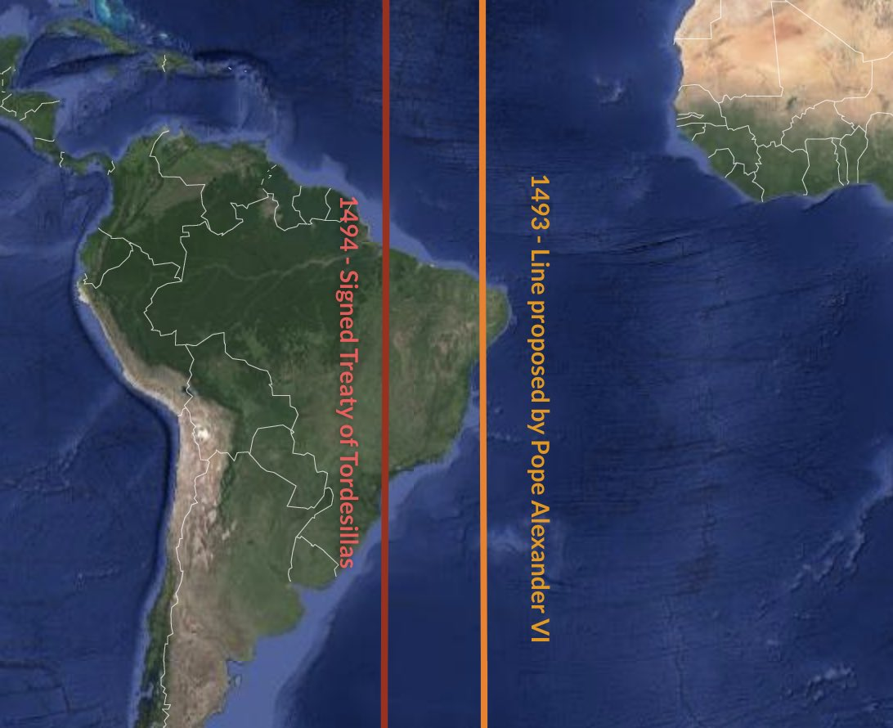
</figure>

---

The first European to arrive on Brazil was a Spaniard.\
While there’s controversial evidence for some 1498 trips (and even earlier speculation) the first documented exploration of the Brazilian coast is of Vicente Pinzon, 2 months before the official Portuguese trip by Cabral.

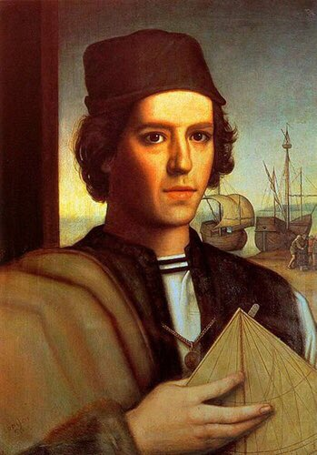
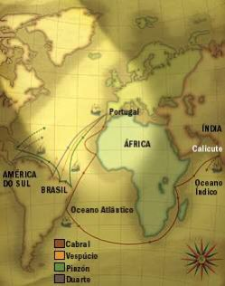

---

Cabral’s fleet to India, which claimed brazil for Portugal, was the largest ever assembled, 13 ships and 1500 men, more than Colombo, Pizarro, Vasco da Gama and Cortês expeditions combined. Yet it was given to a high noble with no sea experience as was the custom of the time.

---

Brazil, the netherlands and Italy shared the same King for 60 years. He was spanish.

<figure>
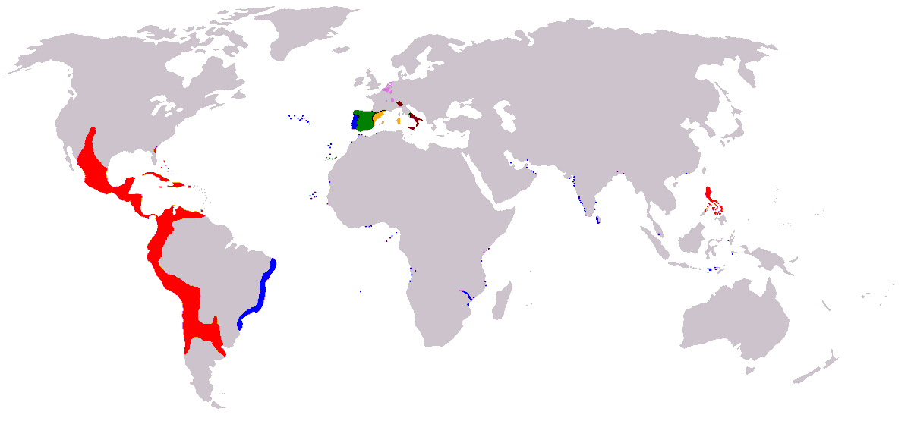
</figure>

---

Like many countries, Brazil celebrates Independence Day. But unlike others, it was actually encouraged by the Portuguese king to his son, who, seeing both colonies and kings were falling out of fashion, declared himself emperor of Brazil\
Only his brother opposed.

---

During one of the few battles in the "indepence war”, the brazilian army was outnumbered and the commander ordered the bugle to call the withdrawal, but it played insted “cavalry, charge and kill”.\
The Portuguese, fearing reinforcements had arrived, receded. There was no cavalry.

<figure>
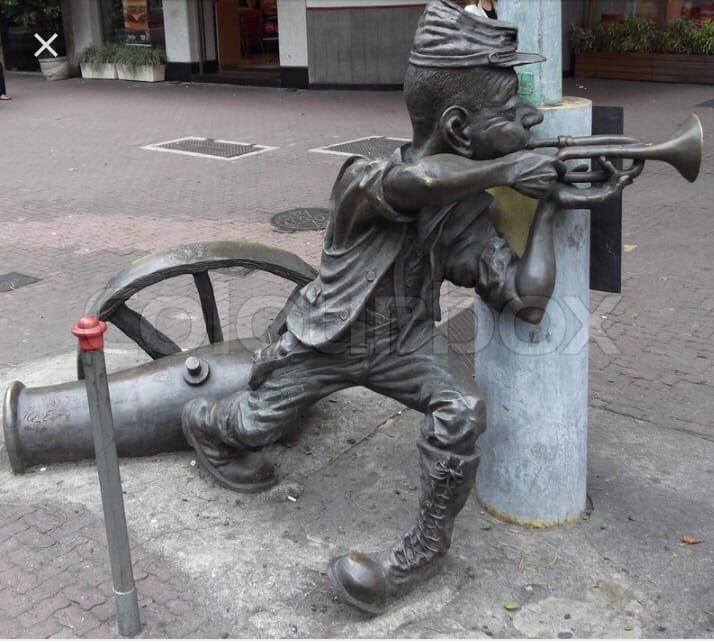
</figure>

\*independence

The trumpet player is commemorated on a comical statue in Ipanema on a street named after a big funder of the war, but unfortunately most people have  no idea of his hilarious story.\
[google.com/maps/place/O+Corneteiro/@-22.9839705,-43.2092109,3a,75y,90t/data=!3m8!1e2!3m6!1sAF1QipPym1flWfV8usEl-HPbK9r58J4AlL5tUryXeyLj!2e10!3e12!6shttps:%2F%2Flh5.googleusercontent.com%2Fp%2FAF1QipPym1flWfV8usEl-HPbK9r58J4AlL5tUryXeyLj%3Dw115-h86-k-no!7i2592!8i1936!4m5!3m4!1s0x9bd5f4627594af:0xb37554009e5574d9!8m2!3d-22.9839728!4d-43.2091708](https://www.google.com/maps/place/O+Corneteiro/@-22.9839705,-43.2092109,3a,75y,90t/data=!3m8!1e2!3m6!1sAF1QipPym1flWfV8usEl-HPbK9r58J4AlL5tUryXeyLj!2e10!3e12!6shttps:%2F%2Flh5.googleusercontent.com%2Fp%2FAF1QipPym1flWfV8usEl-HPbK9r58J4AlL5tUryXeyLj%3Dw115-h86-k-no!7i2592!8i1936!4m5!3m4!1s0x9bd5f4627594af:0xb37554009e5574d9!8m2!3d-22.9839728!4d-43.2091708)

---

Shortly after the Independence the whole process was *accidentally* reversed. Due to his father death, Peter the first, emperor of Brazil, was also crowned Peter the fourth, king of Portugal. He abdicated the Portuguese throne for his daughter, the only Brazilian queen ever.

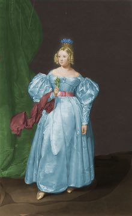

---

Half of all victims of the atlantic human trafficking trade were brought to Brazil.   About 4-5 million enslaved africans were brought, 6x the total number of the United States. Brazil was also the last state in the Americas to abolish slavery.

<figure>
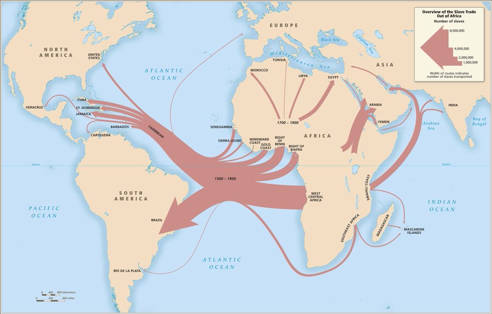
</figure>

---

After aboliton, all the files related to slavery were burned, theoretically to "allow the formerly enslaved to have a blank slate". Of course, quite conveniently for the former enslavers, this prevented any talk of reparations for their former victims.

Link to a new story of the time: [m.acervo.estadao.com.br/noticias/acervo,a-destruicao-dos-documentos-sobre-a-escravidao-,11840,0.htm](http://m.acervo.estadao.com.br/noticias/acervo,a-destruicao-dos-documentos-sobre-a-escravidao-,11840,0.htm)

---

Brazil had its first “black” president in 1906. The country never had racial laws but racism manifested in society in other ways: his critics would call him a “mullato” but Nilo Peçanha’s family denied it and his photographs would be whitened. Only recently has this view changed.

<figure>
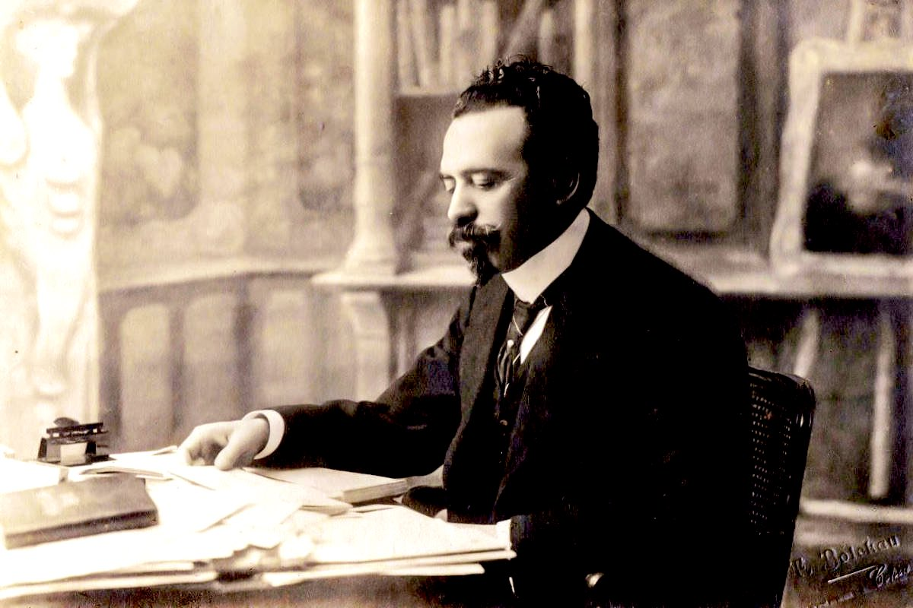
</figure>

---

The emperor was still popular when the republic started, and monarchy still enjoys some occasional popularity. A 1993 referendum to reinstate got 13% of the vote. The current “heir” was elected a congressman in 2018 and was considered for a VP for the current far-right government

---

There's currently a schism in the Brazilian “royal" family, due to a "scandalous” marriage of the Peter’s grandson with a commoner in 1908. As of 2020 there are two claimants for the non-existing throne of emperor of Brazil.

Whe wasn't even a "commoner”, she was a countess noblewoman from the Bohemian kingdom, but she had no *shocked face* royalty claim. I find the whole article particularly funny, a series of detailed wiki articles about people who did nothing but be born.

[en.wikipedia.org/wiki/Line\_of\_succession\_to\_the\_former\_Brazilian\_throne](https://en.wikipedia.org/wiki/Line_of_succession_to_the_former_Brazilian_throne)

---

Only once in the history of Brazil was a democratically elected* president both succeeded and preceded by another democratically elected president. It happened in 2016.

\*This excludes the first republic in which neither woman or poor people could vote. But even if we include that one, it doesn't get much better: the longest sucessions of presidents without a death, impeachment, or coup d'etat was 4 sucessions, 1894 to 1909.

It was actually 2010, 2016 is her impeachment. Had a brain short circuit there.. [x.com/interstar/status/1278391632308711424](https://x.com/interstar/status/1278391632308711424) [x.com/interstar/status/1278391632308711424](https://x.com/interstar/status/1278391632308711424)

---

After Japan, the country with the second largest community of Japanese descendants is Brazil, about 1.5 million people.

---

Brazil’s first war as an independent country was with also newly independent Argentina, over who would control a bordering province. Both countries lost and thus was created the independent country of Uruguay.

---

Brazil still has some territorial disputes with Uruguay. One of them is a river island which was until 2011 inhabited by a single, ninety year old, farmer. When a fire broke there in 2009, firefighters from both countries came to the rescue.  It’s currently uninhabited.

<figure>
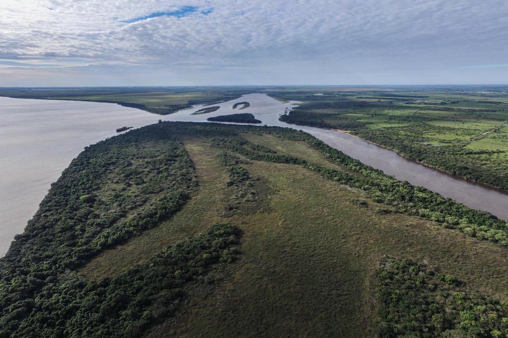
</figure>

When the first Brazilian president since redemocratization visited Uruguay, he was met with a congressional protest against the “occupation” of the island. He knew nothing about it. Locals said there was an old stone house built by “dirty mark”. It was an old boundary marker.

---

France’s largest land border is with Brazil. It’s also Brazil’s second *smallest* border and the only part of Brazil visible on the euro note.\
The border is serviced by a single two lanes bridge since 2017.

<figure>
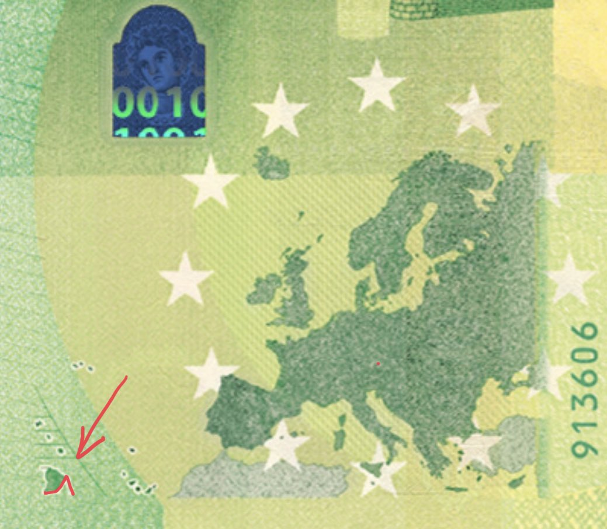
</figure>

Thanks @TheOisinMoran for this one.

---

In 1997 Brazil signed a deal with NASA that would allow one astronaut on the ISS. It required the country to develop and build a metal rack to be mounted un space. Brazil never delivered. Instead in 2006 Brazil paid the Russians $11M for a ride. He’s the current science minister.

<figure>
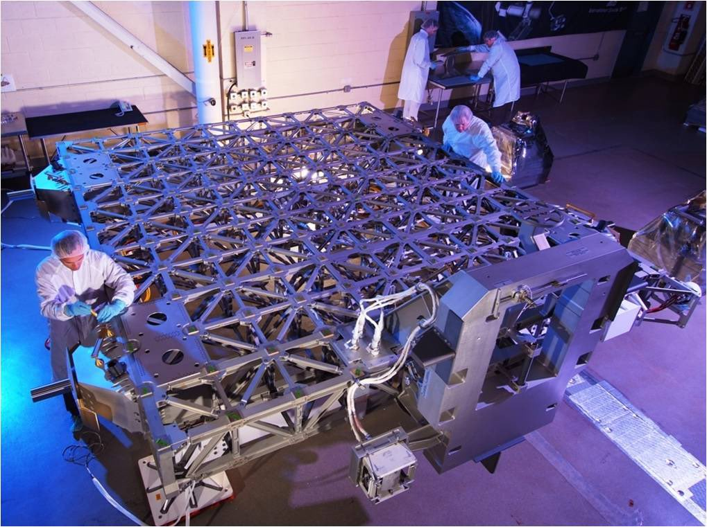
</figure>

---

Brazil has been ruled by 16 kings, 2 emperors, 38 presidents (20 actually elected) and 3 republican prime ministers.

The country has a brief parliamentary phase during one single controversial presidential term in the 60’s.

---

While officially part of the Allies, the Brazilian Government during WWII was much more aligned with the Axis, having even deported Jewish Germans in brazil back to Nazi Germany. It only sent military forces by the end of 1944—less than 1000 brazilians died figthing in the war.

---

The current Brazilian president had over 50 impeachment requests. If one goes through, it will mean that half of all presidents elected in Brazil since the last constitution would’ve been impeached.\
All impeachments have led to removal from office. We never needed to do it twice.

---

In 2013, protesters invaded the national congress, a start of a movement that ultimately led to the president stepping down.\
While it still called a soft coup by some, it was never called insurgence, because protesters never openly planned to take hostages or murder politicians.

<figure>
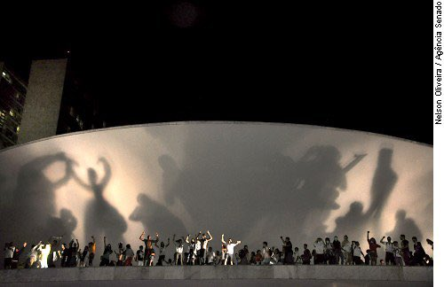
</figure>

---

When compared in area, Brazil is about 10 trillion times larger than Room 711 of the Louvre, where the Mona Lisa is displayed.

Yet this single room has, in a normal average year, 25% more tourist visits.

---

Truthfully we only have indirect evidence of large settlements (see thread).

But I’ve always found curious that the earliest civilizations we know were building large stone temples in arid climates. Is that better for large cities or simply better for the archeological record?

---

Today marks the 200th anniversary of what was probably the most farcical “independence” war ever: after “winning” the “war” the country was ruled by the heir of the former king, who—plot twist—was the one who suggested it to his son in the first place. [blog.vandesande.design/the-man-in-the-hole](https://blog.vandesande.design/the-man-in-the-hole)

---

Been a while since I've done one of these Trivias and it's not Brazil related but close enough. I just figured this  cool fact:

Chile is almost as wide as its tall. In fact it's as close to a perfect square  ratio (1.03)  as Egypt, often considered the "squarest of countries".

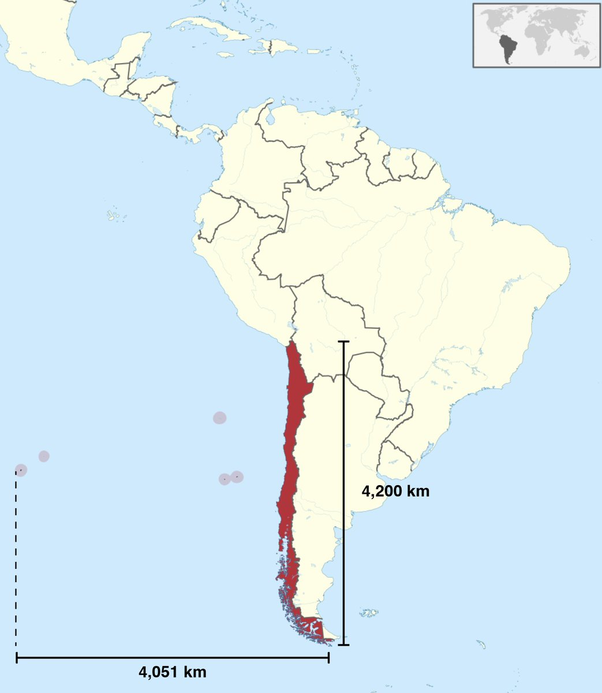
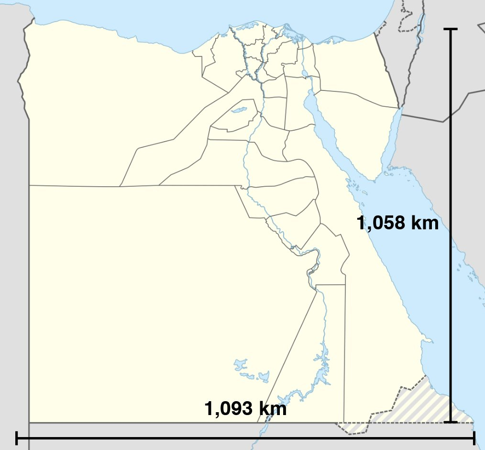

Some friends questioned the calculation. There are many ways to say "wide" as there are no rectangles in a sphere. When measuring the great circle distance from westernmost point (Moto Nui) to easternmost point (Terra del Fuego), Chile is actually wider than tall!

<figure>
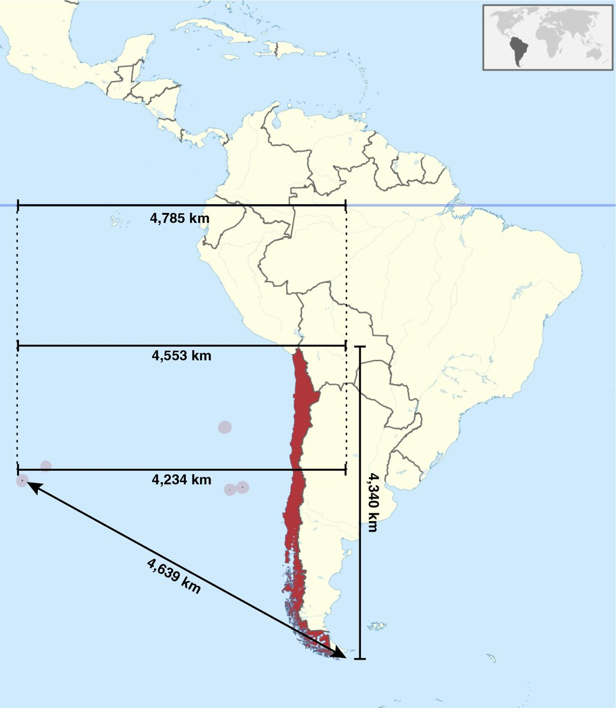
</figure>
