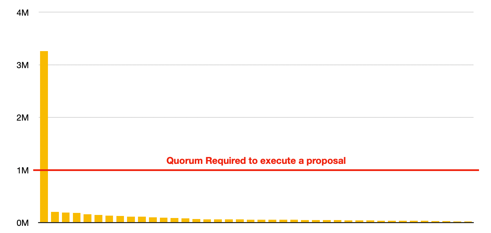
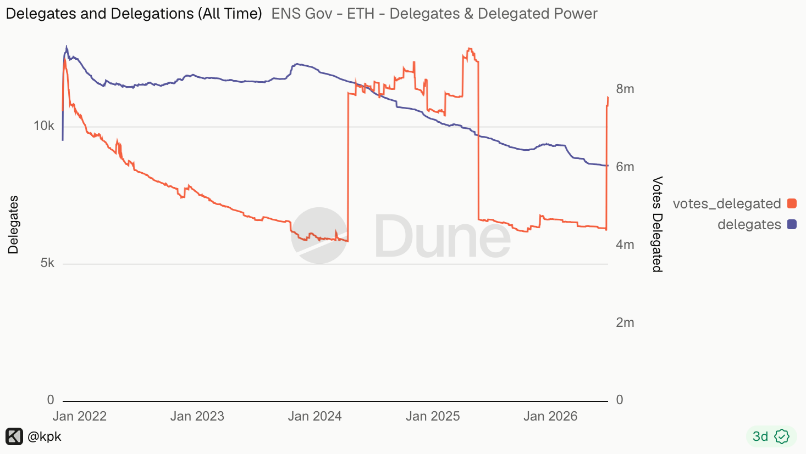
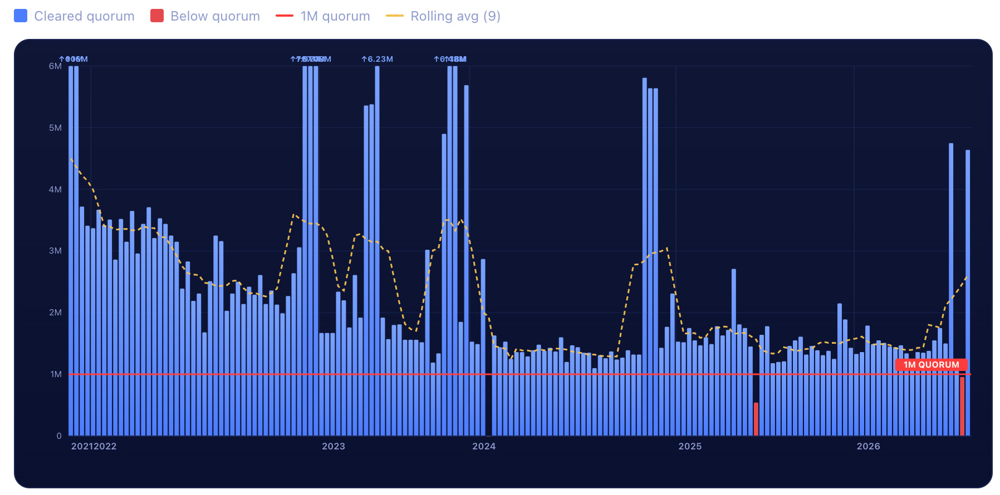

I want to share some ideas on how to reform DAO voting. These is a framework for discussing delegation of DAO votes and I welcome feedback.

TLDR:

The DAO holds over 50% of the voting power. These tokens were intended to be distributed for wider governance but were never done because of their economic value. This proposal discusses how we can delegate them (instead of distributing).

## The problem

Here are three graphs that can summarize the issues this proposal wants to address:

<figure>

</figure>

<figure>

</figure>

<figure>

</figure>

ENS Governance is clearly in a crisis. Currently, one delegate has enough quorum to not only execute any proposal, but also to outvote the next 50 other delegates. The issue didn’t start when these new votes were delegated, but rather total delegated votes has been consistently going down (except for two jumps, when the same tokens were being delegated and then undelegated and delegated once again). Voter turnout has also been consistently going down: while in the first years it was common to get 3M votes in a proposal, more recent proposals have struggled to meet the quorum.

The core issue is that most of the delegated voting power has been delegated at airdrop and then these delegations slowly trickle down as users sell their tokens and new buyers don’t care enough to delegate them. When someone receives an airdrop token, specially for free, they have a thousand reasons to sell them, and almost no incentives to use them for governance. Over the past few years, MetaGov stewards have tried to do address the issue by making redelegation free, by distributing more ENS tokens to new contributors and by [paying users to stake and delegate](https://snapshot.box/#/s:ens.eth/proposal/0xf0ad5ad5a1ee353a65424a83e74f2b8846b16885a4be99af26b5162bfa78c644) their ENS. While these have had some mild successes, they have clearly not been able to reverse the overall trend.

This proposal intends to take a different approach and simply delegate voting power to specific players and stakeholders who have an interest in a working ENS. The amount being proposed here is 5M ENS, which should be enough to be impactful but not so much it can’t be reversed.

### Who are ENS Stakeholders?

The original airdrop was distributed to all accounts who ever held ens domains, proportionally to the amount of time they held them – the ENS community of users, so to speak. But they are not the only players who can help make or break ENS, the ones whose continued collaboration is required for ENS to succeed. [The people who have the power to sucessfully fork it.](https://x.com/search?q=.gwei&src=typed_query) While there are many factors, I’d enumerate them as such:

**Users: wallets, profiles, subdomains.** The original airdrop was targeted at people who paid for .eth identities. But these are not the only names currently available: ENS has built and encouraged many other ways in which wallets can distribute free names for their users. Subdomains, names associated with a web TLD, etc. We need those as the initial distribution of users.

**Integrations: apps, exchanges and websites.** If ENS is not meaningfully integrated in the broad community so that an ENS name can be counted on to always resolve correctly, then it has no value. If the wallets band together and decide to simply pick a different naming system, then ENS will fail.

**Developers: core programmers who understand how the system works.** Besides labs, there are many other greatly talented developers who have made meaningful contributions to ENS core protocol and its associated libraries. If we don’t foster them, then we will be losing talent.

**Legacy naming systems: domain registrars, DNS hosts, IP repositories, etc**. I would argue that a continuing cooperation with the legacy domain system is the path for ENS to keep evolving and being deeply integrated with the largest web infrastructure. Web3, NFTs, Decentralized Internet, these might all have been temporary interests that the overall public is not paying attention to anymore, and in general crypto is slowly finding it’s product market fit not in radicalism but in pragmatic integrations with traditional systems.

**ENS Governance Community: stewards, delegates, etc.** We can talk a lot about the failures of governance, but we also have to point that despite all the weaknesses, ENS has had an active and diverse community of delegates and stewards that should still have an active role and voice and now are unable to express meaningful dissent. We want to make sure these are empowered again.

There might be others and I welcome further suggestions.

### The “Community Treasury”

In the original airdrop, 50M ens were distributed, 25M to the .eth holders and 25M to contributors. [Another 50M remained in the control of the dao](https://paragraph.com/@ens/ens-token-allocation-claiming-opens-nov-8) and were described as such:

> _The remaining 50% of $ENS tokens is allocated to the DAO. 10% of this allocation will be available to the DAO at launch, with the remaining unlocking over 4 years. \[…\] **The DAO is encouraged to allocate these tokens towards community focused initiatives to help the development and growth of ENS**, such as grants, hackathons, meetups and more._

While the working groups have worked in many community focused initiatives including grants, hackathons, meetups etc, not many of the DAO tokens themselves were distributed for this purpose. In fact only a few delegation distributions have happened and they collectively distributed less than 150k – way under the 10 million per year that were vesting every year. And now, it so happens that we are five years later and all the 55 million tokens (this includes a few unclaimed airdrops) are now freely unvested.

There were many reasons stewards were reluctant to distribute those tokens. Despite the DAO having consistently refused to treat them as financial assets, they were in many moments hundreds of millions of dollars unvested each year and it felt unreasonable and irresponsible to simply send those to users. And in the few cases these were indeed sent, many of them were not necessarily used for voting purposes and rather sold as soon as they were unvested. It’s understandable: when faced with the opportunity to secure a large financial opportunity that can help them in their lives, or simply vote in a governance process they don’t directly benefit from, it’s hard to put blame on those who pick the former.

### Proposal

1. Start a nomination process where anyone who wants to be delegated power can put their name forward.

   1. There will be some minimal threshold requirements, like being a person or company (not anon) who owns an ENS, and has participated in discussions before
   2. The candidate will identify itself in one of the stakeholder groups. Each group will have their own particular minimal requirements and a metric. For some, they will require to have at least M of N requirements (ex: 1000 ENS tokens OR 2 ENS related POAPs OR a github with proof of contributions, etc). The metric will be specific for each stakeholder group. For wallet developers we could use MAUs, or for Registrars we could use amount of TLDs connected to ENS, for Governance community we could use total historical delegation, etc.
2. Once the nomination process is over, **there will be no vote**, instead we will pick the 10 candidates that fare well on the chosen metric for their stakeholder group. If there are less than 10, then all are chosen
3. 5 million ENS tokens will be transferred from the DAO into the multidelegate contract.
4. For each group, 1M ENS tokens will be delegated in total, equally distributed to all selected voters on step 2. If there are less than 10 voters, they will get proportionally, more votes.
5. Selected voters will get no financial exposure to ENS, nor will they be able to have access to the capital. It still belongs to the DAO. They are volunteers. If they do not vote for a period of longer than 6 months, their votes will be redistributed to other members of their group

Collectively this new group of delegates will represent over 60% of the DAO vote. Past delegates will see their voting power increase because they will also collectively get more delegations, proportional to their past delegation power. This means that no one person or group can unilaterally pass proposals anymore and vote buying becomes harder. But it also means the current set of delegates (now with more power) will be able to coordinate and prevent any one of the new stakeholders from capturing governance.

### Some considerations

The DAO still holds more than 50% of all tokens. By enacting such reforms, it can substantially change the way decision power is distributed in the DAO. If this proposal passes, and specially if similar proposals are passed in the future delegating even more ENS to new delegates, then the DAO could be seen as quietly moving away from Token Weighted voting to a new system, which is more similar to a multicameral system: the power balance shifts from market power into self-enforced power in which delegates can continuously control who gets the new votes. This could lead to a reformed DAO where multiple stakeholders each get to balance the DAOs best interest – or it could lead to a plutarchy in which few delegates continuously vote to gather more power and control.

Some of these concerns can be addressed by [limiting the amount of ENS tokens](https://discuss.ens.domains/t/temp-check-rate-limiting-the-endowment-to-safely-secure-it/22234) the DAO itself can access every year. Of course, at some point the real governance decision on the DAO happens outside itself: if ENS has no users, no integrations, no developers, and no connections to legacy systems, then it ceases to matter who gets to vote.

We can also limit some of that concern by making these delegations time limited, so they automatically expire in 2 years, etc.

### Open questions

- What is the right amount of ENS to delegate? Too few and the proposal has no teeth, too much and it might give too much power to a new set of delegates
- Who are the true stakeholders of ENS? Is this proposal overlooking some groups?
- This isn’t a total reformation of the DAO, but a step that can be repeated in the future. Many more proposals should be put forth to improve how the overall governance works, to align the incentives of those voting to participate and make sure they have the best interests of the DAO
