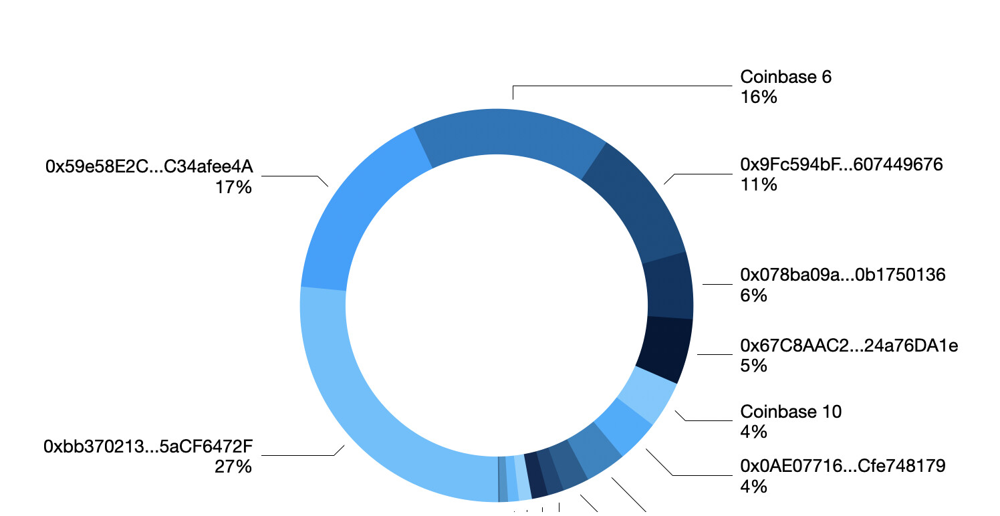

Every so often [someone will accidentally send ENS tokens to the ENS contract](https://discuss.ens.domains/t/proposal-to-correct-ens-transfer-to-ens-token-contract/18592). Luckily, the token contract does have a feature that allows the DAO to sweep these back and we have refunded them, sometimes [en masse](https://snapshot.org/#/ens.eth/proposal/0x9ab53c76cee40d58cb27b244dfa5f9f2763bd8b97b1b4be1dd0f0bf706818fb4) or sometimes [manually](https://discuss.ens.domains/t/accidentally-sending-ens-tokens-to-ens-contract-address/15696/9).

I’d like to discuss different approaches for how to handle this in the future. Since the cutoff date of December 6, 2021, when EP3 amended the airdrop to include accidental returned funds, there have been [21 accidental transactions](https://etherscan.io/advanced-filter?tkn=0xc18360217d8f7ab5e7c516566761ea12ce7f9d72&txntype=2&tadd=0xC18360217D8F7Ab5e7c516566761Ea12Ce7F9D72&age=2021-12-07%7e2024-03-05) to a total of 16 different accounts. As far as I could tell only one has been refunded [manually from the Metagov Safe](https://etherscan.io/tx/0xe3c9e56764fc1564c214e2ef6367eef38429e16a649404ef7cdf33cf332adc2f).

Here’s a summarized table:

<table>
<tr><th>From</th><th>total ENS sent</th></tr>
<tr><td>0xbb370213…5aCF6472F</td><td>200.567159</td></tr>
<tr><td><strong>0x59e58E2C…C34afee4A</strong></td><td><strong>124.194015</strong> *</td></tr>
<tr><td>Coinbase 6</td><td>123.280146</td></tr>
<tr><td>0x9Fc594bF…607449676</td><td>83.826853</td></tr>
<tr><td>0x078ba09a…0b1750136</td><td>41.708035</td></tr>
<tr><td>0x67C8AAC2…24a76DA1e</td><td>40.687676</td></tr>
<tr><td>Coinbase 10</td><td>29.155459</td></tr>
<tr><td>0x0AE07716…Cfe748179</td><td>26.644159</td></tr>
<tr><td>0x99aC46b1…8FF3d9fC0</td><td>25.24</td></tr>
<tr><td>0x194E9c9d…B83c232c6</td><td>16.3</td></tr>
<tr><td>0x3BFcc944…D6e950A12</td><td>10</td></tr>
<tr><td><em>0x95B564F3…AFAFAcc8a</em></td><td><em>10</em> *</td></tr>
<tr><td>dannyh.eth</td><td>8</td></tr>
<tr><td>0x36fAEFB0…ef29879B0</td><td>6.688963</td></tr>
<tr><td>2022020202.eth</td><td>5</td></tr>
<tr><td>Paribu 5</td><td>1</td></tr>
<tr><td>jefflau.eth</td><td>0.01</td></tr>
<tr><td><strong>Grand Total</strong></td><td><strong>752.302465 ENS</strong></td></tr>
</table>

\* requested funds back

It’s important to note that the 3 largest transactions account for 60% of the total. Of these listed, only two have reached out to us asking for the funds back and only the second, asked last year, has received it. User [@tman64](https://discuss.ens.domains/u/tman64) has made a request for his funds, which prompted this study. We can safely assume that these are not the only people who would like their money back and that there others who never bother to contact us – or never managed to find out where to do it.

<figure>

</figure>

Finally, if you read the account of the user [@AlexW](https://discuss.ens.domains/u/alexw) we can also get some context on how these accidents happen. In his case he was sending from his exchange account into his newly set up Metamask, but he didn’t know how it worked and thought the ENS address listed on the wallet was actually his own “ENS deposit address”. We should assume that many of these accidents were also sent from exchanges (we can even see two known coinbase and one Paribu address on the list) and are probably from users who cannot execute transactions nor necessarily receive the money on the address.

So what are we to do as a general policy? Here’s what I see are the options:

**1) Do nothing and wait for requests**

We could simply keep not doing anything and acting on requests on a case by case manner. Metagov would send ENS for [@tman64](https://discuss.ens.domains/u/tman64) and then maybe create a more formal ENS request process later.

It’s the natural inertia action, but it would mean that many users who lost coins would never see them until they found their way to the forum.

**2) Multisend send all back**

We could simply send all these tokens back to the address they came from. This option would be expensive (according to Multisender app calculator it could cost maybe 7 full ethers which is more than the value of the tokens being sent) and not necessarily reach the intended audience. Tokens sent back to the general Coinbase account are not credited to the original recipient, and either end up lost locked up on an accidental address (again!) or are just a donation to Coinbase.

**3) Airdrop them back**

A second option would be to create an airdrop, which is a lot cheaper for the sender (but still pricey, Multisender quotes at lease 0.5 ether to do it). It has the advantage that it only sends tokens back to accounts that can prove they actually own the address. On the other hand that would indeed exclude many newbies who sent it via exchanges and would have the same issue as option 1, in which if you’re not aware of the new airdrop, then you’ll never know you have the chance.

---

Personally I started this research based on the post by Tman64, thinking there ought to be a better way than to wait for forum threads to send money back, but honestly it might be the case that there isn’t. These accidents are common, but not common enough to merit a new process, and any alternatives to send automatically will be very expensive or exclude exchange users. Maybe the process can be marginally improved by having a proper form where people go and submit their request, but maybe not even that’s worth it.

Whats your opinion?
