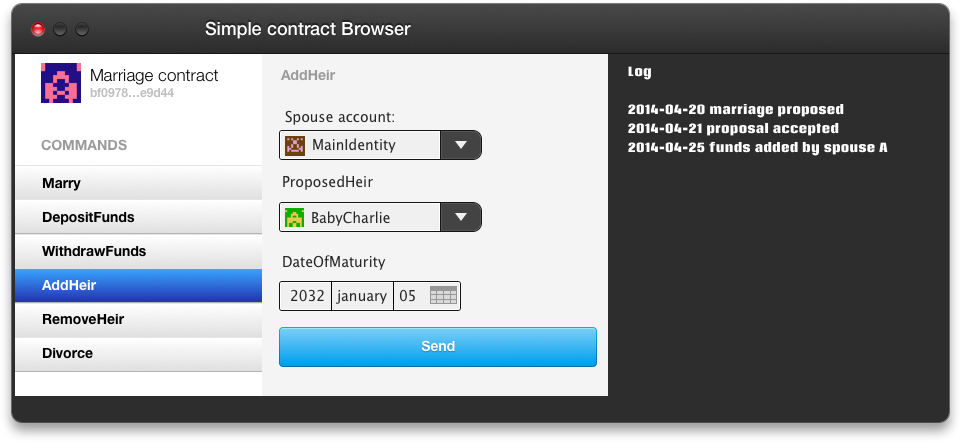

This discussion was inspired by comments from [@Stephan\_Tual](http://forum.ethereum.org/profile/Stephan_Tual) in two other recent posts so I though I'd put here because I really want to see what other people believe is the future of Etherum and the reference clients.

[http://forum.ethereum.org/discussion/751/so-i-designed-a-concept-ui-for-the-alephzero-client](http://forum.ethereum.org/discussion/751/so-i-designed-a-concept-ui-for-the-alephzero-client) 
[http://forum.ethereum.org/discussion/711/web-components-marketplace-for-ethereum-ui-markup](http://forum.ethereum.org/discussion/711/web-components-marketplace-for-ethereum-ui-markup)

The question is either Smart contracts should, in the future, have UI information. I see mainly two ways this could evolve:

\* Ether contracts start having more code related to UI and how to present the information to the final user. New GUI elements are created and can be reused. Ethereum evolves into a whole decentralized OS.

\* Contracts have information on what commands they accept and what's the data format or options each command takes. Ether provides the apis, and data for the backend of any app, in any platform. Clients can use whatever native OS code they prefer, and use Ether as the cloud api, a decentralized always persistent network.

I truly believe the second one is by far a better approach. First, because it's simpler and isn't a boil the ocean kind of approach. You don't need to implement custom interface elements, reinvent the browser, recreate 30 years of GUI code from multiple platforms.

Also, it promotes a separation of code in the Data/Model/Controller layer and the View/Interface layers. This creates cleaner and easier to maintain code.

Finally, it allows UI to flourish and Ether to be future proof. A OS built for the desktop isn't necessarily good for tablets and smartphones, and a mobile OS might not be good for wearables, robots or microwaves. OS's and interface needs change and separating Ether as just the data api we allow it to flourish in any platform.

A good example is Twitter clients. When twitter started, it was an open platform that allowed anyone to build clients on top. This created an environment where UI design flourished as everyone tested different approaches, on multiple platforms. The best innovative UI of the time came from twitter third party clients.

So in my vision, the reference client should only have a very basic "contract navigator" that permits you to use and test any contracts, but allows you to launch it in an external client for a better experience. This contract could have a list of accepted commands and a basic UI to provide the correct data in each command (a api request builder) but not more. The way data is presented, and how the interface is displayed, should be left to developers. (see attached)

<figure>

</figure>

Does everyone thinks similarly or am I too off the mark?
