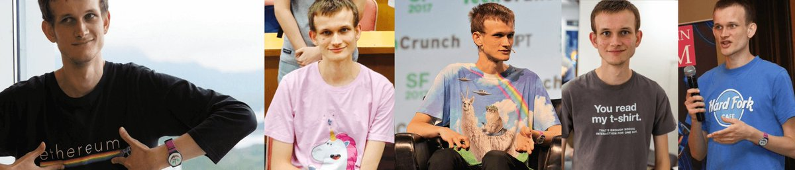

So, about doge and ethereum...

Both coins share some long common friendship. When Ethereum was running its presale, doge was at the top of the game, sponsoring race cars and overall having a lot of fun. I think it was the first coin to really get that a community, not only tech, was the most important thing.

The ethereum community was formed, in part from people that didn't like the bitterness that overtook Bitcoin, so we always tried to be light hearted and fun. Devcons accepted dogecoin. I mean, look at this guy, does he want you to take him seriously?

<figure>

</figure>

Doge was excited about ethereum too and they posted a thread asking if it was possible to be integrated in ethereum: [reddit.com/r/dogecoin/comments/3wxbc3/dogecoin\_transfer\_onto\_ethereum](https://www.reddit.com/r/dogecoin/comments/3wxbc3/dogecoin_transfer_onto_ethereum/)

So a few days later, "some guy" had implemented Scrypt (doge's native code) in Ethereum:\
[reddit.com/r/dogecoin/comments/3xc0co/dogeethereum\_twoway\_peg\_i\_wrote\_up\_an](https://www.reddit.com/r/dogecoin/comments/3xc0co/dogeethereum_twoway_peg_i_wrote_up_an/)

Caveat: it would cost about 370M gas just to do one single header verification. But maybe someone could find a solution to it, and some people they could do it, so I implemented a DAO that would hold a bounty for that purpose and asked donations.\
[reddit.com/r/ethereum/comments/41ohhr/the\_doge\_connection\_bounty\_dao\_is\_live\_and\_working](https://www.reddit.com/r/ethereum/comments/41ohhr/the_doge_connection_bounty_dao_is_live_and_working/)

Many donations came from both doge and ethereum community. Someone donated 5 thousand dollars, other people donated just a few cents. The bounty quickly grew to.. well mostly to a bit more than 5 thousand dollars. Yeah, mostly from that one donor.\
[etherscan.io/address/0xdbf03b407c01e7cd3cbea99509d93f8dddc8c6fb](https://etherscan.io/address/0xdbf03b407c01e7cd3cbea99509d93f8dddc8c6fb)

The problem was, that verifying a single doge transaction would not fit in the amount of calculations afforded per block. They could be broken down in steps, but they would still be super expensive. That's when @ethchris (the father of solidity came up with a very clever idea:

Going to court is expensive, but not all written contracts need lawyers and judges: but knowing that you can if needed, means both parties tend to behave. You can do the calculation off chain, put money on answer and only calculate if there's a dispute. @Truebitprotocol was born.

In the mean time, some developers have all approached the judges and said they wanted to work on it. Seemed like a quick and easy job. It wasn't. So the bounty stayed frozen, while ether price rose. The original big donor even asked for his money back, so we gave it to them.

Still, at some point the bounty passed a million dollars. That should get some attention to it. And it got.

@oscarguindzberg, @coinfabrik and @Truebitprotocol got together and worked for many months on it and finally had something to show for it: [github.com/dogethereum/dogerelay/wiki/How-to-send-dogecoins-to-ethereum](https://github.com/dogethereum/dogerelay/wiki/How-to-send-dogecoins-to-ethereum)

Now it's only one-way now, and it's not production ready but let me recap what these crazy people demonstrated us:

They built a DOGECOIN LIGHT CLIENT ON ETHEREUM. A contract that can check what is the latest dogecoin block, calculate proof of work, figure out chain splits, etc

Right now it can verify that a transaction was sent in Dogecoins to a given address and generate the same amount of cute shiba inu puppy gifs in an ERC20 token. Still need some work to make it solid, then more work making sure they can come back as doge coins, etc

Still, as a judge I believe the work demonstrated merits 25% of the total bounty, which is 372 ether which is worth $350k.. wait $299k.. or maybe $310.. Whatever.\
[etherscan.io/tx/0x0f0e475664792708a0be3cfabb59745c014e0d4224e506f50686fb6801ec1ebc](https://etherscan.io/tx/0x0f0e475664792708a0be3cfabb59745c014e0d4224e506f50686fb6801ec1ebc)

What can you do? You can check their work yourself by following the above links and also reading up on this: [github.com/TrueBitFoundation/scrypt-interactive](https://github.com/TrueBitFoundation/scrypt-interactive)

If you have any concerns, opinions or suggestions about the first award, please let the judges know. They have a week to vote and debate.

Also the remainder 75% of the bounty are still open. That team will still be working to make the app better, but our desire is to see an easy to use interface that anyone can build, so even if you are a simple web designer good at gifs, you can apply to help.

