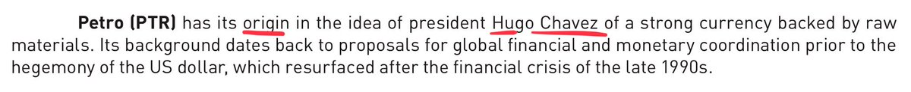
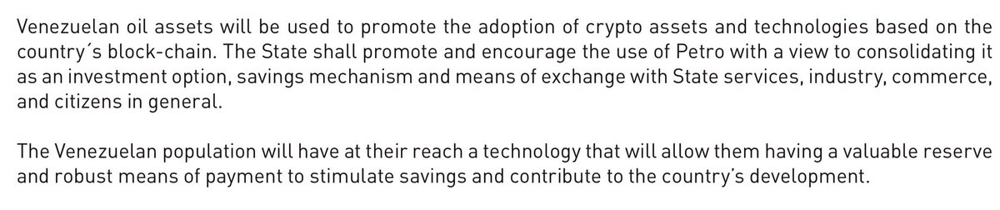
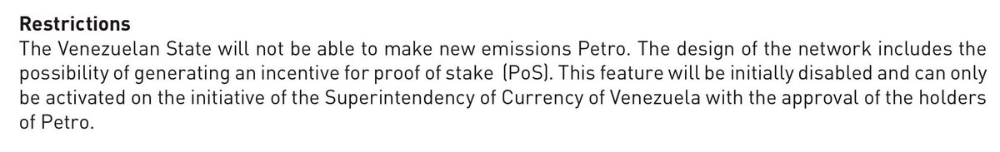
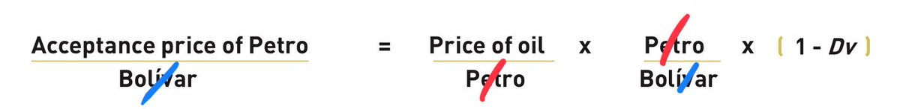
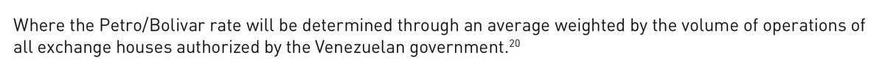
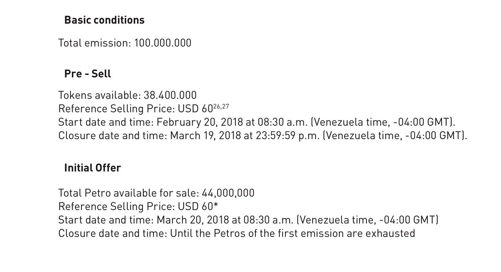
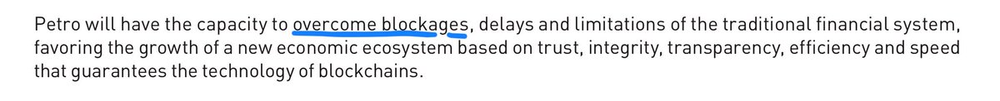

So, about the Petro..

Venezuela released [a white paper](http://www.elpetro.gob.ve/Whitepaper_Petro_en.pdf).

And it’s sooo good.

First of all it was inspired by Chavez, the first person in history to think that currencies should be backed by things. Screw capitalist pig Satoshi, Chavez basically invented crypto. I mean really crypto: Diffie-Helman plagiarized him. He probably invented all currencies too.

<figure>

</figure>

It’s super innovative. Can you imagine the consequences if the Venezuelan people had access to a currency that could be used for investment, savings or means of exchange? Why didn’t anyone think of this before?

<figure>

</figure>

‘The Venezuelan state will not be able to make new emissions”. Except the “superintendency of currency of Venezuela” reserves the right to activate new features, like PoS emission. Or maybe PoW. Which it doesn’t need.

But it’s totally not the government.

<figure>

</figure>

The supply is limited, the demand is market based, but the price will be somehow pegged to the price of oil. Because, thanks to socialism magic, price is not set by supply and demand, but by this incredible formula where both Petro and the Bolivar are divided by themselves

<figure>

</figure>

Notice that in the formula above, not only the “discount rate” DV is set by the government, but the price of Petro and Bolivar as well, as it’s calculated on “exchanges authorized by the government”

<figure>

</figure>

The ICO will happen the day after the day after the pre-sale closes. And tokens on the ICO will be generated by burning the pre-sale tokens. For reasons. And both will have multiple phases. For reasons.

And it doesn’t accept Bolivars. For obvious reasons.

<figure>

</figure>

It’s a token on ethereum, which doesn’t need mining. But it might also be mined anyway in proof of stake. Or maybe they reserve the right to make it proof of work. And miners will be paid in Petro, which is based on price of oil which has no correlation to miner or security cost.

The government cannot create Petros (but it can) which in theory should make the market happy, but there’s no mechanism to issue or destroy the tokens, it’s basically impossible for it to do the one thing it’s supposed to do, follow the price of oil.

So it’s “backed by Venezuelan oil” in the sense that Venezuela promises to buy it back at a discount rate (that they decide) on the price of exchanges (that they control).

But the strength of the Bolivar is a great proof on how much the people trust the government promises.

I am not going to say that the Petro is a useless token intent to get ether and bitcoin out hands of dumb greedy people and in the hands of corrupt government officials, because it has a very clear use:

**To circumvent the international sanctions put in the Venezuelan regime.**

<figure>

</figure>

So there you have it. If you were desperately looking to gamble some money while at the same time funding oppression and probably running amok of international finance laws, then I have just the perfect token for you.
