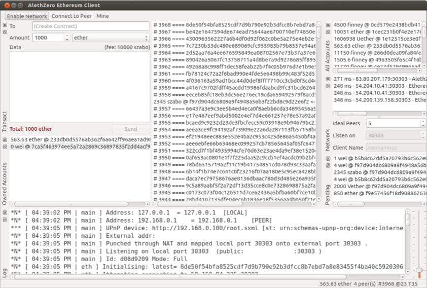
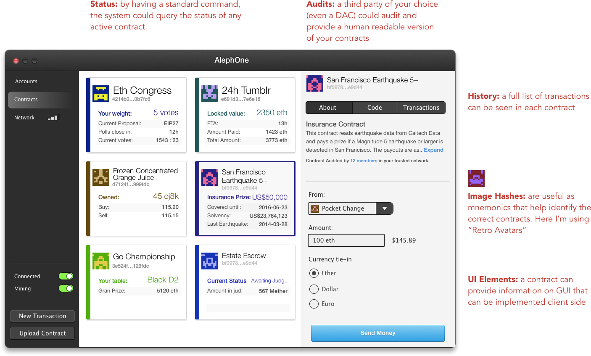

Since using the AlephZero client I began thinking about how the client could look down the line, and once I had that itch I had to scratch it.

<figure>

</figure>

<figure>

</figure>

Of course this is a very rough sketch and shows only the contracts tab. I imagined it as a collection of all your active contracts, but added a few features that are not on the current code but seem no-brainer, specifically features in which a contract tells the client the kind of data it accepts (and what UI) and the current status of the client.

I'm also adding the ability of querying a third party of your choosing to audit and describe each contract, so you can trust it before.

Most features of the current AlephZero are visible on that screen. The "owned accounts" would be similar to the contracts page and the remaining status and blockchain could be tucked in the "network" screen.

I'm using Retro gravatars to identify contracts because they're much more instantly recognizable than hashes, and I believe they are much better than the traditional "kaleidoscope" gravatars. I didn't pick or choose any, but you can still read an image in all of those random patterns.

So what does the community think? Is that kind of contribution welcome? How can I help in a more productive way?

Thanks
