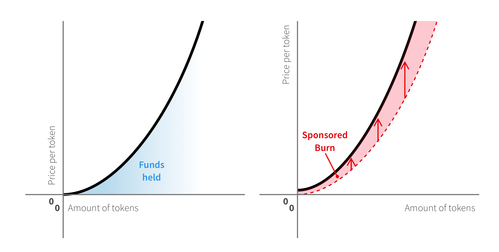
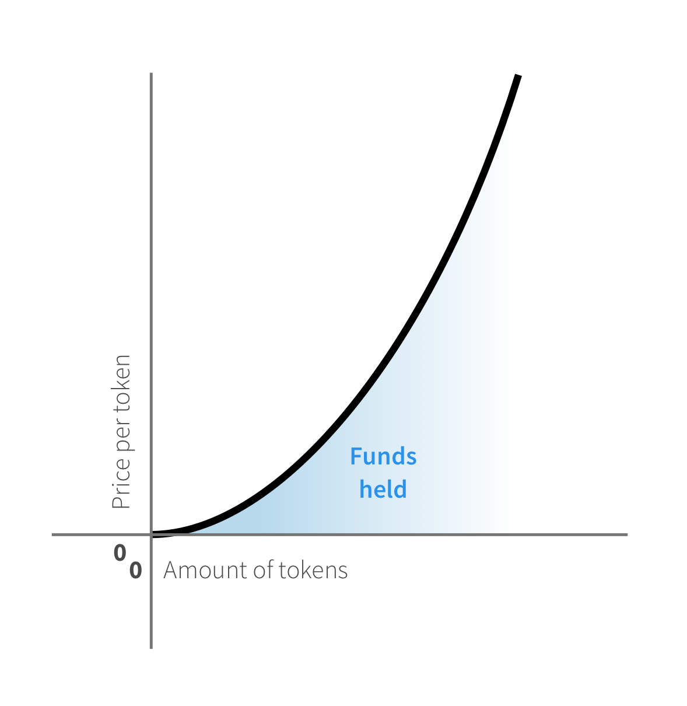
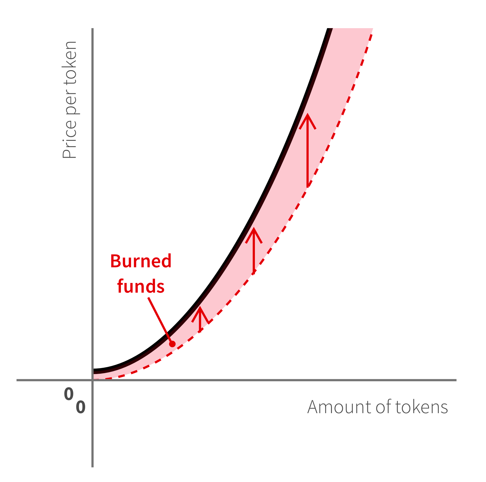
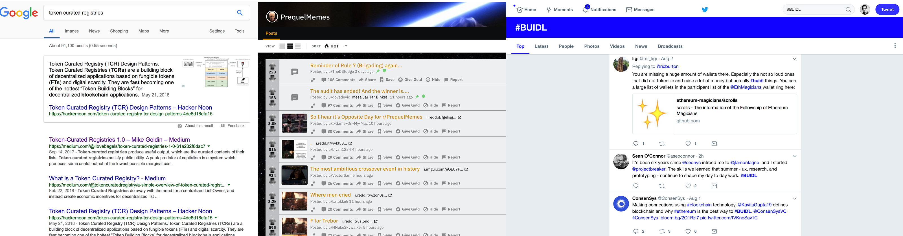

#### Creating revenue for token curated registries members

<figure>

</figure>

If you like reading about novel economic ideas in crypto (and since you’re reading this, I assume you do) then you are probably aware of “Token Curated Registries”, a token incentivization mechanism to help curate lists of stuff. The short version is that a given list (say, “best restaurants in town” or “funniest star wars prequel memes”) is maintained by a community of token holders which add new items by proposing a new entrant and making bets either the majority will accept that as part of the list. **The incentive for small token holders is to only propose items they think are likely to be accepted by the majority (otherwise they’ll lose a bit of their stake) and the incentive for large token holders is to make sure the list is interesting and valuable, otherwise the tokens themselves would become worthless.**

While it hasn’t been tested in any real application, TCRs have been subject to many improvements as well as criticism, specially regarding their aplicability to [subjective lists whose clear answer either doesn’t exist or is very expensive to discover](https://blog.coinfund.io/curate-this-token-curated-registries-that-dont-work-d76370b77150). One of the main problems is also the classic **tragedy of the commons: tokens themselves have no value except for the ability to buy your place in the list for exposure of your business** (in the case of the restaurant review, for example), and while token holders have a collective long term incentive to keep the list high quality, they can also have a short term profit by accepting money from an advertiser to either sell or temporarily lend their tokens for a vote. I’m mostly interested in TCRs _precisely for building subjective lists_ that have no clear answer, so I’d like to propose a solution for that which would create new incentives for token holders to keep hodling.

#### Curved Token Bonding

<figure>

</figure>

A common feature of TCRs is that the voting tokens don’t have a fixed supply and instead are **generated by depositing a base token** (which can be ether, dai, or even another token) and then increasing the unit token price as its supply grows.

This has a few benefits over having a fixed supply set by mining or an ICO: first it means that owning 51% of the tokens doesn’t guarantee winning a vote, since the total supply is dinamic. It also guarantees an external value and liquidity for tokens, since they can always be traded to and from another more liquid token. It also creates interesting ways to fight back a whale: if someone buys a lot of tokens to sway a vote, the community can always generate more tokens to vote against it, or simply sell off their own tokens immediately, therefore devaluing the tokens held by the “attacker”.

The assumption of the bonding curve is that the total supply of tokens always equate the funds held, therefore if everyone sold all tokens, the total amount of money going in would be equal to the amount of money going out. The distribution of money for each participant would be different, depending on when they got in and out, **which makes the whole system a zero-sum game that rewards those who got in early and got out at the top,** making it very similar to a pyramid, or a “pump and dump” scheme in which all profit comes at expense of new members.

Of course, if someone loses access to their account (or the participant leaves the community and doesn’t come back) then the amount of tokens will never go back to 0. The lost funds guarantee that you will never be the _last bag holder_, but these funds are forever locked.

#### Sponsored Burning

<figure>

</figure>

But what if we break the assumption that all funds going in must be equal to the ones going out?

Of course, we can’t have more money going out than it came in, but let’s assume there is a function that enables someone to add to the total supply of funds held by the tokens, _without getting any tokens back._ This would mean that if every token holder decided to sell their tokens back to the system, the total amount distributed to token holders would be more than what they all bought for. If the first person to enter was also the last person to exit, they would still go home with a profit. Even if a mass exit doesn’t occur, it means that by just holding tokens, without any new member needing to come in, your own tokens have increased in value.

But why would someone make what is essentially a donation to the token holders? That goes back to the purpose of TCRs in the first place: curating lists of stuff. Not only restaurant reviews but, Google result pages, Subreddits, Twitter hashtags, even your social media is a curated list (curated by you).

<figure>

<figcaption>What do these have in common? <em>All</em> are different forms of curated registries.</figcaption>
</figure>

**And every single one of these pages has some sort of sponsorship.** Advertising is traditionally seen as adversarial for users, or at least as the necessary evil that users must tolerate in order to keep the site running. Users increasingly want not to be tracked, and to block ads, but website owners need the revenue so they add increasingly clever and intrusive methods to force ads into users.

Let’s suppose a website owner tries to make all their users token owners of their favorite lists (which avoids having to ask for them to buy it), and then users can vote on which stuff belongs in their lists. The more popular and active lists will bring more audience which will bring ad interest. Now let’s suppose that in each list there is a clearly demarcated ad space which is distributed in proportion to the amounts of sponsored burns made in the last 30 days. If $7 dollars were added to the token supply via sponsored burns this week, then if you make a $3 contribution you’ll get 30% of the ad views.

**But who gets to enforce that?** The beauty of this system is that we are supposing that **there isn’t any single “owner” of the token curated content** that needs to follow strict ad rules or keep track of clicks and views, anyone can create an app or website and show the content that was curated by the token holders. But since now token holders gain value from sponsorship, and advertisers will only want to sponsor if they get exposure, then users themselves will demand app builders to add sponsorship slots. These in turn can be adapted to the medium: token curated lists of audio can measure their sponsors in seconds, while scrolling feed based lists can add them to probability of appearing on fixed slots.

#### Conclusion

Sponsored burning proposes a new method of revenue participants in Token Curated Registries that rely on Token Bonded Curves. Sponsoring can better align the incentives of token holders to create a better quality content specially for subjective lists, by adding an external profit model which doesn’t require token holders to sell or rent their tokens. I hope that this model can allow us to create decentralized communities for curated content that don’t need to resort to intrusive advertising to keep the client developer lights running.

**To read more about my ideas on how to create these communities read the** [**_Eternal Septembers paper_**](https://docs.google.com/document/d/10JfZ-6TC48lDqhJh_lGqIBu5KgcuHHYwdd0vo1pD59Y/edit?usp=sharing) **and the** [**_story on how that came about_**](https://blog.vandesande.design/token-curating-the-truth)**_._**
