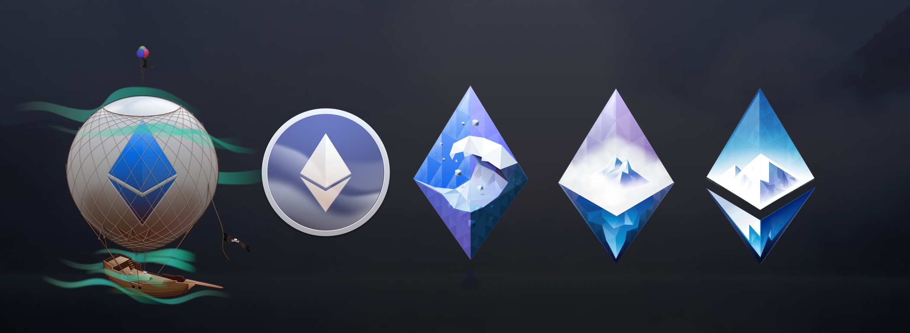
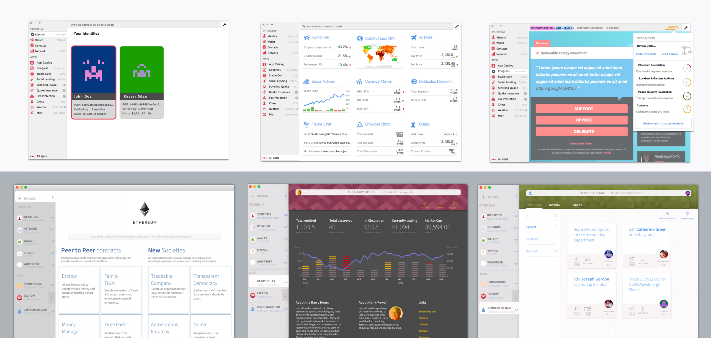
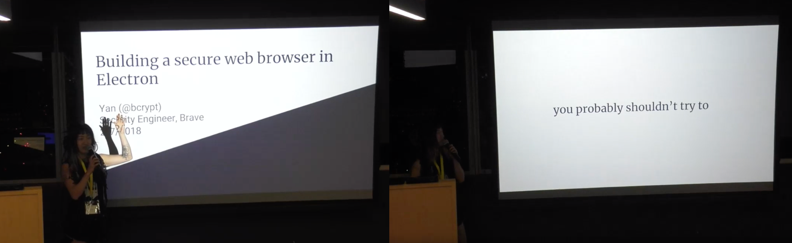
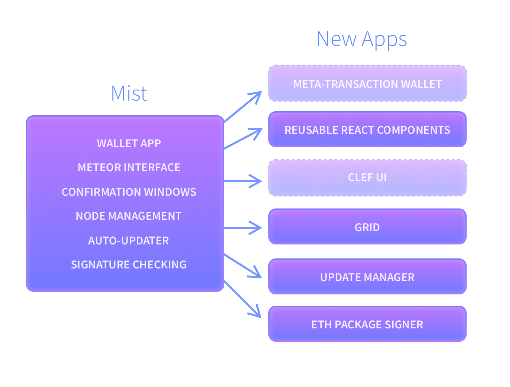

<figure>

<figcaption>A series of icons for the Mist “Navigator”</figcaption>
</figure>

Personally it feels like yesterday, but I’ve been working on Mist for over four years. While I’m proud of all the accomplishments we achieved in this time advancing the usability of Ethereum and sharing a vision for web3, we feel Mist, the browser has outlived it’s usefulness: the ecosystem has matured so much that now the user has tons of great options of wallets and browsers on both mobile and desktop. At the same time, **the message of how crypto can make a better web has reached so far that now great names like Samsung, Opera and Brave are all focused on integrating web3 features on their roadmap**.

Not all were roses, and in our way we faced some extreme security challenges that forced us to reevaluate our whole roadmap and question if keeping the project alive would be a good use of the Ethereum Foundation resources. We decided then to take everything that was valuable from Mist and roll into separate projects, but the main browser app should be considered deprecated and insecure. For more details on what these are, follow on.

### What we did right

A vision of a web3 browser always has been essential to the ethereum mission, so much that when we first set up the huge milestones for Ethereum, “Metropolis” would be one in which we had easy, working web3 browsers. More than that, Mist and the accompanying “Ethereum Wallet” app were crucial in these milestones:

- **It was the wallet that launched the token standard**. Fabian Vogelsteller, writer of the ERC20 draft, was also the lead developer of Mist and we decided to use it to break the chicken and egg problem of standards: we released a version of the wallet that supported tokens almost at the same time we published the token standard, and it also came with an easy way to write and deploy your own tokens
- **Ethereum Wallet paved the way on how to build a Dapp.** While it was a separate downloadble from Mist, it was built completely as web app and the lessons on how to communicate securely with a browser layer really helped pave the way how we deal with that today
- **First GUI wallet that enabled early users to use ethereum** and import their presale keys, back when it was only available through command line (or some exchanges)
- First wallet to set and encourage the **Blockie Identicon standard**
- First wallet to develop and promote the **CamelCase Checksum** (an idea by Vitalik)
- First wallet to allow **easy deployment of contracts** (long before Remix had a web interface)
- First wallet to create a **visual interface for interacting with any contract** from pure ABI (and for many years, the only one)
- **First browser to support ENS domains** without using gateways
- **First browser to support Swarm** Hosted websites
- **Web3.js, a library used by many apps** as a way to interact with ethereum via javascript, was created by the team for Mist and then made available for others

These breakthroughs really paved the way to make Ethereum more usable for the first years, and the fact that it was developed in close proximity with the other teams helped their schedule along. The Ethereum Wallet was always built as a web-based app, and this has helped the team learn a lot about how the Web3 should work, which later evolved into other standards. Small things like Geth’s “signAndSend” API, were developed precisely because Mist was able to use and provide feedback to the team.

<figure>

<figcaption>Screens of early prototypes including many usages for ethereum. These prototypes can still can be navigated <a href="https://invis.io/C2R5VC0WX7F#/23423934_Dapp_Browser">here</a> and <a href="https://invis.io/5VR5VCXMGBN#/47923761_Add_New_App">here</a></figcaption>
</figure>

During the early prototypes we had designs for dashboards, appstores, integrated code audit checks, identity as first class citizens, personal tokens, DAOs, prediction markets, and many other things that are only now started to see the light. One should not see this as “being too early” but as a sober reminder of how long projects take to mature. We couldn’t built most of these tools then, and we could only build a few of them today, because they depend on a more broad ecosystem. You can’t build it all in one day, in one team, and you should beware of anyone that promises you otherwise.

### What we did wrong

<figure>

<figcaption>Our lessons, summarized by <a href="https://medium.com/u/d9023ee5756f">Yan</a> in <a href="https://www.youtube.com/watch?v=Qirdy1TP1Rw">two slides</a></figcaption>
</figure>

Our biggest speed bumps were always mainly two: syncing a node and relying on Electron. Syncing a full node was doable in the early years, but soon became a chore that would take hours. These issues started being solved in 2017 when light client became reliable, and then in 2018 we also compromised and added a remote node (INFURA) connection that would seamlessly switch between nodes; we strongly believe the ecosystem needs a vast number of nodes being run by users. **This issue led us to lose a lot of our early users who voted with their feet to use apps with hosted remote nodes.** While decentralization and convenience are always constant struggles with both sides having downsides, it certainly something that can be fixed in the long term, with both mixed remote/local solutions like we used and with the advancement of light stateless clients. But this was not the case for the security vulnerabilities brought by electron.

Electron is a great framework for webapps on the desktop, built for apps that used their own trusted javascript files. But when you are building a browser, you are, by definition, running random code from unknown people all around the world. This is tricky. Also, for most of our history together, electron was not updated frequently and even when it was, it was still running several versions behind chromium, which meant that often the latest version of Mist was running an engine several months out of date. Google tends to publish vulnerabilities it found after six months of releasing a fix, and at that point we were still stuck with the one-hundred-day exploit open, leading to a situation where we were paying from our bug bounties fund from people who simply took known vulnerabilities in chrome and applied them to us. We had a professional audit of Mist and they were able to discover multiple vulnerabilities that were fixed, none very dangerous but in late last year we received notice of a few very serious bugs: ones that would allow an attacker to take control of your computer (and your crypto keys) by simply visiting an untrusted website. **This is very bad.**

We released a fixed version immediately, but then others similar attacks were revealed and at some point our own internal security team recommended that we not allow the user to navigate to untrusted websites — which is the whole point of a browser. We put an alert on the app and started looking for alternatives.

We explored many alternatives (like [Tau](https://github.com/PhilippLgh/tau), which uses Chrome Embedded Framework instead of Electron), but still we realized that the amount of human resources needed to keep and maintain a safe browser were far larger than our team could support.

Meanwhile, the ecosystem has also evolved a lot since the early years: Brave (which also started as an electron app but now moved to a full chromium fork) is a solid browser with crypto integration and a great companion to Metamask. In the mobile space, wonderful options were launched in the last couple years: ethereum native apps like Coinbase Wallet (formerly Toshi) and classic browsers vendors like Opera now have a web3 integration. This has lead us to believe that **other browser developers have more resources and are closer to having web3 features natively, than we were of having a secure browser framework.**

### What nobody got right

We still believe there’s a long road ahead for the web3 vision. These are things that we haven’t seen done correctly by anyone so far:

- **IPFS/Swarm integration on the browser URL.** Sadly, most ethereum apps still use traditional servers that don’t have the immutability guarantees of hash addressing content. If you are building an app or a wallet, consider hosting on IPFS so users can be sure the underlying code can’t change underneath them and break things. In our experience, this not solely the fault of browser vendors, but also an issue with the maturity of the underlying technologies: we successfully implemented swarm hosting over two years ago, but since then both the protocol and their network changed drastically. Sometimes being too early to adopt a changing protocol is a hindrance. [Brave Browser is making good progress on this.](https://twitter.com/ensdomains/status/1105565560224563202)
- More use of ENS: we believe ENS (or other decentralized DNS alternative, like handshake) offer much better usability when it comes to adding addresses and domains. We have added ENS support to all our address fields in the wallet so you can use a name whenever you added an address. **But in our experience, doing it unilaterally is not enough: you also have to provide easy ways for the user to register their own names,** in a similar way that we launched token support by not only providing an easy way to add tokens, but also to create them. A good example of progress on this is [Argent](https://www.argent.xyz)—inspired by Universal Logins (another project that came out of the Mist team)—which gives each new user their own username as part of the onboarding.
- **Wallet is just another app, identity is not.** We believe we made the right decision when we tried our best to make the wallet just another app on Mist. We also structured the app to focus on Apps that you keep coming back to, and not transient documents you read (which is why we always used sidebar icons instead of tabs for example). But we now realize that the real first class citizen should not be the wallet, but your identity. It’s important for any browser vendor to integrate identity in a way that is both private but universally accessible. This way you shouldn’t need to create a new identity on every app, and you should keep control of that information. For a good approach on keeping information private and yet portable, check the [threebox project](https://3box.io).

### What now?

We are sunsetting Mist the browser and will no longer actively support it (but can revisit this decision for occasional security and fork upgrades), but a lot of our work in the past years will be reused, thanks to a great effort of modularizing and modernizing our own code. We are basically splitting Mist in multiple component pieces:

<figure>

<figcaption>How we’re exploding the current codebase. Dotted are projects not yet started.</figcaption>
</figure>

- **Node management**: during the last year we revamped a lot of the internal node management of Mist and how it downloads and runs new versions of geth, swarm, whisper etc. We are now working to release that as a separate app to help developers manage multiple versions, called [**Grid**](https://github.com/ethereum/grid).
- [**Reusable React UI elements**](https://ethereum.github.io/ethereum-react-components/): we carefully rewrote most of our components in a reusable library called “Ethereum React Components” that can be used as a starting point for other apps. [You can check them all live on our storybook](https://ethereum.github.io/ethereum-react-components/).
- **Confirmation windows**: we refactored the most important piece of the UI for a wallet, the transaction confirmation, in which the user must understand at a glance what’s happening. We are now working to integrate these interface improvements to Geth’s own key management app, [**Clef**](https://github.com/ethereum/go-ethereum/tree/master/cmd/clef).
- [**App update manager**](https://github.com/PhilippLgh/electron-app-manager)**:** we refactored mist’s self update mechanism in a general App Manager for unified update mechanism for binaries with hot updating and signature verification.
- [**Package Signer:**](https://github.com/PhilippLgh/electron-app-manager) we also separated a different library that allows you to sign and deliver updates with nothing but an ethereum key, allowing projects to prove the validity of software in a more decentralized way.
- **Wallet**: the app known as ethereum wallet is actually a webapp, usable by either mist or metamask at wallet.ethereum.org. That code is outdated and the user experience underwhelming, but we believe we can contribute with the [Universal Login project](http://universallogin.io) in an open source non-custodial but safe wallet.

[https://cdn.embedly.com/widgets/media.html?src=https%3A%2F%2Fwww.youtube.com%2Fembed%2F1lH4q1-Ba0k%3Ffeature%3Doembed&url=http%3A%2F%2Fwww.youtube.com%2Fwatch%3Fv%3D1lH4q1-Ba0k&image=https%3A%2F%2Fi.ytimg.com%2Fvi%2F1lH4q1-Ba0k%2Fhqdefault.jpg&key=a19fcc184b9711e1b4764040d3dc5c07&type=text%2Fhtml&schema=youtube](https://cdn.embedly.com/widgets/media.html?src=https%3A%2F%2Fwww.youtube.com%2Fembed%2F1lH4q1-Ba0k%3Ffeature%3Doembed&url=http%3A%2F%2Fwww.youtube.com%2Fwatch%3Fv%3D1lH4q1-Ba0k&image=https%3A%2F%2Fi.ytimg.com%2Fvi%2F1lH4q1-Ba0k%2Fhqdefault.jpg&key=a19fcc184b9711e1b4764040d3dc5c07&type=text%2Fhtml&schema=youtube)

### What’s next?

The Mist team will continue working together, but our mission now instead of building a single app will be to focus on improving and helping the user experience and front-end of other teams in the Ethereum Foundation. It’s sad for us to see the Mist era coming to a close, but we are happy that one of the reasons for this is that the ecosystem has so many other worthy options. Ultimately, it’s important for our team to help the Ethereum Foundation focus on an area we believe deserves more of our attention and skill sets and we believe our experience in building more accessible front-end interfaces for ethereum apps will be precious.

Our short term goals are to release Grid and some of the other mentioned offshoots of Mist. On the medium term we want to collaborate more with other teams within the Ethereum Foundation, in which teams usually work in isolation, and to lend our our expertise in design, user experience, and front-end architecture, to improve design and usability cross sectionally on all projects.

#### What to do with funds on Mist?

Mist and the Ethereum Wallet are user-custodial wallets, meaning all your keys are kept on your own device and you have full control of them, in a file format that is compatible with other ethereum wallets. While there’s no need for any action now, if you want to use them for o, we recommend you migrate these keys to Mycrypto, Metamask and others we have written this [handy Mist migration guide](https://medium.com/@omgwtfmarc/6bcf066ac383).
