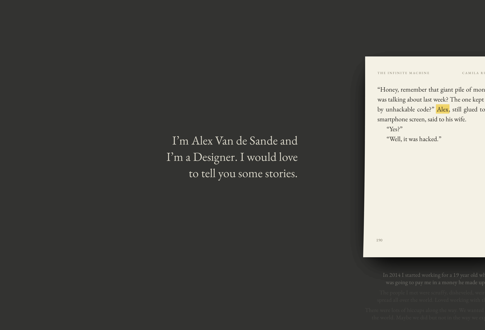
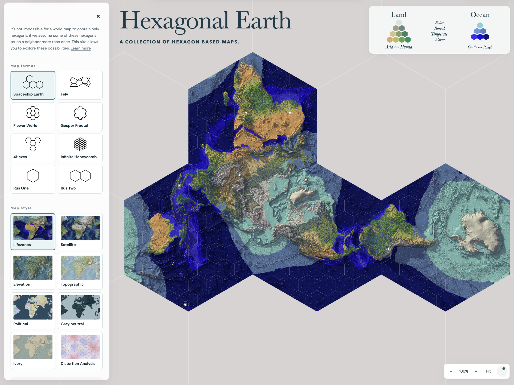
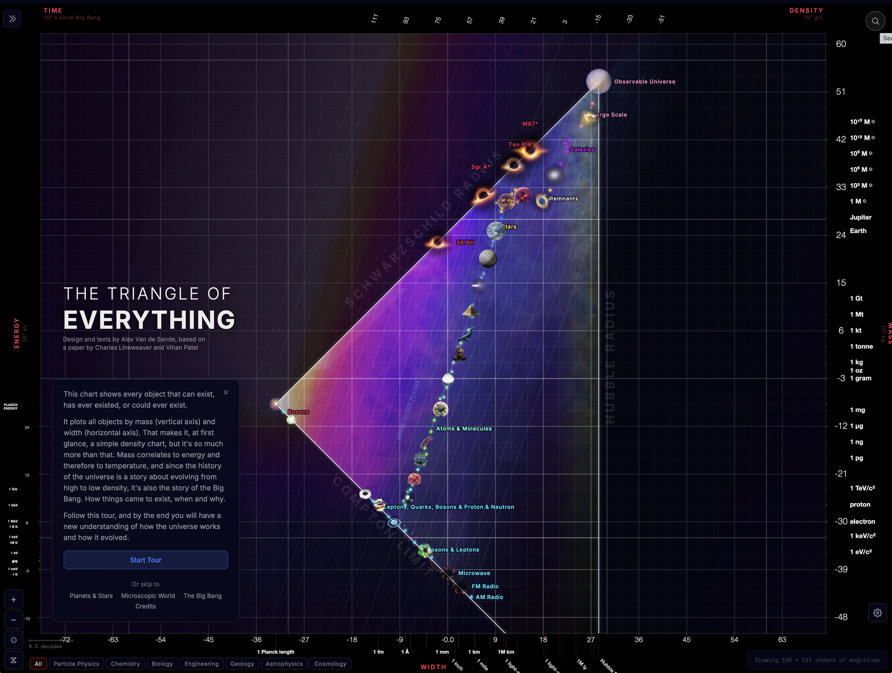
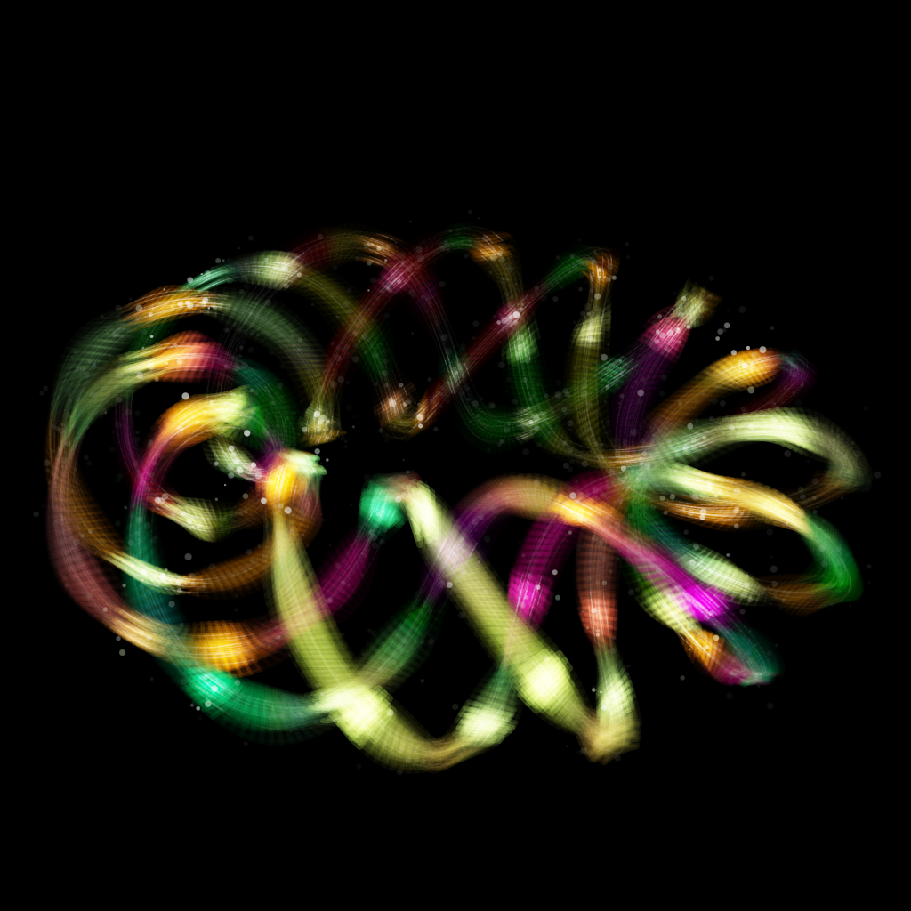
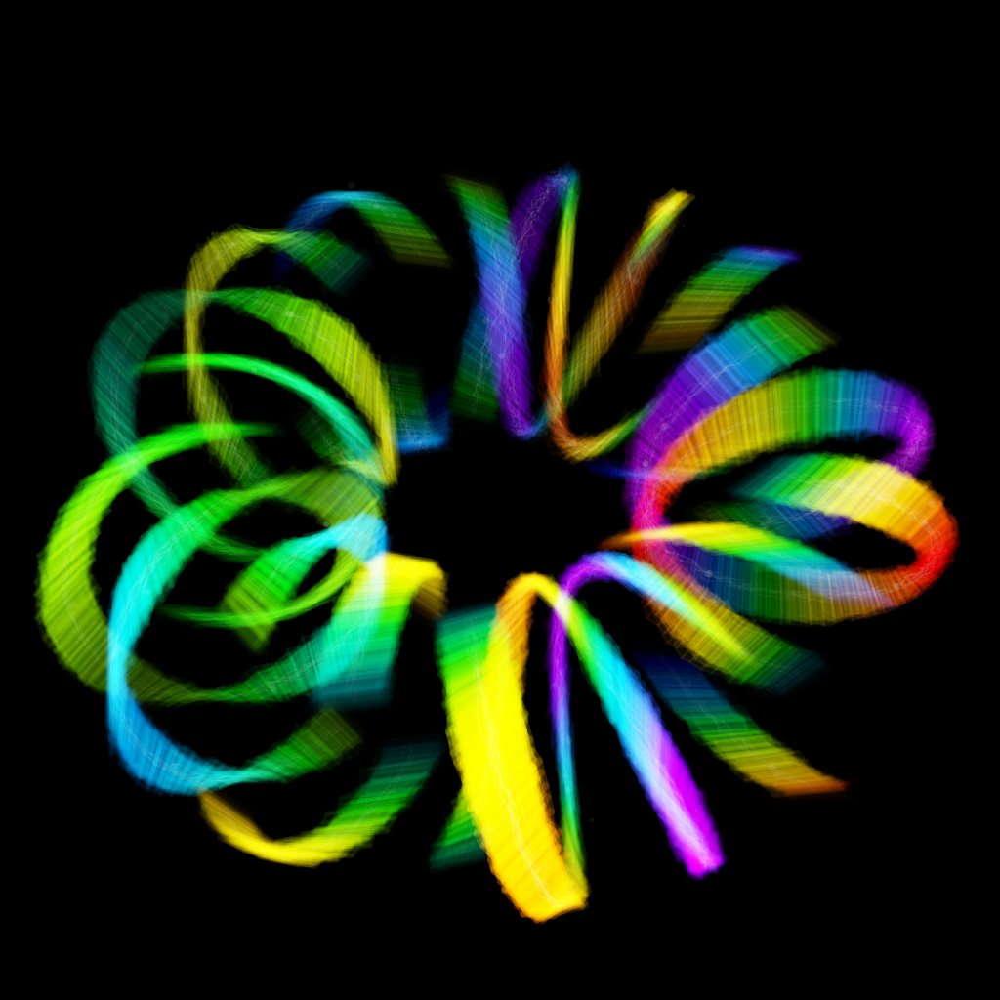
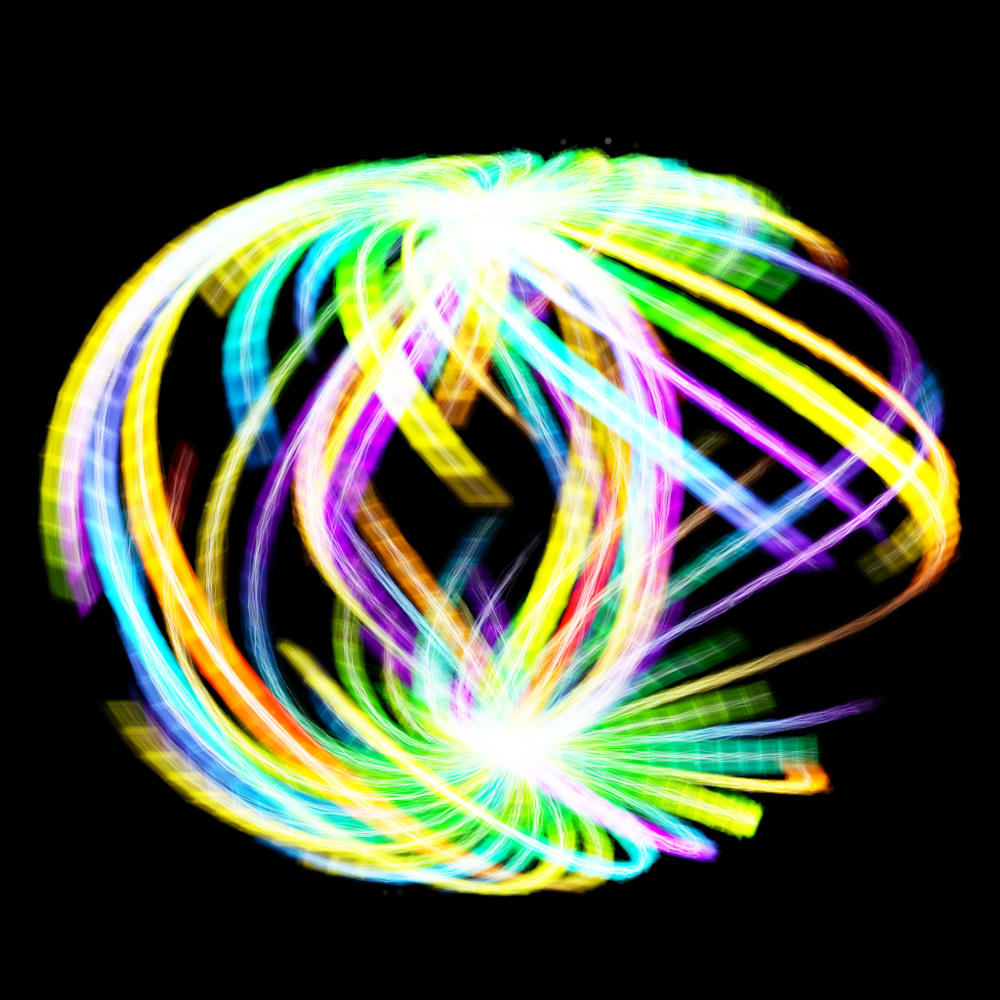
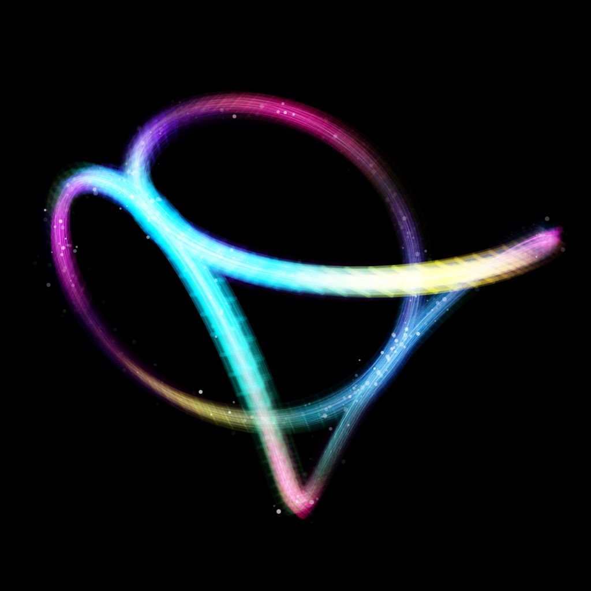
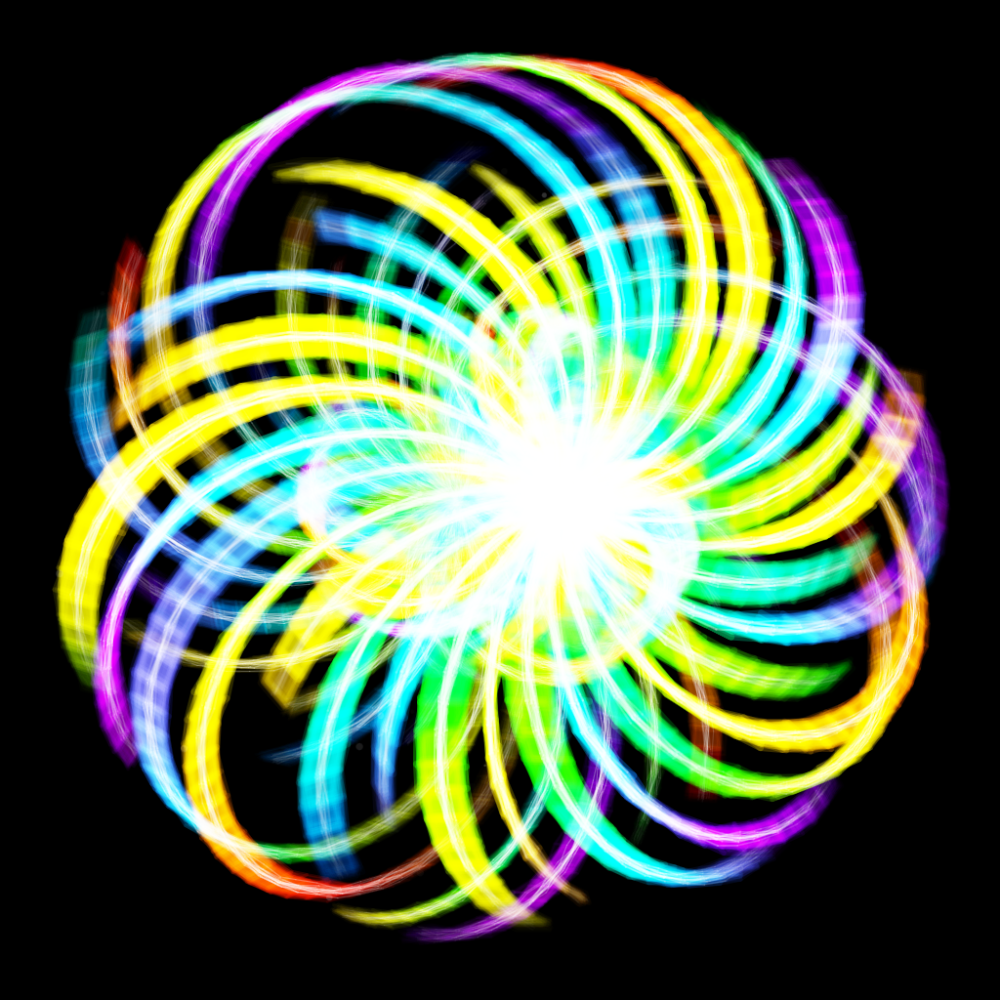
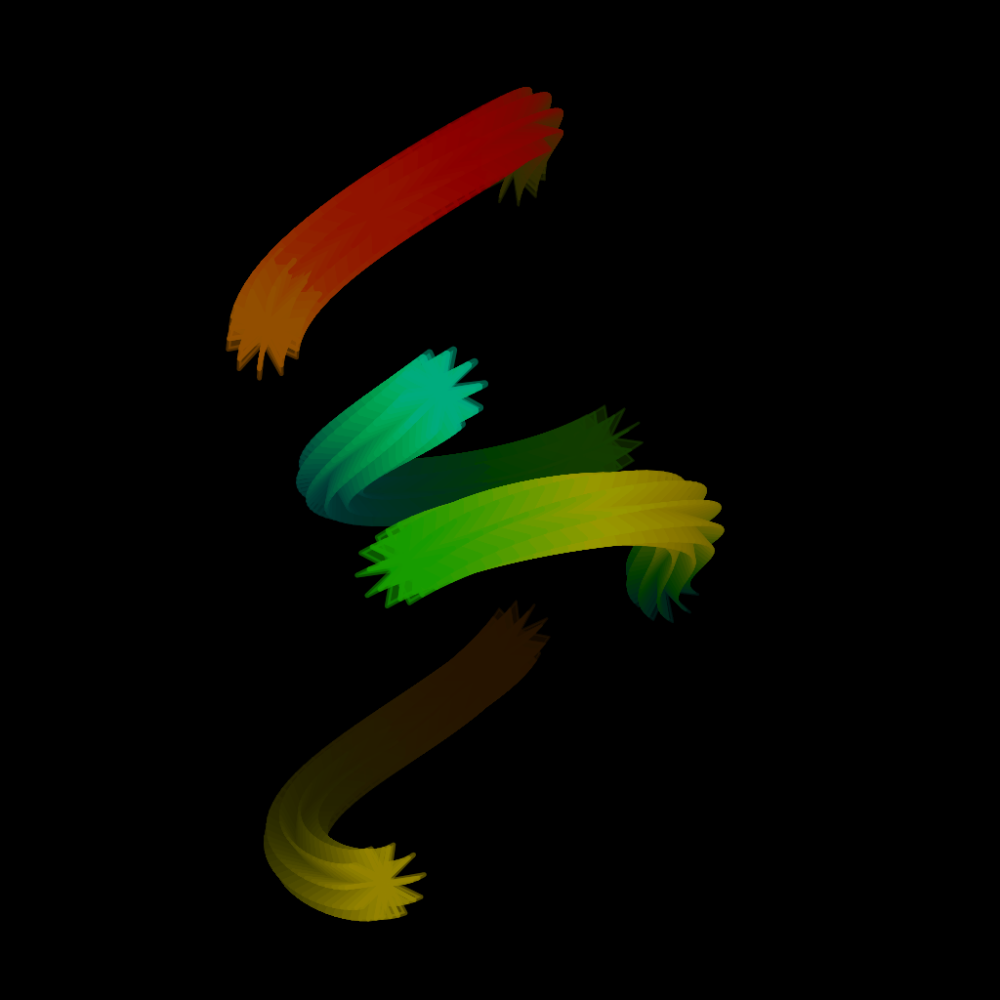

This year I've transformed all my favorite projects, the [Triangle of Everything](https://blog.vandesande.design/the-triangle-of-everything) and the [Hexagonal Earth](https://hexagonal.earth) into full websites of their own, and did this new personal website. Over the last decades I've written lots of places on the web: Wordpress, Posterous, Flickr, Tumblr, Medium, Mirror, Paragraph and some contributions to other people's websites. In the past few years I've (re)bought my own domain (finally) and decided to start posting only to an address I owned. The past week I went one step further, and asked my agent to scour the web for my past writings and bring them all as markdown files I own. It was remarkable, it found old archived posts in addresses I had completely forgotten, fixed formatting errors and broken images and the result is that I now have a working archive of my digital writings for the past 25 years. It probably matters only to me (maybe one day to my grandchildren if I'm lucky) but that's okay–I've always written on the web only for myself.

The web wasn't always just [five websites sharing screenshots of the other four](https://twitter.com/tveastman/status/1069674780826071040), it once was a big playground for small personal sites with fun experiments. The promise of Web3 was to bring that back with new tools: decentralization, blockchains, etc. But maybe we can do that simply with text files and git.

So here are the new personal experiments:

## [VandeSande.design](https://vandesande.design)

Jevons paradox states that when a new technology makes something more efficient, we don't use less of it, we use more. A lot of people who are trying AI love to talk about one-shots, a single prompt that outputs a full game or website. This is a myth: not because the current models aren't capable of delivering a great product in one shot, but because they do, you'd never call that a full website anymore, no more than you'd use a default Wordpress installation and call that a day. Precisely because we can do more, we are expected to do more – what is now considered a basic website will have tests, have been rewritten from scratch twice, and have a lot of features that would have taken a full dev team a few years ago.

But this isn't about AI, it's about creativity. These were websites I wanted to build, which existed only in my head and now are out there in the world and I'm proud of.

---

## [Hexagonal.earth](http://Hexagonal.earth)

I've already [written about my maps extensively](https://blog.vandesande.design/gosper-world-a-novel-world-map-made-of-hexagonal-like-fractals-or-how-i-made-matt-parkers-impossible-ball). I've spent a full year building the crappiest hexagonal map tools but it's now completely rebuilt as something that anyone can play with. I truly hope it finds the other half dozen people in the world who like hexagonal maps. It has lots of neat features, including a download. If for some reason someone out there wants the original old poster, [send me an email.](mailto:blog@vandesande.design)

---

## [TriangleofEverything.com](http://TriangleofEverything.com)

[The poster version](https://blog.vandesande.design/the-triangle-of-everything) is now an interactive website. It's useful since now I am able to add a lot more items and check the accuracy of every item on them. Check the Tour version because there are some real neat animations there. And again, if for some reason you do want to get the original poster, feel free to get in touch.

## Bonus: *hyper-spirographs*!

One of the issues I found when trying to represent all objects was how to represent elementary particles. I wanted something that would feel like a real object, but also be based on some math that had a relationship with real science. I started playing around with the idea of a spirograph (you know, these toys to make flower patterns) as a way to see in multiple dimensions: a 2d spirograph is a flower, a 3d is an orbit and you can use hue, transparency and animations to visualize up to six dimensions. Then I found out about Hopf Fibration and Fiber Bundles, a math model that is used a lot in theoretical physics so it felt like a perfect fit.

Anyway if you want to visualize something in 6d and learn about Fiber Bundles more, play around with the [hyper-spirograph](https://triangleofeverything.com/hyperspirograph.html) tool.
